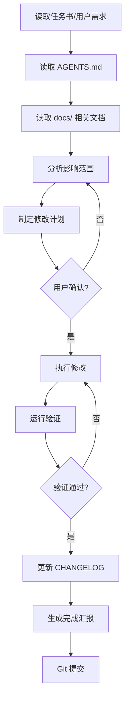

# AI Novel Studio — Agent 工作流文档

> 文件：`docs/agent-workflow.md`  
> 用途：定义 AI Agent 在项目中的标准工作流和交互模式  
> 适用：所有 AI Agent（Copilot / Cursor / Claude / 自定义 Agent）

---

## 1. Agent 角色定位

AI Agent 在 AI Novel Studio 项目中扮演 **开发者助手** 角色：

- ✅ 分析需求，制定计划
- ✅ 在明确范围内实现功能
- ✅ 运行验证，确保质量
- ✅ 更新文档，保持同步
- ❌ 不能自行决定产品方向
- ❌ 不能自动扩展需求范围
- ❌ 不能删除用户未要求，或尚未完成等价迁移与回退验证的已有功能

---

## 2. 标准开发工作流



---

## 3. 各阶段详细说明

### 阶段 1：信息收集

**目标**：充分理解任务背景

**操作**：

1. 仔细阅读用户的任务描述
2. 阅读 `AGENTS.md` 了解项目全局约束
3. 阅读相关 `docs/` 文档：
   - `product-design.md` — 理解产品定位
   - `ui-reference.md` — 理解 UI 标准
   - `data-model.md` — 理解数据结构
   - `module-boundaries.md` — 理解模块边界

### 阶段 2：分析与规划

**目标**：明确要改什么、不改什么

**操作**：

1. 定位相关源文件
2. 分析修改对其它模块的影响
3. 列出要新增/修改的文件清单
4. 明确禁止修改的范围
5. 输出计划供用户确认

### 阶段 3：执行

**目标**：精准执行修改

**操作**：

1. 严格按计划修改
2. 一次只改一个文件
3. 每改完一个文件检查是否有错误
4. 不顺手修改无关代码
5. 不扩展需求范围

### 阶段 4：验证

**目标**：确保修改没有破坏项目

**操作**：

验证按范围分层：

1. 纯文档：docs/version sync、Prettier、diff 与范围检查；
2. 前端：相关动态测试、`npm run lint:ci`、`npm run build`；
3. Rust/SQLite：`cargo check` 与相关动态测试；
4. Tauri/DSH payload：真实桌面与生产构建门禁；
5. 发布：`scripts/agent-workflow/verify_project.ps1` 完整矩阵；
6. 所有任务：`git status --short` 确认变更范围。

### 阶段 5：收尾

**目标**：更新文档、提交代码

**操作**：

1. 更新 `CHANGELOG.md`
2. 如果涉及新功能，更新 `README.md`
3. 生成完成汇报
4. 仅在用户或版本任务明确要求时 Git commit / push；tag 只属于发布流程

---

## 4. 内置 Skills 工作流

### 4.1 plan-version

```text
读取项目状态 → 分析差距 → 定义范围 → 输出计划
```

### 4.2 implement-feature

```text
读约束 → 读设计 → 分析影响 → 执行修改 → 验证 → 文档同步
```

### 4.3 verify-build

```text
识别变更范围 → 定向测试 → 适用 lint/build/Rust/桌面门禁 → git status；发布时运行完整统一验证
```

### 4.4 review-ui

```text
加载标准 → 逐项检查 → 输出报告
```

### 4.5 release-package

```text
验证构建 → 更新版本号 → 更新 CHANGELOG → 从 CHANGELOG 提取发布正文 → Git tag
```

---

## 5. Agent 交互模式

### 5.1 项目开发协作：用户主导的 Agent 任务执行模式

```
用户目标 → Agent 读取状态/文档 → 计划（需要时确认）→ 执行 → 分层验证 → 汇报
```

### 5.2 产品运行时：Multi-Agent 自主创作模式（v3.0.0）

```
小说 Brief → Plot Planner → 人物 / 世界 / 冲突 / 节奏 Agent → 全书章节计划
                                                        ↓
                                                   用户确认应用
                                                        ↓
章节候选 → Outline / Character / Setting / Logic / Polish / Quality
                                                        ↓
                                              共识 / 主编修订候选
                                                        ↓
                                                   用户采用正文
                                                        ↓
                                      章节总结 / 人物变化 / 世界候选
                                                        ↓
                                                   用户确认沉淀
```

上述产品运行时模式已覆盖全书规划和受审核逐章推进。任何候选都不会自动采用，章节分析和世界扩展也不会绕过用户确认。

### 5.3 产品运行时：对话式并发创作工作台（v3.3.0+ 已落地）

```text
创作工作台 → 小说项目 → 独立任务对话
                         ↓
               DSH Headless Session/Agent
                         ↓
        小说工具 / 错误 / Result Artifact 投影到对话
                         ↓
               用户确认 / 审阅 / Safe Apply
```

该目标已在 v3.5.0 落地。具体边界以 `docs/architecture/conversational-creative-workbench.md` 为准。

---

## 6. Agent 使用文档的优先级

当面对多个文档时，Agent 应按以下优先级参考：

1. **用户最新需求**（最高优先级）
2. `AGENTS.md`（行为约束）
3. `docs/product-design.md`（产品定位）
4. `docs/architecture/conversational-creative-workbench.md`（v3.3.0+ 已确认规划）
5. `docs/ui-reference.md`（UI 标准）
6. `docs/data-model.md`（数据边界）
7. `.github/instructions/`（分领域指令）
8. `.cursor/rules/`（IDE 规则）

---

## 7. Agent 错误处理

如果 Agent 在执行过程中发现：

- **需求不明确** → 询问用户
- **需要架构决策** → 询问用户
- **修改会影响其他模块** → 先告知用户，评估风险
- **引入了错误** → 立即报告，分析原因，修复或回退

---

> **本文件是 AI Novel Studio 中 Agent 工作流的权威定义。所有 Agent 操作应遵循本文件。**
