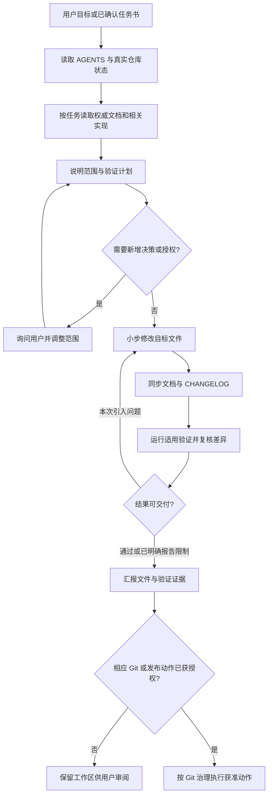

# AI Novel Studio — Agent 开发工作流

> 本文细化 [AGENTS.md](../AGENTS.md) 的仓库开发流程，不另设平行总约束。产品内执行链见 [Agent Runtime](agent-runtime.md)，两者的权限和验证证据不能混用。

## 1. 标准流程



明确、低风险的同会话任务不必为了形式再次生成任务书或等待确认；架构决策、破坏性操作、需求歧义和范围扩展必须先询问。未运行或未通过的门禁不能写成通过；报告限制不等于豁免发布门禁。

## 2. 开始前：确认事实与范围

在实际仓库根目录检查：

```powershell
pwd
git status --short --branch
```

- 读取 `package.json` 的版本和脚本；不要使用旧文档中的固定磁盘路径或按分支名推断版本。
- 若有已有修改，读取与目标重叠的差异并保留用户工作；不能用 reset、checkout、clean 或全文件覆盖来“恢复干净”。
- 按 [AGENTS 查阅表](../AGENTS.md#2-文档查阅与冲突处理) 定位产品、UI、数据、Runtime 或发布资料；先看适用版本/当前状态，再深入相关章节。
- 定位真正的调用路径、状态所有者、测试和跨端契约。文档所述已实现能力应能找到代码或证据，不能只依据目录、类型名或任务书。

修改前给出简短计划：

```text
目标：本次要解决什么
范围：拟修改的文件或模块，必要联动项
不做：不涉及的功能、schema、依赖、版本或发布动作
验证：直接相关测试 + 适用分层门禁
确认点：尚缺的信息或授权；没有则直接执行
```

## 3. 执行中：小步修改与同步

1. 在既有模块边界内修改，优先局部补丁；不顺手重构、不扩大下一版本范围。
2. 行为修复补直接回归测试，跨层契约更新同时检查 TypeScript、Rust、DSH 及备份兼容性中的实际受影响项。
3. 保留作用域、基线、事务、用户确认、幂等与失败关闭检查；UI 内存投影不能替代正式持久化事实。
4. 功能、架构或数据边界变化同步对应文档；纯文档任务只校正文档，不修改业务代码或版本号。
5. 在最终验证前更新根 `CHANGELOG.md`；不要新增逐版本发布说明文件，也不要把历史验收记录改成最新版本证据。

### 使用开发 Skills

从 [开发 Skills 索引](development-skills.md) 选择与当前目标匹配的 `SKILL.md` 并先读取。例如局部修复使用 `bugfix-safe-patch`，文档同步使用 `docs-sync`，构建核查使用 `verify-build`。

Skill 中的示例版本、提交、真实模型调用和发布步骤都不是独立授权。明确需要跨会话/工具交接或复杂版本任务时，才使用 `agent-task-writer` 产出自包含任务书：目标、版本或非版本任务、禁止事项、实现要求、测试与完成格式缺一不可。

## 4. 验证：按范围叠加门禁

[AGENTS 验证矩阵](../AGENTS.md#6-验证矩阵) 定义最低要求，[测试策略](technical/testing.md) 说明完整套件、环境和证据。执行命令先核对 `package.json`，只格式化本次修改文件。

| 场景             | 检查重点                                                                                       |
| ---------------- | ---------------------------------------------------------------------------------------------- |
| 文档             | 文档同步、实际路径/链接、当前版本声明、改动文件格式、diff 范围；涉及版本/路线/发布时加版本同步 |
| 前端/TypeScript  | 直接动态测试、零警告 lint、前端构建；交互变化加对应 UI/E2E                                     |
| Rust/SQLite      | locked check、相关动态测试；版本验收完整串行 Rust 测试；不使用真实用户库                       |
| 桌面/DSH payload | 固定载体、当前 Gateway、真实 Windows Tauri E2E 与 `npm run tauri:build`                        |
| 发布             | `scripts/agent-workflow/verify_project.ps1` 完整矩阵；不能用定向测试替代                       |

所有任务最后执行 `git diff --check` 和 `git status --short`，确认没有混入构建产物、凭据、用户数据或无关文件。纯文档任务不要求完整 Tauri 发布构建，普通任务也不要求自动提交来取得 clean working tree。

### 失败与证据分类

- **本次引入失败**：定位、修复并重跑相关检查，再更新最终结果。
- **既有失败或环境阻碍**：报告具体命令、错误和受影响验收项；不扩大任务或降低断言以取得绿色结果。
- **未运行/跳过**：明确写 `未运行` 或 `NOT_RUN` 及原因；即使脚本退出码为 0，也不能视为目标能力通过。
- **Mock / loopback / 浏览器 / 真实桌面 / live Provider**：分别标明证据范围。真实云端调用需要明确授权和可用凭据，普通文档任务不发起调用。

## 5. 完成与可选 Git 操作

完成汇报遵循 [AGENTS 交付要求](../AGENTS.md#7-文档同步git-与交付)：列出完成内容、主要文件、实际命令与结果、未验证项、剩余风险和 Git 状态。不能把执行计划或历史测试记录当成本次运行结果。

仅在相应动作已经获得用户或已确认任务授权时 commit / push / PR / tag / 发布。获准提交时只暂存相关文件并核对暂存差异；发布遵循 [Git 治理](project/git-workflow.md) 的 PR、门禁、审查、合入 `main`、同步后打不可移动 tag 的顺序。没有授权则交付未提交差异。

## 6. 开发 Agent 与产品 Agent 的区别

| 概念                      | 职责                                                  | 权威入口                                                                                                  |
| ------------------------- | ----------------------------------------------------- | --------------------------------------------------------------------------------------------------------- |
| 仓库开发 Agent            | 在用户授权范围内读代码、修改、测试和更新文档          | [AGENTS.md](../AGENTS.md)                                                                                 |
| 开发辅助 Skills           | 帮助执行当前开发任务，不决定产品方向                  | [development-skills.md](development-skills.md)                                                            |
| 产品 Agent / Task Runtime | 小说任务、模型/工具调度、候选产物、用户决定和安全应用 | [agent-runtime.md](agent-runtime.md)、[对话工作台架构](architecture/conversational-creative-workbench.md) |

多 Agent 评审、确定性章节 Writer、Canonical 只读回合和实验 Harness 的存在，不代表 Writing SubAgent 或 live R4 验收已经完成；实现与准入按当前架构的证据层级分别判断。
