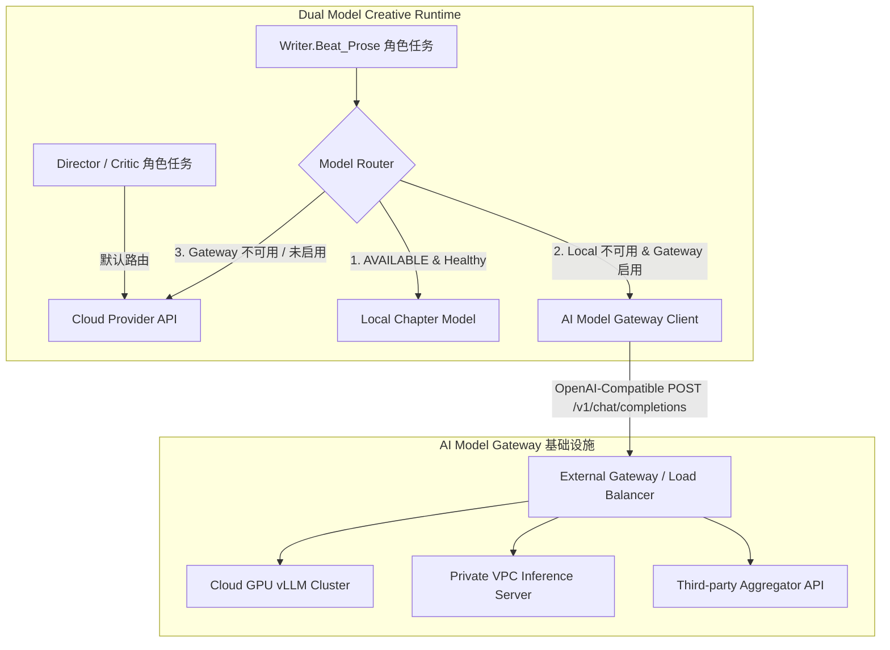

# AI Model Gateway 接入层架构规范

> **状态**：已落地  
> **适用版本**：v3.5.0+  
> **核心定位**：AI Novel Studio 统一外部模型网关客户端接入层，解耦具体模型基础设施与平台业务逻辑。

---

## 1. 架构目标与背景

在长篇小说创作工程中，模型调用呈现异构性：
- **云端通用模型**（Cloud Provider: DeepSeek, OpenAI 等）：擅长世界观构建、人物设定、大纲规划与全局审阅（Director / Critic 角色）。
- **本地微调模型**（Local Chapter Model / llama.cpp 等）：擅长低延迟、离线正文行文创作（Local Writer）。
- **外部模型网关**（**AI Model Gateway**）：用于统一接入云 GPU 算力集群（如 vLLM、Ollama、Triton、One-API、LiteLLM 等私有网关或第三方聚合服务），作为通用 Remote Model Provider。



---

## 2. API 协议标准（OpenAI-Compatible Contract）

AI Model Gateway 客户端严格采用工业标准 **OpenAI Chat Completions API** 规范进行通信：

- **请求路径**：`${baseUrl}/chat/completions`
- **请求方法**：`POST`
- **请求头**：
  ```http
  Content-Type: application/json
  Authorization: Bearer <API_KEY_OR_TOKEN>
  ```
- **核心载荷**：
  ```json
  {
    "model": "qwen35-32b-novel-v1",
    "messages": [
      { "role": "system", "content": "..." },
      { "role": "user", "content": "..." }
    ],
    "temperature": 0.7,
    "top_p": 0.8,
    "max_tokens": 4000,
    "stream": false
  }
  ```

---

## 3. 网络与安全治理策略

### 3.1 网络策略
- **公网访问控制**：如果 Endpoint 位于公网（如 `https://gateway.example.com/v1`），**强制要求 HTTPS** 协议，拒绝明文 HTTP 传输。
- **局域网 / VPC / 私有云支持**：
  - 自动识别 RFC 1918 私有 IP（`10.0.0.0/8`、`172.16.0.0/12`、`192.168.0.0/16`）；
  - 自动识别 RFC 6598 CGNAT / VPC 地址段（`100.64.0.0/10`）；
  - 自动识别回环与局域网域名（`localhost`、`127.0.0.0/8`、`::1`、`.local`、`.internal`、`.lan`）；
  - 私有网络下允许 `http://` 或 `https://` 访问。

### 3.2 鉴权与防匿名调用
- 所有外部网关调用**必须配置非空的 API Key / Token**；
- 拒绝任何匿名（空 Token）远程调用，防止未授权与链路滥用。

### 3.3 凭据隔离与存储安全
- Gateway API Key 仅保留在客户端内存会话中（`SessionCredentials`）；
- 写入 LocalStorage 时统一进行脱敏持久化，杜绝明文凭据泄露。

---

## 4. 配置契约与类型定义

```typescript
export interface GatewayModelConfig {
  enabled: boolean;
  providerId: string;
  baseUrl: string;
  apiKey: string;
  modelName: string;
  timeoutSeconds: number;
  contextTokens?: number;
  maxTokens?: number;
  temperature?: number;
  topP?: number;
  topK?: number;
  repeatPenalty?: number;
  minTokens?: number;
  noRepeatNgramSize?: number;
  seed?: number;
}
```

向下兼容说明：
- 兼容旧版 `remoteWriter` 配置，系统初始化与存储读取时自动无缝迁移至 `gateway`。
