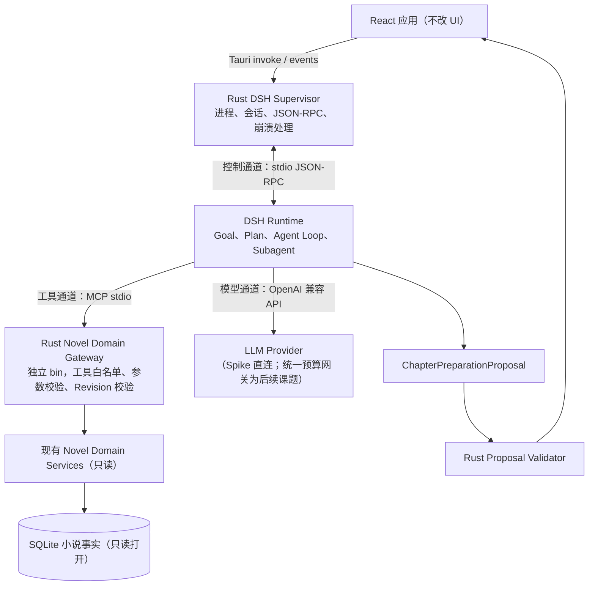

# DSH Feasibility Spike — 设计文档（草案）

> 文件：`docs/architecture/dsh-feasibility-spike.md`
> 状态：草案，待评审
> 用途：定义"DeepSeek Harness 作为 AI Novel Studio 进程外大脑"的验证实验（Spike）边界、架构与验收门槛
> 前置：本 Spike 是 **v3.1.0 立项前的验证**，不是版本开发任务；验收通过后才允许立项 v3.1.0

---

## 1. 背景与定位

AI Novel Studio 已自建完整的小说领域能力（生成、质量、Memory、预算、事务、Safe Apply、自主调度），但通用智能层（模型自主工具选择、会话轨迹、子代理委派、插件化扩展）为固定 DAG 管线。DeepSeek Harness（DSH，MIT，开发者预览 `0.1.0-rc.x`）提供通用 Agent 运行时。

本 Spike 只回答一个问题：

> **在 Windows 上，DSH 能否作为进程外"大脑"，在不触碰现有事实层、预算、事务与用户确认门禁的前提下，产出优于现有 Planner 的章节准备提案？**

不回答：正文生成迁移、UI 形态、打包交付、长期成本模型。这些问题留给 v3.1.0 及之后。

## 2. 权限边界（本 Spike 及后续版本的最高约束）

| 侧 | 拥有 | 不拥有 |
|---|---|---|
| **DSH（大脑）** | 规划、推理、工具选择权、会话轨迹 | 事实解释、策略否决、预算、执行、事务、最终采用 |
| **AI Novel Studio（身体）** | 事实解释、策略否决、预算、执行、事务、最终采用权 | — |

推论：

1. DSH 的产出是 **可验证的 Proposal**，不是决定；Rust 侧 Proposal Validator 校验不通过的提案直接丢弃。
2. DSH **禁止**直接读取小说 SQLite 文件；一切数据只经版本化领域工具（MCP 通道）进出。
3. DSH Session 只保存推理轨迹（提示词、工具调用记录、计划历史），**不保存唯一小说事实**——Session 可删除重建而不损失任何小说数据。
4. 现有 Planner / Multi-Agent / Autonomous 模块全部保留，与 DSH 并行比较，不因功能重叠而删除。

## 3. 架构总览



**Supervisor、Domain Gateway、Model Gateway 是三个职责，不合并为一个 Bridge。**

- Supervisor：由 Tauri 主进程承载，负责 spawn/kill DSH、转发控制帧、崩溃恢复。
- Domain Gateway：独立 Rust bin（`novel-domain-gateway`），由 DSH 以 MCP stdio 子进程 spawn，与 Supervisor 互不通信。
- Model Gateway：Spike 阶段不存在（见 4.3），不写占位代码。

## 4. 三条通道协议

### 4.1 控制通道（Rust Supervisor ↔ DSH，stdio JSON-RPC）

DSH 的 `dsh-sdk-jsonrpc-server` 插件在 stdout 上提供 newline-delimited JSON-RPC 2.0。权威协议见 harness 仓库 `packages/sdk/protocol/README.md` 与 `packages/sdk/server/README.md`。已核实的 Wire 事实：

| 方向 | Method | 说明 |
|---|---|---|
| client→server | `initialize` | 可选 `maxTokens`（每次模型输出的 token 上限）；无效值拒绝初始化 |
| client→server | `session/prompt` | 排队一条用户消息，立即返回 `{ messageId }`；**不返回本次提示的最终结果** |
| client→server | `shutdown` | 优雅退出，退出码 0 |
| server→client | `session.event` | 每个持久化会话事件（含全部 session log envelope） |
| server→client | `session.status` | 整 Agent `running`/`idle` 转换 |
| server→client | `subagent.started` / `subagent.finished` | 子代理生命周期（仅 in-process） |

**必须遵守的协议限制（已官方确认）：**

- **没有单次 Prompt 取消、没有 Session Close 方法**。取消语义 = 杀掉 Runtime 进程重启（Supervisor 的唯一取消手段）。
- **Server→Client 请求是死能力**：传输层支持但服务端从不发送。因此 **DSH 不得反向调用 ANS**；任何审批/写操作请求只能以 Proposal 文本产出，由 Validator + 用户确认闭环完成。
- stdout 只允许 JSON-RPC 帧；spike 的 cordis.yml 不得挂 stdout logger。
- 模型按 session 经 `session/prompt` 传入（spike 固定 deepseek 适配器），不写在 cordis.yml 里钉死。
- 无协议版本协商（`serverInfo.version=0.0.1`）；版本防漂移靠 9 节的固定矩阵，不靠握手。

### 4.2 领域工具通道（DSH ↔ Rust Novel Domain Gateway，MCP stdio）

DSH 的 `@deepseek-ai/dsh-mcp-client` 插件以 stdio spawn 网关进程，将其工具以 `mcp__<serverName>__<rawName>` 注册到模型。已核实的配置事实：

- `serverName` 唯一命名空间（本 Spike 固定为 `novel`）。
- `transport: stdio`，DSH 负责 spawn（command/args/env/cwd），**子进程崩溃自动重连**（默认退避 500ms→30s，每中断最多 10 次）。
- 每个 MCP server 一个插件实例。

Spike 网关暴露 4 个只读工具（模型侧名称）：

```text
mcp__novel__get_metadata           → 复用 novel.read_context@1 语义
mcp__novel__get_chapter_context    → 复用 chapter.read_outline@1 + chapter.read_context@1 语义
mcp__novel__search_memory          → 复用现有 Memory 服务（FTS / 向量 / 结构化过滤）
mcp__novel__get_character_states   → 复用现有角色状态与人物变化轨迹读取
```

硬约束：

- 全部只读（sideEffect = none），无 business.write 权限，无正文生成。
- 每个工具返回体 ≤ 2 MiB，拒绝疑似凭据（沿用 `ai_fact_security` 现有规则）。
- 输入必须携带 `novelId` / `chapterId`，输出必须携带来源 `revision`，供 baseline 校验（见 6.3）。
- 网关以独立 bin 形式**只读**打开 SQLite（`SQLITE_OPEN_READONLY`），不持有写锁。
- Spike 工具走 MCP 通道，**不**进入生产 `tool_registry_v1` 冻结；是否纳入正式 Registry 是 v3.1.0 决策。

### 4.3 模型通道（DSH → LLM Provider）

Spike 直接使用 harness 自带 `@deepseek-ai/dsh-llm-deepseek` 适配器，`DEEPSEEK_API_KEY` / `DEEPSEEK_BASE_URL` 由 Supervisor 以环境变量注入子进程，**不写入 cordis.yml、不进入仓库、不进入 session 日志**。

**统一预算网关是目标，不是现有能力**：DSH 自发的模型调用不经过 ANS 现有 Rust 预算账本（migration 029 的每分钟限流、并发预留、每日预算、结算协议）。Spike 用绝对成本上限兜底（见 8），并在 A/B 报告中记录每案例 token/成本。v3.1.0 前必须二选一并独立验证：

- ANS 提供本地 OpenAI/DeepSeek 兼容代理，DSH `BASE_URL` 指向它；或
- 自定义 DSH LLM Adapter，回调 ANS 现有 AI 执行管线。

## 5. 数据边界

- 小说事实唯一真相：ANS SQLite。网关是唯一读写入口（Spike 只读）。
- DSH Session 根目录（`DSH_SESSION_ROOT`）指向 Spike 专用目录，`DSH_HOME` 隔离，避免污染用户真实 harness 环境。
- `SESSION_FORMAT_VERSION = 0`，无兼容承诺：session 视为可再生缓存，任何时间可整目录删除。
- Proposal 是纯 JSON 文档，校验通过后作为盲评输入，不写入 SQLite（Spike 阶段）。

## 6. 核心接口：`ChapterPreparationPlannerPort`

类型归属 `src/types/`，端口实现归属 `src/services/dsh-spike/`。全部为纯数据 JSON 类型，不持有宿主引用。

### 6.1 端口

```ts
// src/types/chapterPreparation.ts
export interface ChapterPreparationInput {
  novelId: string
  chapterId: string
  /** 调用方已知的各类来源当前修订号；Proposal 必须原样回显且与其一致 */
  baselineRevisions: ChapterBaselineRevision[]
}

export interface ChapterBaselineRevision {
  source: 'outline' | 'chapter_context' | 'style_profile' | 'output_control' | 'character_states' | 'memory_index'
  revision: number
}

export interface ChapterPreparationPlannerPort {
  prepare(input: ChapterPreparationInput): Promise<ChapterPreparationProposal>
}
```

两个实现：

- `CurrentPlannerAdapter`：编排现有 `chapter_readiness_plan_v1` 链路（`create_agent_plan` 等现有命令），把 readiness 结果与工具输出**确定性映射**为 Proposal（无模型调用，成本 ≈ 0，作为对照组）。
- `DshPlannerAdapter`：`invoke('dsh_spike_prepare', …)` 走 Rust Supervisor 驱动 DSH；浏览器开发模式返回明确的"仅 Tauri 可用"错误，不伪造结果。

### 6.2 Proposal Schema

```ts
// src/types/chapterPreparation.ts
export interface ChapterPreparationProposal {
  schemaVersion: 1
  planner: 'current_chapter_readiness_v1' | 'dsh_spike_v0'
  targetChapter: { novelId: string; chapterId: string }
  baselineRevisions: ChapterBaselineRevision[]
  retrievedEvidence: RetrievedEvidenceItem[]
  chapterGoals: string[]
  scenePlan: ScenePlanItem[]
  characterConstraints: CharacterConstraintItem[]
  continuityRisks: ContinuityRiskItem[]
  unresolvedQuestions: string[]
  recommendedActions: RecommendedActionItem[]
  producedAt: string
  metrics: ProposalMetrics
}

export interface RetrievedEvidenceItem {
  source: ChapterBaselineRevision['source']
  revision: number            // 必须与 baselineRevisions 中对应 source 一致
  summary: string
  detailRef?: string
}

export interface ScenePlanItem { title: string; purpose: string; conflicts?: string[] }
export interface CharacterConstraintItem { characterId: string; constraint: string }
export interface ContinuityRiskItem { kind: string; description: string; severity: 'low' | 'medium' | 'high' }
export interface RecommendedActionItem {
  type: 'read_tool' | 'ask_user'   // Spike 只允许这两类；禁止任何写动作
  target?: string
  description: string
}
export interface ProposalMetrics {
  planner: ChapterPreparationProposal['planner']
  durationMs: number
  promptTokens?: number
  completionTokens?: number
  toolCallCount?: number
  processRestarts?: number
}
```

### 6.3 校验（Rust 权威，TS 侧镜像）

- `schemaVersion === 1`；`planner` 枚举合法；`targetChapter` 存在且用户会话归属合法。
- `baselineRevisions` 原样回显；每个 `retrievedEvidence.revision` 与对应 `baselineRevisions` 严格一致，任何不一致 → 整体丢弃并记录（防止大脑使用过期事实）。
- `recommendedActions.type` 只允许 `read_tool` / `ask_user`；出现写动作 → 整体丢弃（越权计数 +1）。
- 全字段长度上限（沿用 toolRegistry 的 schema 上限风格），拒绝超大文档。

## 7. Spike 的 DSH 组合（cordis.yml）

新增 `scripts/dsh-spike/cordis.yml`，只挂最小集合（参照 harness `examples/jsonrpc-agent/cordis.yml`，并移除 bash/fs/subprocess 等全部写能力）：

```yaml
- id: sdk-jsonrpc-server        # '@deepseek-ai/dsh-sdk-jsonrpc-server'
- id: llm-deepseek              # '@deepseek-ai/dsh-llm-deepseek'（thinking 默认）
- id: agent-spine               # '@deepseek-ai/dsh-agent-spine-demo'，persona 指向 scripts/dsh-spike/persona.md
- id: sessions                  # '@deepseek-ai/dsh-session-persistence-jsonl'，root = DSH_SESSION_ROOT
- id: session-checkpoints       # '@deepseek-ai/dsh-session-checkpoint-policy'
- id: token-meter               # '@deepseek-ai/dsh-token-meter'
- id: mcp-novel                 # '@deepseek-ai/dsh-mcp-client'，serverName: novel，stdio spawn novel-domain-gateway
```

明确**不挂**：web-app、bash、fs、terminal、workflow、用户审批 UI 插件、stdout logger。persona（`scripts/dsh-spike/persona.md`）固定为"章节准备规划"角色，并写入：只产出 Proposal JSON、禁止写工具、事实以工具返回为准、不得臆造角色/事件。

## 8. Shadow A/B 与验收门槛

### 8.1 案例集

20 个固定章节案例（`tests/dsh-spike/cases/*.json`）：每个案例包含 `novelId / chapterId / baselineRevisions` 与盲评 rubric；案例集定稿后固化整体 SHA-256。数据来源优先级：

1. 现有开发/测试小说的 SQLite 只读副本（网关直读）；
2. 不足部分用 repo 内 fixture 数据补齐（fixture 属 Spike 测试资产，网关内置 fixture provider，仅测试构建启用）。

### 8.2 流程

同一案例分别经 `CurrentPlannerAdapter` 与 `DshPlannerAdapter` 产出两份 Proposal → Rust Validator 校验 → 脱敏为盲评文档 → 固定 rubric 盲评（人评或评审模型，盲评者不知道 planner 身份）。

### 8.3 验收门槛（全部通过才算 Spike 成功）

| # | 门槛 | 说明 |
|---|---|---|
| 1 | Proposal schema 有效率 100% | 全部 20 案例通过 6.3 校验 |
| 2 | 越权或写工具调用 = 0 | 工具通道 + recommendedActions 双口径 |
| 3 | 严重连续性错误 ≤ 旧 Planner | 同一 rubric 对比 |
| 4 | DSH 盲评胜率 ≥ 60% | 平局计 0.5 |
| 5 | 成本上限 | 见 8.4 |
| 6 | 完整度量记录 | 每案例延迟、token、工具次数、失败恢复、进程退出结果 |

### 8.4 成本门槛（对原方案的修正）

原门槛"DSH 总成本 ≤ 旧 Planner 2 倍"不成立：`CurrentPlannerAdapter` 无模型调用，成本 ≈ 0，任何 2 倍上限都恒不满足。修正为：

- 每案例 prompt+completion 合计 ≤ 40k tokens（软上限，超限案例单独标记）；
- 全 20 案例总成本 ≤ 一次性实验预算（默认 ¥50，可配置）；
- A/B 报告逐案例记录 token / 成本 / 延迟，作为 v3.1.0 经济性立项的输入。

## 9. 版本固定矩阵（写进 Spike 报告，缺一不可）

DSH 是开发者预览，npm/PyPI（`0.1.0-rc.6`）与源码 checkout（`0.1.0-rc.5`）已存在版本错位，且声明未来破坏性变更。Spike 必须记录并固定：

```text
DSH_SOURCE_COMMIT           # harness checkout 的精确 commit
DSH_PACKAGE_LOCK_HASH       # pnpm-lock.yaml 的 SHA-256
DSH_RUNTIME_SHA256          # 实际启动的运行时产物哈希
DSH_WIRE_SCHEMA_VERSION     # SDK 协议语义版本（serverInfo.version）
DSH_SESSION_FORMAT_VERSION  # 恒为 0，无兼容承诺
DSH_CORDIS_CONFIG_HASH      # scripts/dsh-spike/cordis.yml 的 SHA-256
NODE_VERSION                # 本机 v24.15.0 起验证
```

任一字段变化视为新实验，重新跑 20 案例。

## 10. Windows 交付现实（Spike 只验证，不定案）

- Python 单文件 Runtime 官方载体只有 linux-x64 / linux-arm64 / macos-arm64，**无 Windows**（`python/sdk-runtime/platforms.json`）。
- 因此 Spike 载体 = 系统 Node（`^22.19 || >=24`，本机 v24.15.0）+ harness checkout 构建产物。
- Rust 侧定义 `DshRuntimeLauncher` 特征（trait），Spike 只实现 Node 版；将来官方/自建 Windows 单文件 Runtime 可用时替换载体，不改上层协议。

## 11. 执行阶段与出口

| 阶段 | 内容 | 出口条件 |
|---|---|---|
| P1 载体验证 | Rust Supervisor 单测：spawn Node+DSH → initialize → session/prompt → 收 session.event 至 idle → 杀进程重启 → 再初始化成功 | cargo test 全绿；重启延迟与退出码记录在案 |
| P2 领域通道 | novel-domain-gateway bin：4 工具 + 参数/revision 校验 + 只读 SQLite；DSH 能实际调用 mcp__novel__* | 对只读副本 DB 的 4 工具冒烟通过；越权输入被拒 |
| P3 Shadow A/B | 两个 adapter + 20 案例 + Validator + 盲评报告 | 8.3 六项门槛全部通过 |

任何阶段失败：记录失败事实与根因，Spike 终止，产品零影响。

## 12. 风险与回滚

- **回滚**：全部代码在独立 spike 分支（建议 `codex/spike-dsh-feasibility`），不进 main、不打 tag；失败即弃分支。
- **进程泄露**：Supervisor 负责进程树清理（Windows Job Object / kill tree），e2e 中显式验证退出后无残留 node.exe。
- **API Key**：只经环境变量注入；禁止出现在 cordis.yml、日志、测试 fixture、git 历史。
- **session 日志含正文**：工具返回的小说上下文会进入 DSH session JSONL；该目录放在 spike 工作区，随实验清理。

## 13. v3.1.0 立项前置条件

1. Spike 六项门槛全部通过；
2. 模型网关方向二选一完成独立验证（4.3）；
3. Windows 交付载体决策完成（Node sidecar vs 单文件 Runtime）；
4. 按版本任务书流程正式立项（此时才允许动 UI、改 CHANGELOG、定 v3.1.0 号）。

---

> 本文件是 Spike 的权威边界。任务书见 `docs/architecture/dsh-feasibility-spike-taskbook.md`。
