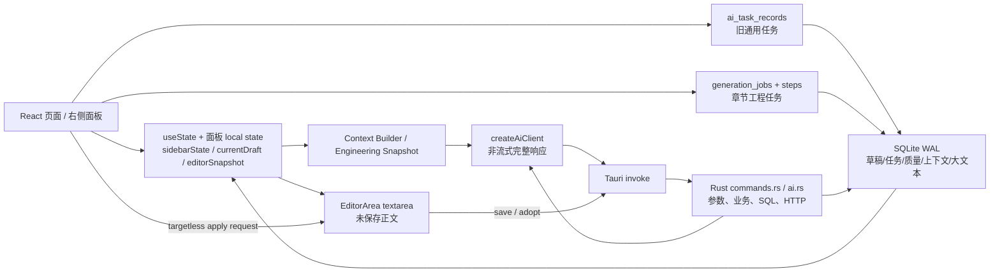

# AI Novel Studio Phase 1 最终审计报告

> 日期：2026-07-10  
> 范围：可信项目基线、状态所有权、AI/正文/质量/放置链路、历史修复复审、回归测试设计  
> 边界：未修改业务源码、Schema、迁移或依赖；未调用真实 AI；未访问真实用户数据；Phase 2 未开始。

## 1. 执行摘要

### 1.1 是否适合继续增加 AI 自动写入能力

**当前不适合直接继续增加“AI 自动写入正式正文/多目标自动放置”能力。**

项目已具备可用基础：SQLite 草稿版本、正式采用概念、较丰富的结构化小说上下文、持久 generation job、质量报告快照/hash、质量修复复检和候选草稿隔离。但正文写入的最后一公里没有统一安全协议：异步结果不校验当前章节，通用 apply 不携带目标/版本/hash，正式采用非事务，大文本完整性失败仍可提交。

在正常单任务路径上，功能可能表现可用；在章节快速切换、未保存正文、迟到响应、DB 超时/部分失败等路径上，存在写错章节、覆盖/丢失正文和正式版本不一致的 P0 风险。

### 1.2 本阶段执行结果

| 项目                   | 结果                                                                                   |
| ---------------------- | -------------------------------------------------------------------------------------- |
| Git 工作区             | 本地 ZIP 无 `.git`，无法判断 clean/commit；远端历史以 GitHub 只读数据补充              |
| 依赖一致性             | `npm ls --depth=0` 通过；package/lock 根版本 2.1.0                                     |
| 前端 lint              | 通过；1 条 hooks dependency warning                                                    |
| 前端构建               | 同快照完整生产构建曾成功；隔离复跑因 Vite 临时配置文件 `EPERM` 失败，TypeScript 已完成 |
| Rust format check      | 失败，多个文件有格式 diff；未执行格式化                                                |
| `cargo check`          | 通过，10 warnings                                                                      |
| `cargo test`           | 2 通过、1 失败                                                                         |
| 前端/脚本测试          | 3 个静态检查通过                                                                       |
| runtime AI task delete | Rust 测试失败，但 PowerShell 脚本错误返回退出 0（假绿）                                |
| 真实 AI / 真实用户库   | 未使用                                                                                 |

详细命令、时间、warning/error：`01-project-baseline.md`。

### 1.3 十五个问题的直接答案

1. 当前正式正文事实来源：`chapter_drafts.is_adopted=1`；不是未维护的 `chapters.adopted_draft_id`。
2. 未保存正文：`EditorArea.content/isDirty` 内存；DB 正文：chapter draft；AI 候选：非 adopted 的 AI source draft。
3. 当前章节：`activeChapterId`；AI 目标章节：旧面板闭包 `chapter.id` 或 `generation_jobs.chapter_id`。
4. AI 任务绑定：固定 project/chapter，但旧任务不绑定正文版本；job 有 context snapshot 但无 base revision/hash 字段。
5. 侧栏关闭：同面板 CSS 隐藏时任务继续；换面板/页面卸载时 local 结果丢失，后台 Promise/DB 写入仍可继续。
6. 流式输出：没有流式实现，因此无 streamed content store。
7. AI 结果应用：面板 `onApplyAiText` → page request → EditorArea 内存 append/replace → 用户另行保存/采用。
8. 多个正文入口：用户编辑、currentDraft effect、onGenerated、generic apply、草稿恢复、质量修复、格式化、保存/采用。
9. 应用前版本检查：generic apply 无；quality fix 有 hash gate。
10. 质量报告：绑定 draft/version/hash/length/time，但缺 task/context snapshot/selection。
11. 自动放置：整体 L2；局部 string patch / setting target 有 L3- 特征，无统一计划/事务/撤销。
12. AI 约束：主要为 prompt + 结构化上下文；硬验证只覆盖质量 hash/scope、有限 patch/type gate。
13. 用户重复输入：选区、当前场景、锁定范围、人物知识/状态、自动放置目标/冲突策略等未被可靠自动补齐。
14. 历史残留：右栏 Store/writingContext 结构已建但未接通；两套 task 系统；`chapters.adopted_draft_id` 未维护；大文本未使用字段/函数。
15. P0：章节切换丢未保存正文、迟到回调错位、targetless apply、非事务 adopt、假保存、大文本 hash/预览链、非幂等超时。

## 2. 当前架构图



关键断点：

- `ai_task_records` 与 `generation_jobs` 是两套模型。
- generation job id 传给 draft `aiTaskId` 时，Rust 只在 `ai_task_records` 查询，因而清空该关联：`commands.rs:1105-1121`。
- `sidebarState.toolStates` 的 stale/output 模型没有具体面板写入。
- Editor 与 DB 之间没有统一 document operation / revision gate。

## 3. 状态所有权表

| 状态                        | 当前所有者                                   | 是否持久 | 事实/缓存                 | 主要风险                                      |
| --------------------------- | -------------------------------------------- | -------: | ------------------------- | --------------------------------------------- |
| 当前项目                    | route `novelId` + page `novel`               |   URL/DB | route 为选择，DB 为事实   | 旧 async 无 page generation guard             |
| 当前章节                    | page `activeChapterId`                       |       否 | UI 选择                   | 先切 ID 后异步 load，无乱序保护               |
| 当前正文草稿                | page `currentDraft`                          |  对应 DB | 页面缓存                  | 可与 active chapter 错配                      |
| 未保存正文                  | `EditorArea.content/isDirty`                 |       否 | 当前编辑会话事实          | 切章/退出无统一保护                           |
| 正式正文                    | `chapter_drafts.is_adopted`                  |       是 | 持久事实                  | adopt 非事务；可能 0 adopted                  |
| `chapters.adopted_draft_id` | chapters 列                                  |       是 | 未接通/不可信             | 当前无写入者                                  |
| AI 旧任务                   | `ai_task_records`                            |       是 | 任务摘要                  | 无 revision/context/selection/progress/cancel |
| 章节工程任务                | `generation_jobs/steps`                      |       是 | 较完整任务                | 无 base version；网络不可取消                 |
| 流式内容                    | 不存在                                       |       否 | 不适用                    | 未来接入前无 sequence/store                   |
| AI 生成结果                 | `chapter_drafts` / step output / panel local |     部分 | 候选                      | UI result 生命周期不统一                      |
| 质量报告                    | `quality_check_reports/items` + page cache   |       是 | draft/hash 快照           | 保存非事务，历史 item 可迁移 report           |
| 自动放置计划                | 无统一实体                                   |       否 | transient patch/candidate | 无版本/锁/事务/撤销                           |
| 面板显示状态                | page `sidebarState` + RightPanel last type   |       否 | UI 状态                   | 收起保留，换面板卸载                          |
| 面板业务状态                | 多数 panel local                             |   多数否 | 业务与 UI 混合            | 切面板/重启丢失                               |
| 长文本全文                  | large text tables + draft ref                |       是 | 正文事实的一部分          | hash 错仍 commit、引用跨命令                  |

完整证据：`02-state-ownership.md`。

## 4. 五条关键时序

### 4.1 AI 生成

```text
用户在章节 A 点击生成
→ fresh context(A)
→ ai_task_record(A) 或 generation_job(A)
→ 非流式 AI（无主动取消）
→ create candidate draft(A)
→ onGenerated(draft A)
→ [缺失：activeChapterId == A 校验]
→ 页面 currentDraft / Editor 可能已是 B
```

DB 目标通常固定 A；UI 回调可能错位到 B。风险 P0。

### 4.2 章节切换

```text
点击 B
→ 只确认 chapter goal dirty
→ [缺失：正文 dirty 保存/丢弃确认]
→ setActiveChapterId(B)
→ loadLatestDraft(B) async
→ [缺失：request id / response target check]
→ setCurrentDraft(last response)
→ Editor effect 无 chapter match，替换全文
```

快速 A→B→C 时，最后返回的旧请求决定编辑器内容。风险 P0。

### 4.3 正文应用

```text
result(A, base unknown)
→ onApplyAiText({mode,text,source})
→ replace 时仅提示 current dirty；append 无提示
→ Editor 当前内容 append/replace，标 dirty
→ [无 DB 应用记录 / 无 target / revision / hash]
→ 用户 Save
→ create/update draft
→ 用户 Adopt
→ 两个非事务 UPDATE 修改 is_adopted
```

风险 P0。

### 4.4 质量检测

```text
当前 editor
→ 必要时保存 source snapshot draft
→ pending report(draft,hash,length,time)
→ AI quality check
→ report completed + merge items（非事务）
→ 当前 hash 变化则 stale
→ AI fix 前阻断 stale
→ scope heuristic → candidate → recheck → compare
```

正文快照绑定方向正确；报告持久化、异步隔离和语义验证仍有 P1/P0 缺口。

### 4.5 自动放置

```text
章节工程 quality item
→ patch {quote,replacement,risk}
→ low + quote exists
→ String.replace 首处
→ 新 candidate draft（不正式 adopt）

设定推演 JSON candidate
→ 用户采纳
→ type switch: character / rule / world
→ 创建正式 target
→ localStorage candidate 标 adopted
```

没有统一 placement plan、base version、lock、diff、事务或整体 undo。整体 L2。

## 5. 历史修复复审结果

### 5.1 历史证据限制

本地无 `.git`，以下“提交”来自远端 GitHub 只读记录；当前实现来自本地静态代码。二者时间/功能高度吻合，但无法证明 ZIP 就是某 SHA，故涉及本地-提交映射的结论最高为“高度可能”。

### 5.2 九项历史问题

| 原问题                | 远端历史/修改文件                                                                                                                                                                                                                                                                                                         | 核心修改方式                                               | 当前使用/覆盖                       | 未覆盖/旧实现                                                          | 判定         | 根因判断                                          |
| --------------------- | ------------------------------------------------------------------------------------------------------------------------------------------------------------------------------------------------------------------------------------------------------------------------------------------------------------------------- | ---------------------------------------------------------- | ----------------------------------- | ---------------------------------------------------------------------- | ------------ | ------------------------------------------------- |
| 1. 面板状态保留       | [c30a7e](https://github.com/Mon-Knight/AI-Novel-Studio/commit/c30a7eca82435dd32ca3cef142c9fd6766901c98)、[a9bcf7](https://github.com/Mon-Knight/AI-Novel-Studio/commit/a9bcf7a80f6ac945439b389be5d98adae1b00c85)；`RightPanel.tsx`, `rightSidebarStore.ts`                                                                | 收起用 CSS hide；新增 toolStates                           | 同一面板收起/展开在用               | 换面板卸载；toolStates 无面板写入；重启丢                              | **表面修复** | 用 keep-mounted 缓解生命周期，业务所有权未迁出 UI |
| 2. 切章关闭/保留面板  | c30a7e；`WritingWorkspacePage.tsx`                                                                                                                                                                                                                                                                                        | 切章不再 close panel，props 感知新章节                     | UI 连续性在用                       | in-flight callback/load 无章节 token，结果错位                         | **表面修复** | 改显示行为，未解决异步目标隔离                    |
| 3. AI 结果应用正文    | c30a7e；`PolishPanel`, `AiGeneratePanel`, page, Editor                                                                                                                                                                                                                                                                    | 新增 append/replace 通用回调                               | 按钮和 Editor effect 在用           | 无 target/revision/hash/idempotency/undo                               | **表面修复** | 增加入口，未建立安全应用协议                      |
| 4. 重生成包含当前正文 | c30a7e；prompt/context/panel                                                                                                                                                                                                                                                                                              | rewrite 传 `currentEditorContent` 为 draftContent          | rewrite 模式在用                    | 无 base snapshot；选区未接；new mode不一定含未保存正文                 | **部分修复** | 数据已进入 prompt，任务版本绑定未完成             |
| 5. 质量结果保存       | [b10010](https://github.com/Mon-Knight/AI-Novel-Studio/commit/b1001099ffa58516329522cacd68f5dfc98a9222)、[0422fa](https://github.com/Mon-Knight/AI-Novel-Studio/commit/0422fa18cf8adb99967289372c47734756f420f8)、[86ea15](https://github.com/Mon-Knight/AI-Novel-Studio/commit/86ea152d8c1fa6c66b7d6cab87b47852681a391d) | DB report/items、页面 lifted state、质量闭环               | chapter/draft/hash/version 绑定在用 | save 非事务；task/context/selection 未绑定；load race                  | **部分修复** | 快照模型基本建立，事务与任务隔离未完成            |
| 6. 长文本目标引用     | [7844b0](https://github.com/Mon-Knight/AI-Novel-Studio/commit/7844b0b38455)；Rust large text + draft service                                                                                                                                                                                                              | 分片事务、draft `large_text_ref_id`                        | >阈值正文在用                       | hash 错继续；draft 引用跨 command；read 失败退预览；unused target_type | **部分修复** | 分片存储解决，端到端原子/完整性未解决             |
| 7. 自动放置           | [59756d](https://github.com/Mon-Knight/AI-Novel-Studio/commit/59756dd66684d37d8f9533b62a154bc251137105)、[bee9ef](https://github.com/Mon-Knight/AI-Novel-Studio/commit/bee9efdf768edb3d024c92f8d6480b65ebbf1d07)                                                                                                          | low-risk quote patch；大纲结果应用当前章；设定 type switch | 局部路径在用                        | 无统一 plan/version/lock/transaction/undo                              | **部分修复** | 局部操作落地，不是通用安全放置架构                |
| 8. 启动白屏           | [d9345e](https://github.com/Mon-Knight/AI-Novel-Studio/commit/d9345e79bff3637018fd3d5615267ee086dddae7) 及当前 `main.tsx/index.html`                                                                                                                                                                                      | 静态 splash；先 mount React，再异步 accent；启动计时       | 当前代码在用                        | 未跑 packaged cold-start/E2E；脚本异常前 splash 可能常驻               | **部分修复** | 正常启动反馈已改善，缺发布态验证                  |
| 9. DB 保存和恢复      | [4091da](https://github.com/Mon-Knight/AI-Novel-Studio/commit/4091da0646b04e78c94f8774ca5550670c616fb0)、[6642f5](https://github.com/Mon-Knight/AI-Novel-Studio/commit/6642f5dda73b48b807fe699e24c66fa7a00728cd)、d9345e                                                                                                  | workspace repository 单源、Tauri 不静默 fallback、草稿版本 | 正常 CRUD 在用                      | 3 秒迟到提交；adopt/quality/large text 边界；无 migration ledger       | **部分修复** | 正常路径统一，故障/并发/恢复语义未完成            |

### 5.3 新旧实现并存

- `ai_task_records` 与 `generation_jobs` 并存，草稿关联只认 old task。
- `chapters.adopted_draft_id` 与 `chapter_drafts.is_adopted` 并存，前者未维护。
- `rightSidebarStore.toolStates` 与各面板 local result 并存，前者未接通。
- `writingContext.selectedText/cursor` 与 `editorSnapshot.selectionStart/end` 并存，未连接。
- quality report 是持久快照，但 issue item 又被当跨报告持续状态修改。

## 6. P0 / P1 / P2 风险清单

### 6.1 P0（从高到低）

| ID    | 风险                                                                                 | 证据                                              | 置信度                             |
| ----- | ------------------------------------------------------------------------------------ | ------------------------------------------------- | ---------------------------------- |
| P0-01 | 切换章节不确认/保存未保存正文，新草稿 effect 直接覆盖                                | page `handleSelectChapter`; Editor effect         | 代码确认                           |
| P0-02 | load/AI/润色/质量迟到回调把 A 草稿装入 B 当前编辑器                                  | `loadChapterDraft`, `handleDraftApplied`, panels  | 代码确认                           |
| P0-03 | 通用 apply 无 target/revision/hash，依赖当前正好打开目标章节                         | page `applyAiTextToEditor`; Editor apply effect   | 代码确认                           |
| P0-04 | `adopt_chapter_draft` 两次 UPDATE 无事务、不查 affected rows、返回查询不约束 chapter | `commands.rs:1169-1189`                           | 代码确认                           |
| P0-05 | 错配 draft/chapter 的 save 可 0 行更新却显示 clean/返回旧草稿                        | `EditorArea.tsx:281-319`; `commands.rs:1145-1165` | 代码确认                           |
| P0-06 | 大文本全文 SHA mismatch 只警告继续 commit                                            | `large_text_save.rs:277-286`                      | 代码确认                           |
| P0-07 | 大文本读取失败静默使用 500 字预览，用户后续保存可形成截断正文                        | `draftVersionService.ts:95-152,222-230,286-294`   | 高度可能                           |
| P0-08 | `dbCall` 3 秒超时不取消 Rust；非幂等写可能“前端失败、DB 成功、用户重试”              | `db.ts:77-124`                                    | 高度可能                           |
| P0-09 | 大文本 document/chunks 与 draft 引用跨 command，无整体事务                           | draft service + large text Rust                   | 代码确认（孤儿）；正文影响高度可能 |

### 6.2 P1

| ID    | 风险                                                             | 证据/影响                                     |
| ----- | ---------------------------------------------------------------- | --------------------------------------------- |
| P1-01 | 切换不同面板/重启丢 local AI 结果与进度                          | RightPanel 动态 component + panel local state |
| P1-02 | old task 缺 target revision/context/selection/progress/cancel    | `AiTaskRecord`/table                          |
| P1-03 | generation job 取消不能终止在途 HTTP，迟到全文仍可进 step output | `runStep` 取消检查时机                        |
| P1-04 | 两套 task 追溯断裂；job 草稿 aiTaskId 被清空                     | Rust 只查 `ai_task_records`                   |
| P1-05 | quality report completed/items 保存非事务                        | commands save result                          |
| P1-06 | 历史 quality item 被改挂新 report，旧报告不能稳定重放            | issue merge SQL                               |
| P1-07 | pending 新报告可遮住旧 completed 报告                            | latest report query 不过滤 status             |
| P1-08 | quality fix `adopted` 不等于正式 adopted draft                   | CheckPanel 只 `onGenerated`                   |
| P1-09 | selection 状态已采集但 writingContext 未接通                     | Editor snapshot vs writingContext             |
| P1-10 | 工程约束主要仅 prompt，无 scene/knowledge/lock validator         | compiler/job                                  |
| P1-11 | 自动放置整体仅 L2，无多目标事务/撤销                             | patch + setting adoption                      |
| P1-12 | runtime 测试脚本吞 cargo 失败，CI 可假绿                         | PowerShell 缺 exit code propagation           |

### 6.3 P2

| ID    | 风险                                                    | 证据/影响                         |
| ----- | ------------------------------------------------------- | --------------------------------- |
| P2-01 | 10 个 Rust warning，含未用结构/字段/函数                | `cargo check`                     |
| P2-02 | hooks dependency warning                                | `ChapterEngineeringPanel.tsx:310` |
| P2-03 | Vite 主 chunk >500k、动态/静态混合导入                  | 前端构建输出                      |
| P2-04 | console/string 日志，无统一 task/chapter/revision trace | 前后端日志实现                    |
| P2-05 | `commands.rs` 同时承担 command/业务/SQL/映射/错误       | 模块职责集中                      |
| P2-06 | `cargo fmt --check` 不通过                              | format baseline                   |

## 7. 减少用户输入的现状差距

### 7.1 已存在且自动利用

- 当前项目/章节；
- active 总纲、分卷大纲、章节大纲及来源 fallback；
- 世界设定、规则、主角与禁止行为；
- 本章角色、必须出场角色、本章事件；
- 前文章节/分卷上下文摘要；
- 风格、输出方案、目标字数；
- quality 的当前全文、draft/version/hash。

### 7.2 系统已有但没有可靠自动使用

- Editor selection offsets：已上报，writingContext 未接。
- 当前未保存全文：rewrite/job 用，旧 new-generation 不稳定使用。
- `character_states.location/health/knowledgeState`：有服务/类型，主 context builder 不读取最新状态。
- Chapter engineering scene/known/unknown/forbidden：会进 prompt，但不判断 active scene，也不验证输出。
- qualityRules 的 manual review/autoFix policy：已保存，job patch 决策未接。
- sidebar tool output/hash：Store 已定义，面板未写入。

### 7.3 系统根本没有完整保存

- 生成时 selection snapshot + base revision；
- 当前光标对应的 active scene；
- 正文锁定 range/field；
- 每个角色在每章的可知事实集合与推导规则；
- 通用 placement plan、operation、confidence、conflict/undo；
- 某个 AI result 实际应用到哪个 document revision 的操作记录。

### 7.4 必须由用户即时决定

- 本次创作意图和审美选择；
- 是否接受有冲突的生成结果；
- 候选人物/设定是否成为正式事实；
- 对真实语义冲突的最终取舍。

任务별详细重复输入表：`06-constraint-gap-analysis.md`。

## 8. AI 约束能力差距

| 层级         | 当前能力                                                                          | 主要差距                                                           |
| ------------ | --------------------------------------------------------------------------------- | ------------------------------------------------------------------ |
| Prompt 建议  | 覆盖人物、世界、剧情、场景、风格、禁止事项                                        | 模型可违背，普通 apply 不阻断                                      |
| 结构化上下文 | ChapterGenerationContext、EngineeringState、ContextSnapshot、quality/fix snapshot | old tasks 无 snapshot id；character state/selection/lock 不完整    |
| 输出结构     | 多个 JSON prompt + 容错 parser                                                    | 无 provider JSON Schema/constrained decoding；自由正文不可结构验证 |
| 程序硬约束   | 配置范围、FK、quality stale hash、fix scope、low-risk quote/type gate             | 无通用 document version/lock/knowledge/scene/placement validator   |
| 生成后审查   | outline/required character check、job quality、fix recheck                        | 覆盖不统一；警告结果仍可 apply/adopt                               |
| 安全应用     | 候选草稿先于正式采用                                                              | apply targetless；adopt 非事务；无 idempotency/diff/undo           |

特别判断：AI 通常不会自动把生成正文设为正式 `is_adopted=1`，这是有效的人工门槛；但质量更优结果会自动载入编辑器，通用 apply 可覆盖当前全文，且最终采用实现不安全，因此不能把“候选草稿”本身视为完整安全保证。

## 9. 测试缺口

### 9.1 当前能证明什么

- TypeScript/Vite/Rust 编译链可工作（受本次 sandbox 临时文件权限限制的复跑已单列）。
- DB legacy characters 迁移和系统强调色 parser 的两个 Rust 测试通过。
- PowerShell 静态脚本可证明部分字段/函数文本存在。

### 9.2 当前不能证明什么

- 章节/项目切换与 in-flight AI 的隔离；
- 未保存正文保护；
- apply target/revision/idempotency；
- adopt/quality/large text 故障时的事务与恢复；
- 取消迟到响应；
- 面板/重启恢复；
- 锁定内容与多目标放置；
- packaged Tauri 冷启动和升级恢复。

### 9.3 确定的测试基础设施问题

`runtime_check_ai_task_delete.ps1` 的内部 cargo test 失败，却返回 npm exit 0。Rust 测试本身又只建 `ai_task_records`，没有建删除逻辑会访问的 child tables。当前“运行时删除测试”既不能通过，也可能在 CI 显示通过。

完整 R01-R20 前置、步骤、预期、当前推测和缺失位置：`07-regression-test-matrix.md`。

## 10. 第二阶段建议

**第二阶段首要主题：建立统一的“正文变更安全门”（固定目标 + 基础版本/hash + 原子采用 + 幂等应用）。**

**选择理由：** 当前最高风险集中在同一边界：AI/历史/质量产生的文本进入 Editor、草稿和正式采用时，没有共同的不变量。先修这个边界，能直接阻断写错章节、覆盖新正文、假保存和 0 adopted；它也是以后 streaming、自动放置和更多 AI agent 能力的前置条件。

**涉及模块：**

- `WritingWorkspacePage` 的 `handleDraftApplied` / `applyAiTextToEditor`；
- `EditorArea` 的 apply/save/adopt；
- `AiTextApplyRequest` 与任务结果元数据；
- `draftVersionService`；
- Rust `update_chapter_draft` / `adopt_chapter_draft`；
- 必要的最小 DB 操作记录/约束（以第二阶段证据和测试决定，不在本阶段设计 Schema）。

**需要先补充的测试：** R03、R04、R08、R11、R12、R14、R15，以及 DB01（不存在 draft）、DB02（跨章 draft）、DB03（0-row update）、DB08（迟到提交）。这些测试必须使用 deferred async 和临时完整 SQLite，不能只做静态字符串断言。

**最小修改边界：**

1. 所有会改变正文的 result/apply 请求携带 `novelId/chapterId/sourceDraftId/sourceRevision/baseContentHash/resultId`。
2. 页面和 Editor 消费前验证目标仍是当前文档且 base 未变化；冲突时拒绝，不静默重定向。
3. 保存对 0 affected rows 返回明确 conflict，前端保持 dirty。
4. 正式采用在一个 Rust/SQLite transaction 中验证 target 属于 chapter，再切换 adopted；失败整体回滚。
5. 以 resultId + target revision 提供最小幂等保护。

**明确不在第二阶段处理的内容：** streaming、全面任务队列重构、状态管理库更换、通用多目标自动放置、人物知识图谱、全部 prompt/质量规则重写、目录重组、warning 清理、UI 美化。

本报告只推荐上述一个主题。Phase 1 到此停止，等待后续任务。
