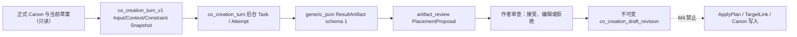

# v2.3.0-M4 — AI 共创协议、数据流与可恢复会话验收说明

日期：2026-07-13

## 1. 里程碑结论

v2.3.0-M4 建立作品级 AI 共创工作区：作者以自然语言逐步讨论故事，系统以固定十阶段组织上下文，经现有后台 Task/DAG 生成结构化 Artifact，再由作者在工作草案中逐项接受、编辑或拒绝。桌面 SQLite 保存会话、消息、草案 revision 和幂等 operation，关闭页面或重启应用后可以恢复已经持久化的会话状态。

本里程碑不把 AI 建议直接写入正式作品数据。正式 Canon、冻结创作意图和当前章节只作为只读上下文；M4 不创建 ApplyPlan 或 TargetLink，不自动采用章节正文，也不实现 Multi-Agent 自主创作。

## 2. 桌面工作区与十阶段协议

正式入口为 `/novels/:novelId/co-creation`。作品详情提供作品级入口，写作工作台可携带 `chapterId` 返回同一章节上下文。布局保持桌面写作软件形态：

- 左侧：固定十阶段进度与切换；
- 中部：作者/AI 对话、下一高价值问题、最多四个快捷回答和输入区；
- 右侧：当前工作草案字段、来源状态、待确认建议、冲突与接受/编辑/拒绝操作。

阶段顺序固定为：

```text
story_seed → creative_intent → world_background → rule_system → protagonist
→ core_conflict → story_arc → outline → chapter_plan → chapter_generation
```

每阶段定义最低完备字段。只有 `user_confirmed` 字段计入 complete；AI 建议、推断、临时假设或冲突最多计入 minimum_complete。系统优先询问第一个未确认的高价值字段，不能把 AI 补全伪装成作者确认。

## 3. 上下文优先级与范围

每轮上下文按以下顺序编译：

1. `formal_project_data`：作品、冻结创作意图、世界设定、规则、主角、选定分卷/章节；
2. `pending_draft`：当前共创工作草案；
3. `session_summary`：旧对话的有界摘要；
4. `recent_messages`：最近 8 条已完成消息，每条最多 4,000 字符。

编译器生成 `sourceManifest` 与 `canonicalDataHash`。章节或分卷不属于当前作品时停止提交；轮次完成前重新编译，如果正式数据或草案 hash 已变化，Artifact 只能标记 stale 并要求重新生成，不能静默合并旧建议。

## 4. CoCreationTurnOutputV1

Provider 只能返回一个 schema 1 JSON 对象。权威字段为：

| 字段 | 约束 |
|---|---|
| `naturalLanguageReply` | 给作者展示的非空自然语言回复 |
| `intent` | 固定意图枚举，不接受未知动作 |
| `currentStage` | 十阶段之一；必须与 completion stage 一致 |
| `extractedInformation` | 目标路径、值、信任状态、来源引用与 0～1 confidence |
| `pendingConfirmations` | 仍需作者决定的事项 |
| `nextHighValueQuestion` | 每轮最多一个问题及其目标字段 |
| `quickReplies` | 最多四个可直接发送的回答 |
| `changeSuggestions` | 原值/建议值、来源、冲突、baseline 与候选 hash；初始 decision 固定为 pending |
| `stageCompletion` | 已完成/缺失最低字段、状态和 0～100 percentage |
| `dataRevision` | 必须原样匹配本轮冻结 revision |

目标对象与字段前缀必须一致；credential key、API Key、Authorization、Bearer、`sk-` 文本，错误 revision、非法 JSON、未知枚举、越界 confidence 和不安全来源均失败关闭。完整结构化 JSON 由 ResultArtifact 保存；对话区只展示 `naturalLanguageReply`。

## 5. 共享 Task → Artifact → Proposal 数据流



Task 必须属于当前作品、`task_type=co_creation_turn`、具有后台 worker，并通过 target hint 与 Input Snapshot 绑定当前 session/user message。Artifact 必须属于同 Task/作品、`artifact_type=generic_json`、schema 1、有效且未 stale。`reviewOutput` 只创建 `confirm_artifact_review` Proposal；Proposal 确认记录审查证据，不等价于业务 Apply。

作者采用建议时，结果先保存为共创草案 revision。建议不得在“只补空白”模式覆盖 `user_confirmed` 字段；阻断冲突必须显式确认；采用前重新编译正式 Canon 与待确认字段并核对 `baseContextHash`，旧上下文建议必须重新生成或合并。

## 6. migration 020 与恢复模型

单个前向 migration `020_co_creation_workspace` 新增：

- `co_creation_sessions`：V1 type 固定为 `ai_co_creation`，每作品/workspace type 只有一个 active session，保存全局 revision/stateHash；
- `co_creation_messages`：连续 sequence、每会话最多一个 pending/running user turn、状态、独立大文本引用、冻结 turn context 和 Task/Artifact 来源；
- `co_creation_draft_revisions`：按 stage 的不可变父链、payload hash、origin 和精确来源；
- `co_creation_operations`：operationId/requestHash 与首次 mutation receipt。

001～019 migration definition/checksum 不得改变。最新 ledger 数量为 19，020 definition checksum 固定为 `6fa0f47a817b5e4bdcdd34ec77dd419b023eb5a8325d35556a7cb4de1d7eaf62`。

所有 mutation 使用 `BEGIN IMMEDIATE`。append、bind 与草案保存执行 session 级 `expectedRevision + expectedStateHash` CAS，草案保存还执行该 stage 的 `expectedDraftRevision + expectedDraftContentHash` CAS。complete/fail 是确定性 terminal operation：以已冻结的 Session/Message/Task/Artifact 身份为基线，在事务内读取当前 session 链并追加结果，因此并行的合法草案编辑不会让已结束 Task 永久停在 running。相同 operation/request 重放首次结果；相同 operation 的不同 payload 失败关闭。

消息正文独立写入 `large_text_documents/chunks`。读取恢复时重新验证 target、分片、长度和 SHA-256；损坏消息或草案不允许被当作空会话覆盖。业务外键均使用 `ON DELETE RESTRICT`，会话、消息、草案和 operation 保留为恢复/审计证据。

## 7. Tauri 命令与浏览器回退

M4 新增八个 Tauri command：

- `open_co_creation_workspace`；
- `read_co_creation_workspace`；
- `recover_co_creation_turn_task`；
- `append_co_creation_user_message`；
- `bind_co_creation_turn_task`；
- `complete_co_creation_turn`；
- `fail_co_creation_turn`；
- `save_co_creation_draft_revision`。

浏览器开发模式按作品保存 schema 1 workspace 与 operation receipts，使用当前上下文作品级串行锁、CAS、写后回读和损坏数据失败关闭。该回退不替代 SQLite 权威来源。

## 8. 自动化验收项

前端专项命令：

```powershell
npm run test:co-creation
```

覆盖页面三栏与十阶段、章节深链、上下文优先级和范围拒绝、阶段推进、旧 revision、字段路径、凭据拦截、建议采用门禁、会话摘要窗口、浏览器重开、幂等、并发冲突、损坏存储与写入失败。

Rust 专项覆盖：

- 文件数据库关闭重开后恢复 session、消息和草案；
- append CAS、相同 operation 重放、不同 payload 冲突；
- 大文本/消息故障注入整体回滚与完整性读取失败关闭；
- Task 类型、worker、session/turn、Input Snapshot 与跨作品校验；
- Artifact 类型、schema、状态、stale、Task/作品范围校验；
- turn 完成、失败、取消和 assistant 插入失败回滚；
- Task 在 bind 前已经完成/失败/取消仍可恢复绑定；非法协议或 stale Artifact 会安全终止 turn；
- stage 草案 r1/r2、父链、stage 级 CAS、不可变与 Message/Task/Artifact 来源；
- credential 拒绝、数据库篡改 fail-closed；
- 空库/旧库升级到 020、重复启动与 001～019 checksum 保持不变。

最终里程碑门禁仍需执行并以实际命令输出为准：

```powershell
npm run test:co-creation
npm run build
cargo test services::co_creation_service::tests -- --nocapture
cargo test migrations::tests -- --nocapture
cargo test
cargo fmt --all -- --check
cargo check
npm run tauri build
git diff --check
git status
```

本说明不把尚未运行或失败的命令写成通过证据；最终 commit/tag 前应补入主任务的真实验证结果。

### M4 最终验证结果

- `npx tsc --noEmit`：通过；
- `npm run lint`：通过（保留基线已有 1 条 Hook warning，本里程碑未新增）；
- `npm run test:co-creation`：10 个文件、50/50 通过；
- `npx vitest run --maxWorkers=1`：54 个文件、243/243 通过；
- `cargo test co_creation`：13/13 通过；
- `cargo test migrations::tests -- --nocapture`：19/19 通过；
- `cargo test`：179/179 通过；
- `cargo fmt --all -- --check`、`cargo check`：通过（保留基线已有 10 条 Rust warning，本里程碑未新增）；
- `npm run build`、`npm run tauri build`：通过，成功生成 MSI 与 NSIS 安装包；
- `git diff --check`：通过。

## 9. M4 明确不做

- 不把共创草案直接写入世界设定、规则、角色、大纲、章节或正文；
- 不创建可执行 ApplyPlan 或 ArtifactTargetLink；
- 不自动采用章节正文，不绕过现有正文候选审查和版本安全门；
- 不实现导演预算/权限的完整运行记账与跨阶段自动规划；
- 不实现 Story State、跨作品记忆、云同步或 Multi-Agent；
- 不修改 Provider 凭据或模型配置，不改变正式应用版本 2.2.0。

正式 Canon 采纳、章节生成交接、导演治理、冲突合并和更高自主度编排留待 M5/M6，以各自独立任务书、测试、commit 和 tag 验收。
