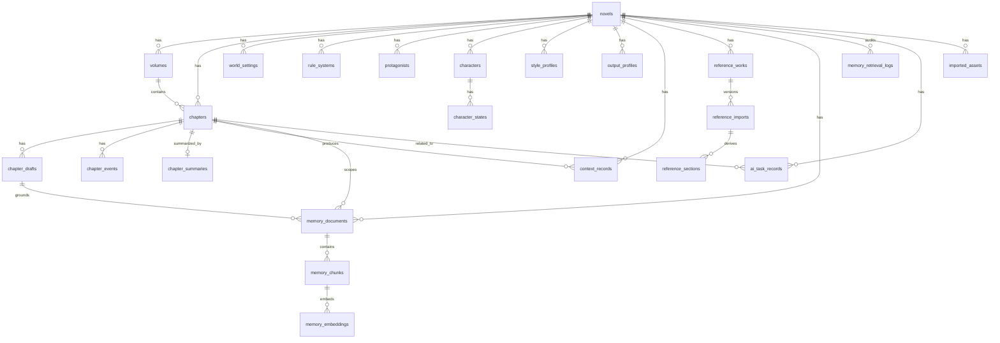

# AI Novel Studio 数据模型设计文档

版本：v0.1.0 草案  
项目名称：AI Novel Studio  
项目路径：F:\ai-novel-studio  
目标平台：Windows 桌面端  
技术路线：Tauri + React + TypeScript + SQLite  
开发方式：VS Code + Copilot / Agent 辅助开发

> 文档演进说明：既有表和 migration 章节描述当前事实；第 40 节记录 v3.3.0+ 对话式工作台事实以及 v3.6.0 候选的决定、采用与 Canonical 边界。首阶段使用 migration 032，并由 migration 033 补充作用域、状态边和不可变事实保护；migration 036 增加 `artifact_decisions` 与 `review_authorizations`。当前完整项目备份 schema 为 11。小说继续是领域数据最高级对象。

---

# 1. 文档目的

本文档用于定义 AI Novel Studio 的核心数据模型、数据关系、状态流转和后续数据库扩展方向。

AI Novel Studio 是一个 Windows 桌面端 AI 小说创作软件。它的核心不是简单保存文本，而是围绕“逐章生成一本小说”的完整工作流保存数据：

```text
小说作品
↓
世界背景 / 规则体系 / 主角 / 特殊能力
↓
分卷大纲 / 章节大纲
↓
风格方案 / 输出控制方案
↓
角色库 / 章节出场角色 / 剧情事件
↓
AI 生成章节正文
↓
用户修改 / 重生成 / 润色 / 检查
↓
确认采用
↓
章节总结 / 角色状态更新 / 上下文沉淀
↓
继续下一章
```

本文档的目标是让 Copilot / Agent 在开发时有明确的数据边界，避免把所有内容混成一个大表或全部写死在前端组件中。

---

# 2. 数据设计核心原则

## 2.1 以小说作品为最高级对象

本项目不再使用旧项目中的“世界项目”作为最高级入口。

最高级对象应是：

```text
Novel / 小说作品
```

世界背景、规则体系、主角、角色、章节、风格方案、输出控制方案都属于某个小说作品。

---

## 2.2 以章节为核心生成单位

AI Novel Studio 不追求一次性生成整本小说。

正文生成、正文草稿、质量检查、章节总结、上下文更新都应围绕章节展开。

核心单位是：

```text
Chapter / 章节
```

每个章节可以有多个正文版本：

```text
ChapterDraft / 章节草稿版本
```

只有用户确认采用的草稿，才会成为章节正式正文，并参与后续上下文总结。

---

## 2.3 AI 结果必须可追踪

AI 生成的内容不能只保存最终文本。

应保存：

```text
任务类型
输入摘要
调用的提示词模板
调用的模型
生成结果
是否被用户采用
生成时间
错误信息
```

这样后续才能回溯：

- 这一章正文是怎么生成的
- 用了哪个风格方案
- 用了哪些角色
- 用户采用了哪个版本
- 哪个 AI 任务失败了

---

## 2.4 复杂配置放在作品详情页，工作台只调用

例如：

- 风格方案
- 输出控制方案
- TXT / JSON 导入结果
- 角色库
- 世界设定
- 大纲

这些数据应在作品详情页或专门管理页维护。

写作工作台只读取和调用这些数据，不应在工作台中维护完整复杂配置。

---

## 2.5 本地优先，SQLite 保存

AI Novel Studio 是 Windows 原生桌面软件，早期版本应优先采用本地 SQLite 保存数据。

后续可扩展云同步，但 v1.0.0 前不作为重点。

---

## 2.6 允许渐进式实现

v0.1.0 不需要一次实现全部表。

第一阶段可以先用 mock 数据与 TypeScript 类型搭建 UI。

后续从 v0.2.0 开始逐步接入 SQLite。

---

# 3. 总体数据模块

建议核心数据模块如下：

```text
AI Novel Studio 数据模块
├─ novels                    小说作品
├─ volumes                   分卷
├─ chapters                  章节
├─ chapter_drafts            章节正文版本
├─ world_settings            世界背景
├─ rule_systems              魔法 / 科技 / 规则体系
├─ protagonists              主角设定
├─ characters                角色库
├─ character_states          角色状态
├─ outlines                  大纲
├─ chapter_events            章节剧情事件
├─ style_profiles            风格方案
├─ output_profiles           输出控制方案
├─ chapter_summaries         章节总结
├─ context_records           上下文记录
├─ reference_works           独立参考作品
├─ reference_imports         不可变导入版本
├─ reference_sections        可重建章节派生记录
├─ memory_documents          可失效的长期 Memory 来源版本
├─ memory_chunks             结构化 Memory 片段
├─ memory_embeddings         显式真实向量
├─ memory_retrieval_logs     检索审计
├─ prompt_templates          提示词模板
├─ ai_task_records           AI 任务记录
├─ imported_assets           导入文件记录
├─ settings                  设置
└─ app_metadata              应用元信息
```

---

# 4. 数据关系总览

## 4.1 核心关系

```text
novels 1 ─── N volumes
novels 1 ─── N chapters
volumes 1 ─── N chapters

chapters 1 ─── N chapter_drafts
chapters 1 ─── N chapter_events
chapters 1 ─── 1 chapter_summaries

novels 1 ─── N characters
characters 1 ─── N character_states

novels 1 ─── N style_profiles
novels 1 ─── N output_profiles

novels 1 ─── N ai_task_records
chapters 1 ─── N ai_task_records

novels 1 ─── N context_records
chapters 1 ─── N context_records

novels 1 ─── N reference_works
reference_works 1 ─── N reference_imports
reference_imports 1 ─── N reference_sections

novels 1 ─── N memory_documents
memory_documents 1 ─── N memory_chunks
memory_chunks 1 ─── N memory_embeddings
novels 1 ─── N memory_retrieval_logs

novels 1 ─── N imported_assets
```

---

## 4.2 推荐 Mermaid 关系图



---

# 5. 表设计总览

## 5.1 v0.1.0 阶段

v0.1.0 主要做 UI 原型，可先不接完整数据库。

建议先准备 TypeScript 类型和 mock 数据：

```text
Novel
Volume
Chapter
ChapterDraft
StyleProfile
OutputProfile
Character
AiTaskRecord
```

---

## 5.2 v0.2.0 至 v0.5.0 阶段优先落库

建议优先实现：

```text
novels
volumes
chapters
chapter_drafts
world_settings
rule_systems
protagonists
style_profiles
output_profiles
settings
ai_task_records
```

---

## 5.3 v0.6.0 之后扩展

后续实现：

```text
characters
character_states
chapter_events
chapter_summaries
context_records
imported_assets
prompt_templates
```

---

# 6. 通用字段规范

多数表建议包含：

```text
id                  主键，建议使用 UUID 字符串
novel_id            所属小说作品 ID
created_at           创建时间
updated_at           更新时间
deleted_at           软删除时间，可选
```

时间格式建议使用 ISO 8601 字符串：

```text
2026-05-17T01:30:00+08:00
```

SQLite 中可用 `TEXT` 保存时间。

---

# 7. 枚举值规范

## 7.1 小说状态 NovelStatus

```ts
export type NovelStatus = 'draft' | 'writing' | 'paused' | 'completed' | 'archived';
```

含义：

```text
draft       草稿
writing     创作中
paused      暂停
completed   已完结
archived    已归档
```

---

## 7.2 章节状态 ChapterStatus

```ts
export type ChapterStatus =
  | 'not_started'
  | 'outline_ready'
  | 'draft_generated'
  | 'editing'
  | 'polished'
  | 'adopted'
  | 'summarized';
```

含义：

```text
not_started       未开始
outline_ready     已有章节大纲
draft_generated   已生成初稿
editing           修改中
polished          已润色
adopted           已采用
summarized        已总结
```

---

## 7.3 草稿来源 DraftSource

```ts
export type DraftSource =
  'ai_generated' | 'ai_regenerated' | 'user_edited' | 'ai_polished' | 'imported';
```

含义：

```text
ai_generated      AI 初稿
ai_regenerated    AI 重生成版本
user_edited        用户修改版本
ai_polished        AI 润色版本
imported           导入正文
```

---

## 7.4 AI 任务类型 AiTaskType

```ts
export type AiTaskType =
  | 'setting_structure'
  | 'rule_structure'
  | 'protagonist_structure'
  | 'volume_outline_expand'
  | 'chapter_outline_generate'
  | 'style_analyze'
  | 'character_generate'
  | 'event_suggest'
  | 'chapter_generate'
  | 'chapter_rewrite'
  | 'chapter_polish'
  | 'quality_check'
  | 'chapter_summarize'
  | 'context_update';
```

---

## 7.5 AI 任务状态 AiTaskStatus

```ts
export type AiTaskStatus = 'pending' | 'running' | 'succeeded' | 'failed' | 'cancelled';
```

---

## 7.6 风格来源 StyleSourceType

```ts
export type StyleSourceType = 'manual' | 'txt_analysis' | 'json_import' | 'system_default';
```

---

## 7.7 事件状态 ChapterEventStatus

```ts
export type ChapterEventStatus =
  'candidate' | 'selected' | 'required' | 'forbidden' | 'adopted' | 'discarded';
```

---

# 8. 核心表详细设计

---

# 8.1 novels：小说作品表

## 作用

保存小说作品的基本信息，是所有创作数据的最高级归属。

## 字段设计

| 字段名             | 类型    | 必填 | 说明                                            |
| ------------------ | ------- | ---: | ----------------------------------------------- |
| id                 | TEXT    |   是 | UUID 主键                                       |
| title              | TEXT    |   是 | 作品名称                                        |
| subtitle           | TEXT    |   否 | 副标题                                          |
| genre              | TEXT    |   否 | 题材，例如玄幻、科幻、奇幻、都市                |
| description        | TEXT    |   否 | 作品简介                                        |
| cover_path         | TEXT    |   否 | 本地封面路径                                    |
| status             | TEXT    |   是 | draft / writing / paused / completed / archived |
| current_volume_id  | TEXT    |   否 | 当前写作分卷                                    |
| current_chapter_id | TEXT    |   否 | 当前写作章节                                    |
| total_word_count   | INTEGER |   是 | 总字数                                          |
| target_word_count  | INTEGER |   否 | 目标总字数                                      |
| last_opened_at     | TEXT    |   否 | 最近打开时间                                    |
| created_at         | TEXT    |   是 | 创建时间                                        |
| updated_at         | TEXT    |   是 | 更新时间                                        |
| deleted_at         | TEXT    |   否 | 软删除时间                                      |

## SQLite 建表示例

```sql
CREATE TABLE IF NOT EXISTS novels (
  id TEXT PRIMARY KEY,
  title TEXT NOT NULL,
  subtitle TEXT,
  genre TEXT,
  description TEXT,
  cover_path TEXT,
  status TEXT NOT NULL DEFAULT 'draft',
  current_volume_id TEXT,
  current_chapter_id TEXT,
  total_word_count INTEGER NOT NULL DEFAULT 0,
  target_word_count INTEGER,
  last_opened_at TEXT,
  created_at TEXT NOT NULL,
  updated_at TEXT NOT NULL,
  deleted_at TEXT
);
```

## TypeScript 类型

```ts
export interface Novel {
  id: string;
  title: string;
  subtitle?: string;
  genre?: string;
  description?: string;
  coverPath?: string;
  status: NovelStatus;
  currentVolumeId?: string;
  currentChapterId?: string;
  totalWordCount: number;
  targetWordCount?: number;
  lastOpenedAt?: string;
  createdAt: string;
  updatedAt: string;
  deletedAt?: string;
}
```

---

# 8.2 volumes：分卷表

## 作用

保存小说分卷结构。一个小说可以有多个分卷。

## 字段设计

| 字段名        | 类型    | 必填 | 说明                          |
| ------------- | ------- | ---: | ----------------------------- |
| id            | TEXT    |   是 | UUID 主键                     |
| novel_id      | TEXT    |   是 | 所属小说                      |
| title         | TEXT    |   是 | 分卷名称                      |
| summary       | TEXT    |   否 | 分卷简介                      |
| goal          | TEXT    |   否 | 分卷目标                      |
| main_conflict | TEXT    |   否 | 分卷主要矛盾                  |
| order_index   | INTEGER |   是 | 排序                          |
| status        | TEXT    |   是 | planned / writing / completed |
| created_at    | TEXT    |   是 | 创建时间                      |
| updated_at    | TEXT    |   是 | 更新时间                      |
| deleted_at    | TEXT    |   否 | 软删除时间                    |

## SQLite 建表示例

```sql
CREATE TABLE IF NOT EXISTS volumes (
  id TEXT PRIMARY KEY,
  novel_id TEXT NOT NULL,
  title TEXT NOT NULL,
  summary TEXT,
  goal TEXT,
  main_conflict TEXT,
  order_index INTEGER NOT NULL DEFAULT 0,
  status TEXT NOT NULL DEFAULT 'planned',
  created_at TEXT NOT NULL,
  updated_at TEXT NOT NULL,
  deleted_at TEXT,
  FOREIGN KEY (novel_id) REFERENCES novels(id)
);
```

## TypeScript 类型

```ts
export interface Volume {
  id: string;
  novelId: string;
  title: string;
  summary?: string;
  goal?: string;
  mainConflict?: string;
  orderIndex: number;
  status: 'planned' | 'writing' | 'completed';
  createdAt: string;
  updatedAt: string;
  deletedAt?: string;
}
```

---

# 8.3 chapters：章节表

## 作用

保存章节基础信息、章节大纲、状态和正式采用正文引用。

正文版本本身不直接放在 chapters 表中，而放在 chapter_drafts 表中。

## 字段设计

| 字段名            | 类型    | 必填 | 说明           |
| ----------------- | ------- | ---: | -------------- |
| id                | TEXT    |   是 | UUID 主键      |
| novel_id          | TEXT    |   是 | 所属小说       |
| volume_id         | TEXT    |   否 | 所属分卷       |
| title             | TEXT    |   是 | 章节标题       |
| outline           | TEXT    |   否 | 章节大纲       |
| goal              | TEXT    |   否 | 本章目标       |
| order_index       | INTEGER |   是 | 排序           |
| status            | TEXT    |   是 | 章节状态       |
| adopted_draft_id  | TEXT    |   否 | 已采用正文版本 |
| word_count        | INTEGER |   是 | 当前正式字数   |
| target_word_count | INTEGER |   否 | 目标字数       |
| created_at        | TEXT    |   是 | 创建时间       |
| updated_at        | TEXT    |   是 | 更新时间       |
| deleted_at        | TEXT    |   否 | 软删除时间     |

## SQLite 建表示例

```sql
CREATE TABLE IF NOT EXISTS chapters (
  id TEXT PRIMARY KEY,
  novel_id TEXT NOT NULL,
  volume_id TEXT,
  title TEXT NOT NULL,
  outline TEXT,
  goal TEXT,
  order_index INTEGER NOT NULL DEFAULT 0,
  status TEXT NOT NULL DEFAULT 'not_started',
  adopted_draft_id TEXT,
  word_count INTEGER NOT NULL DEFAULT 0,
  target_word_count INTEGER,
  created_at TEXT NOT NULL,
  updated_at TEXT NOT NULL,
  deleted_at TEXT,
  FOREIGN KEY (novel_id) REFERENCES novels(id),
  FOREIGN KEY (volume_id) REFERENCES volumes(id),
  FOREIGN KEY (adopted_draft_id) REFERENCES chapter_drafts(id)
);
```

## TypeScript 类型

```ts
export interface Chapter {
  id: string;
  novelId: string;
  volumeId?: string;
  title: string;
  outline?: string;
  goal?: string;
  orderIndex: number;
  status: ChapterStatus;
  adoptedDraftId?: string;
  wordCount: number;
  targetWordCount?: number;
  createdAt: string;
  updatedAt: string;
  deletedAt?: string;
}
```

---

# 8.4 chapter_drafts：章节正文版本表

## 作用

保存同一章节的多个正文版本。

例如：

- AI 初稿
- AI 重生成版
- 用户修改稿
- AI 润色稿
- 导入版本
- 最终采用版本

## 字段设计

| 字段名     | 类型    | 必填 | 说明                                        |
| ---------- | ------- | ---: | ------------------------------------------- |
| id         | TEXT    |   是 | UUID 主键                                   |
| novel_id   | TEXT    |   是 | 所属小说                                    |
| chapter_id | TEXT    |   是 | 所属章节                                    |
| title      | TEXT    |   否 | 草稿标题                                    |
| content    | TEXT    |   是 | 正文内容                                    |
| source     | TEXT    |   是 | ai_generated / user_edited / ai_polished 等 |
| version_no | INTEGER |   是 | 版本号                                      |
| word_count | INTEGER |   是 | 字数                                        |
| is_adopted | INTEGER |   是 | 是否采用，0/1                               |
| ai_task_id | TEXT    |   否 | 来源 AI 任务                                |
| note       | TEXT    |   否 | 用户备注                                    |
| created_at | TEXT    |   是 | 创建时间                                    |
| updated_at | TEXT    |   是 | 更新时间                                    |

## SQLite 建表示例

```sql
CREATE TABLE IF NOT EXISTS chapter_drafts (
  id TEXT PRIMARY KEY,
  novel_id TEXT NOT NULL,
  chapter_id TEXT NOT NULL,
  title TEXT,
  content TEXT NOT NULL,
  source TEXT NOT NULL,
  version_no INTEGER NOT NULL DEFAULT 1,
  word_count INTEGER NOT NULL DEFAULT 0,
  is_adopted INTEGER NOT NULL DEFAULT 0,
  ai_task_id TEXT,
  note TEXT,
  created_at TEXT NOT NULL,
  updated_at TEXT NOT NULL,
  FOREIGN KEY (novel_id) REFERENCES novels(id),
  FOREIGN KEY (chapter_id) REFERENCES chapters(id),
  FOREIGN KEY (ai_task_id) REFERENCES ai_task_records(id)
);
```

## TypeScript 类型

```ts
export interface ChapterDraft {
  id: string;
  novelId: string;
  chapterId: string;
  title?: string;
  content: string;
  source: DraftSource;
  versionNo: number;
  wordCount: number;
  isAdopted: boolean;
  aiTaskId?: string;
  note?: string;
  createdAt: string;
  updatedAt: string;
}
```

## 采用正文规则

当用户点击“确认采用”时：

```text
1. 当前 draft 的 is_adopted 设置为 1
2. 同章节其他 draft 的 is_adopted 设置为 0
3. chapters.adopted_draft_id 更新为当前 draft.id
4. chapters.status 更新为 adopted
5. chapters.word_count 更新为当前 draft.word_count
6. novels.total_word_count 重新统计或增量更新
7. 触发后续章节总结任务
```

## 8.4.1 章节工程中的 Scene/Beat JSON 契约

`chapter_engineering_states.scene_plan_json` 继续作为 JSON 文本保存，不新增 SQLite 列。
每个场景在归一化后包含有序、场景内的 Beat；它与 Autonomous 的跨章节人物演化
`characterBeatIds` 不同：

```ts
interface SceneBeat {
  id: string;
  order: number;
  text: string;
  required: boolean;
  characterIds?: string[];
  stateChange?: string;
}

interface ScenePlanItem {
  // 既有场景字段保持不变
  beats: SceneBeat[];
  contextCapsule?: string;
  constraints?: string[];
  expectedEndState?: string;
  targetCharacters?: number;
}
```

读取旧版本 ScenePlan 时，归一化器按 `keyActions → keyDialogue → informationRelease →
result → transition` 的既有顺序生成 Beat，并重新编号 `sceneNo` 与 `order`；空场景使用一个
可执行的默认 Beat。候选规划只作为 draft/Artifact 保存，用户确认后才可成为 active 状态。
因此本扩展不改变迁移版本，也不改变章节草稿的采用规则。

`generation_step_results` 中带有 `sceneNo / beatOrder / generationUnitNo /
generationUnitCount` 的成功 `draft_generation` 步骤同时构成手动重跑断点。若旧 job 的外部
`chapter_beat_repair` Task 已 `completed` 并绑定有效不可变 Artifact，但当时被语义门禁拒绝，
断点发现也可从 Input Snapshot 的 `generationJobId / contextHash / sceneNo / beatOrder /
scenePlan` 重建单元身份；仅允许 `finish_reason=stop` 的原始 Artifact 先按当前安全边界裁剪，
`length`、来源不一致或旧兼容投影正文都不得参与。断点不新增表或列，只允许在来源 job 已失败、
`compile_context.contextHash` 与当前冻结上下文完全一致、job 的本地 Provider/模型一致时选取
同一 job 的最长连续前缀。编排器仍必须按当前规则重新验证每个 Beat；首个无效、缺失或顺序
不一致的单元会关闭全部后续复用。复用记录通过新 job 步骤中的 `reusedFromJobId` 保留来源，
Token 统计只计算本次真实请求；该机制由用户再次启动生成触发，不把应用重启或网络中断解释为
自动重发授权。

---

# 8.5 world_settings：世界背景表

## 作用

保存作品的大致世界背景。用户不需要填写完整世界观，只需要填写方向性内容。

## 字段设计

| 字段名          | 类型    | 必填 | 说明              |
| --------------- | ------- | ---: | ----------------- |
| id              | TEXT    |   是 | UUID 主键         |
| novel_id        | TEXT    |   是 | 所属小说          |
| title           | TEXT    |   是 | 设定标题          |
| content         | TEXT    |   是 | 世界背景正文      |
| structured_json | TEXT    |   否 | AI 结构化整理结果 |
| is_active       | INTEGER |   是 | 是否当前启用      |
| created_at      | TEXT    |   是 | 创建时间          |
| updated_at      | TEXT    |   是 | 更新时间          |

## TypeScript 类型

```ts
export interface WorldSetting {
  id: string;
  novelId: string;
  title: string;
  content: string;
  structuredJson?: string;
  isActive: boolean;
  createdAt: string;
  updatedAt: string;
}
```

---

# 8.6 rule_systems：规则体系表

## 作用

保存魔法、科技、修炼、能力、战斗等规则体系。

## 字段设计

| 字段名          | 类型    | 必填 | 说明                                                  |
| --------------- | ------- | ---: | ----------------------------------------------------- |
| id              | TEXT    |   是 | UUID 主键                                             |
| novel_id        | TEXT    |   是 | 所属小说                                              |
| title           | TEXT    |   是 | 规则体系名称                                          |
| category        | TEXT    |   否 | magic / technology / cultivation / combat / social 等 |
| content         | TEXT    |   是 | 规则内容                                              |
| forbidden_rules | TEXT    |   否 | 禁止违背内容                                          |
| structured_json | TEXT    |   否 | AI 结构化结果                                         |
| is_active       | INTEGER |   是 | 是否启用                                              |
| created_at      | TEXT    |   是 | 创建时间                                              |
| updated_at      | TEXT    |   是 | 更新时间                                              |

## TypeScript 类型

```ts
export interface RuleSystem {
  id: string;
  novelId: string;
  title: string;
  category?: 'magic' | 'technology' | 'cultivation' | 'combat' | 'social' | 'other';
  content: string;
  forbiddenRules?: string;
  structuredJson?: string;
  isActive: boolean;
  createdAt: string;
  updatedAt: string;
}
```

---

# 8.7 protagonists：主角设定表

## 作用

保存主角基础设定、特殊能力、目标和限制。

一个小说早期可以只有一个主角。后续可支持多主角。

## 字段设计

| 字段名              | 类型 | 必填 | 说明           |
| ------------------- | ---- | ---: | -------------- |
| id                  | TEXT |   是 | UUID 主键      |
| novel_id            | TEXT |   是 | 所属小说       |
| name                | TEXT |   是 | 主角姓名       |
| identity            | TEXT |   否 | 身份           |
| personality         | TEXT |   否 | 性格           |
| goal                | TEXT |   否 | 长期目标       |
| special_ability     | TEXT |   否 | 特殊能力       |
| ability_limits      | TEXT |   否 | 能力限制       |
| forbidden_behaviors | TEXT |   否 | 不能做出的行为 |
| current_state       | TEXT |   否 | 当前状态       |
| created_at          | TEXT |   是 | 创建时间       |
| updated_at          | TEXT |   是 | 更新时间       |

## TypeScript 类型

```ts
export interface Protagonist {
  id: string;
  novelId: string;
  name: string;
  identity?: string;
  personality?: string;
  goal?: string;
  specialAbility?: string;
  abilityLimits?: string;
  forbiddenBehaviors?: string;
  currentState?: string;
  createdAt: string;
  updatedAt: string;
}
```

---

# 8.8 characters：角色库表

## 作用

保存已生成或用户创建的角色。

AI 候选角色被用户选择后，才进入正式角色库。

第二次调用角色时，必须读取已有角色信息，避免长篇割裂。

## 字段设计

| 字段名                      | 类型    | 必填 | 说明                                            |
| --------------------------- | ------- | ---: | ----------------------------------------------- |
| id                          | TEXT    |   是 | UUID 主键                                       |
| novel_id                    | TEXT    |   是 | 所属小说                                        |
| name                        | TEXT    |   是 | 角色姓名                                        |
| role_type                   | TEXT    |   否 | protagonist / supporting / antagonist / neutral |
| identity                    | TEXT    |   否 | 身份                                            |
| faction                     | TEXT    |   否 | 阵营                                            |
| relation_to_protagonist     | TEXT    |   否 | 与主角关系                                      |
| goal                        | TEXT    |   否 | 当前目标                                        |
| personality                 | TEXT    |   否 | 性格特点                                        |
| behavior_limits             | TEXT    |   否 | 行为边界                                        |
| forbidden_behaviors         | TEXT    |   否 | 不能做出的行为                                  |
| first_appearance_chapter_id | TEXT    |   否 | 首次出场章节                                    |
| current_state               | TEXT    |   否 | 当前状态                                        |
| source                      | TEXT    |   是 | manual / ai_generated                           |
| is_active                   | INTEGER |   是 | 是否启用                                        |
| created_at                  | TEXT    |   是 | 创建时间                                        |
| updated_at                  | TEXT    |   是 | 更新时间                                        |

## SQLite 建表示例

```sql
CREATE TABLE IF NOT EXISTS characters (
  id TEXT PRIMARY KEY,
  novel_id TEXT NOT NULL,
  name TEXT NOT NULL,
  role_type TEXT,
  identity TEXT,
  faction TEXT,
  relation_to_protagonist TEXT,
  goal TEXT,
  personality TEXT,
  behavior_limits TEXT,
  forbidden_behaviors TEXT,
  first_appearance_chapter_id TEXT,
  current_state TEXT,
  source TEXT NOT NULL DEFAULT 'manual',
  is_active INTEGER NOT NULL DEFAULT 1,
  created_at TEXT NOT NULL,
  updated_at TEXT NOT NULL,
  FOREIGN KEY (novel_id) REFERENCES novels(id),
  FOREIGN KEY (first_appearance_chapter_id) REFERENCES chapters(id)
);
```

## TypeScript 类型

```ts
export interface Character {
  id: string;
  novelId: string;
  name: string;
  roleType?: 'protagonist' | 'supporting' | 'antagonist' | 'neutral';
  identity?: string;
  faction?: string;
  relationToProtagonist?: string;
  goal?: string;
  personality?: string;
  behaviorLimits?: string;
  forbiddenBehaviors?: string;
  firstAppearanceChapterId?: string;
  currentState?: string;
  source: 'manual' | 'ai_generated';
  isActive: boolean;
  createdAt: string;
  updatedAt: string;
}
```

---

# 8.9 character_states：角色状态表

## 作用

保存角色在不同章节后的状态变化。

这对长篇连续性非常重要。

例如：

```text
第 3 章后，角色 A 受伤
第 6 章后，角色 A 对主角产生怀疑
第 10 章后，角色 A 离开学院
```

## 字段设计

| 字段名               | 类型 | 必填 | 说明             |
| -------------------- | ---- | ---: | ---------------- |
| id                   | TEXT |   是 | UUID 主键        |
| novel_id             | TEXT |   是 | 所属小说         |
| character_id         | TEXT |   是 | 角色 ID          |
| chapter_id           | TEXT |   否 | 产生该状态的章节 |
| state_summary        | TEXT |   是 | 状态摘要         |
| relationship_changes | TEXT |   否 | 关系变化         |
| goal_changes         | TEXT |   否 | 目标变化         |
| location             | TEXT |   否 | 当前地点         |
| health_state         | TEXT |   否 | 身体状态         |
| knowledge_state      | TEXT |   否 | 已知信息         |
| created_at           | TEXT |   是 | 创建时间         |

## TypeScript 类型

```ts
export interface CharacterState {
  id: string;
  novelId: string;
  characterId: string;
  chapterId?: string;
  stateSummary: string;
  relationshipChanges?: string;
  goalChanges?: string;
  location?: string;
  healthState?: string;
  knowledgeState?: string;
  createdAt: string;
}
```

---

# 8.10 outlines：大纲表

## 作用

保存作品级、分卷级、章节级大纲。

也可以在早期将章节大纲直接放在 chapters.outline 中。后续复杂后再拆分。

## 字段设计

| 字段名       | 类型    | 必填 | 说明                     |
| ------------ | ------- | ---: | ------------------------ |
| id           | TEXT    |   是 | UUID 主键                |
| novel_id     | TEXT    |   是 | 所属小说                 |
| volume_id    | TEXT    |   否 | 所属分卷                 |
| chapter_id   | TEXT    |   否 | 所属章节                 |
| outline_type | TEXT    |   是 | novel / volume / chapter |
| title        | TEXT    |   是 | 大纲标题                 |
| content      | TEXT    |   是 | 大纲内容                 |
| order_index  | INTEGER |   是 | 排序                     |
| created_at   | TEXT    |   是 | 创建时间                 |
| updated_at   | TEXT    |   是 | 更新时间                 |

## TypeScript 类型

```ts
export interface Outline {
  id: string;
  novelId: string;
  volumeId?: string;
  chapterId?: string;
  outlineType: 'novel' | 'volume' | 'chapter';
  title: string;
  content: string;
  orderIndex: number;
  createdAt: string;
  updatedAt: string;
}
```

---

# 8.11 chapter_events：章节剧情事件表

## 作用

保存 AI 推荐事件、用户选择事件、必须发生事件、禁止发生事件。

事件是正文生成提示词的重要来源。

## 字段设计

| 字段名                 | 类型 | 必填 | 说明                                                              |
| ---------------------- | ---- | ---: | ----------------------------------------------------------------- |
| id                     | TEXT |   是 | UUID 主键                                                         |
| novel_id               | TEXT |   是 | 所属小说                                                          |
| chapter_id             | TEXT |   是 | 所属章节                                                          |
| title                  | TEXT |   是 | 事件标题                                                          |
| description            | TEXT |   是 | 事件说明                                                          |
| involved_character_ids | TEXT |   否 | 涉及角色 ID，JSON 数组                                            |
| impact                 | TEXT |   否 | 剧情影响                                                          |
| risk                   | TEXT |   否 | 风险提示                                                          |
| status                 | TEXT |   是 | candidate / selected / required / forbidden / adopted / discarded |
| source                 | TEXT |   是 | manual / ai_suggested                                             |
| ai_task_id             | TEXT |   否 | 来源 AI 任务                                                      |
| created_at             | TEXT |   是 | 创建时间                                                          |
| updated_at             | TEXT |   是 | 更新时间                                                          |

## TypeScript 类型

```ts
export interface ChapterEvent {
  id: string;
  novelId: string;
  chapterId: string;
  title: string;
  description: string;
  involvedCharacterIds?: string[];
  impact?: string;
  risk?: string;
  status: ChapterEventStatus;
  source: 'manual' | 'ai_suggested';
  aiTaskId?: string;
  createdAt: string;
  updatedAt: string;
}
```

---

# 8.12 style_profiles：风格方案表

## 作用

保存写作风格画像。

风格方案可以来自：

- 手动创建
- TXT 分析
- JSON 导入
- 系统默认

工作台只调用风格方案，不负责复杂编辑和导入。

## 字段设计

| 字段名                | 类型    | 必填 | 说明                                                 |
| --------------------- | ------- | ---: | ---------------------------------------------------- |
| id                    | TEXT    |   是 | UUID 主键                                            |
| novel_id              | TEXT    |   否 | 所属小说；为空表示全局风格                           |
| name                  | TEXT    |   是 | 风格名称                                             |
| source_type           | TEXT    |   是 | manual / txt_analysis / json_import / system_default |
| source_asset_id       | TEXT    |   否 | 来源导入文件                                         |
| narrative_perspective | TEXT    |   否 | 叙事人称                                             |
| tone                  | TEXT    |   否 | 文风语气                                             |
| pace                  | TEXT    |   否 | 节奏                                                 |
| sentence_style        | TEXT    |   否 | 句式特点                                             |
| dialogue_ratio        | REAL    |   否 | 对话比例                                             |
| description_ratio     | REAL    |   否 | 描写比例                                             |
| psychological_ratio   | REAL    |   否 | 心理描写比例                                         |
| battle_style          | TEXT    |   否 | 战斗描写方式                                         |
| battle_intensity      | TEXT    |   否 | 战斗强度                                             |
| emotion_tendency      | TEXT    |   否 | 情绪倾向                                             |
| chapter_ending        | TEXT    |   否 | 章节结尾方式                                         |
| forbidden_styles      | TEXT    |   否 | 禁用写法，JSON 数组                                  |
| style_summary         | TEXT    |   否 | 风格总结                                             |
| raw_config_json       | TEXT    |   否 | 原始配置 JSON                                        |
| is_active             | INTEGER |   是 | 是否启用                                             |
| created_at            | TEXT    |   是 | 创建时间                                             |
| updated_at            | TEXT    |   是 | 更新时间                                             |

## SQLite 建表示例

```sql
CREATE TABLE IF NOT EXISTS style_profiles (
  id TEXT PRIMARY KEY,
  novel_id TEXT,
  name TEXT NOT NULL,
  source_type TEXT NOT NULL DEFAULT 'manual',
  source_asset_id TEXT,
  narrative_perspective TEXT,
  tone TEXT,
  pace TEXT,
  sentence_style TEXT,
  dialogue_ratio REAL,
  description_ratio REAL,
  psychological_ratio REAL,
  battle_style TEXT,
  battle_intensity TEXT,
  emotion_tendency TEXT,
  chapter_ending TEXT,
  forbidden_styles TEXT,
  style_summary TEXT,
  raw_config_json TEXT,
  is_active INTEGER NOT NULL DEFAULT 1,
  created_at TEXT NOT NULL,
  updated_at TEXT NOT NULL,
  FOREIGN KEY (novel_id) REFERENCES novels(id),
  FOREIGN KEY (source_asset_id) REFERENCES imported_assets(id)
);
```

## TypeScript 类型

```ts
export interface StyleProfile {
  id: string;
  novelId?: string;
  name: string;
  sourceType: StyleSourceType;
  sourceAssetId?: string;
  narrativePerspective?: string;
  tone?: string;
  pace?: string;
  sentenceStyle?: string;
  dialogueRatio?: number;
  descriptionRatio?: number;
  psychologicalRatio?: number;
  battleStyle?: string;
  battleIntensity?: string;
  emotionTendency?: string;
  chapterEnding?: string;
  forbiddenStyles?: string[];
  styleSummary?: string;
  rawConfigJson?: string;
  isActive: boolean;
  createdAt: string;
  updatedAt: string;
}
```

---

# 8.13 output_profiles：输出控制方案表

## 作用

保存章节生成参数。

例如：

- 默认章节
- 战斗章节
- 日常过渡
- 高压冲突
- 结尾爆点

## 字段设计

| 字段名               | 类型    | 必填 | 说明                       |
| -------------------- | ------- | ---: | -------------------------- |
| id                   | TEXT    |   是 | UUID 主键                  |
| novel_id             | TEXT    |   否 | 所属小说；为空表示全局方案 |
| name                 | TEXT    |   是 | 方案名称                   |
| target_word_count    | INTEGER |   否 | 目标字数                   |
| min_word_count       | INTEGER |   否 | 最少字数                   |
| max_word_count       | INTEGER |   否 | 最多字数                   |
| pace_level           | TEXT    |   否 | slow / medium / fast       |
| dialogue_ratio       | REAL    |   否 | 对话比例                   |
| description_ratio    | REAL    |   否 | 描写比例                   |
| battle_intensity     | TEXT    |   否 | low / medium / high        |
| emotion_tendency     | TEXT    |   否 | 情绪倾向                   |
| ending_hook_required | INTEGER |   是 | 是否要求结尾钩子           |
| extra_requirements   | TEXT    |   否 | 额外要求                   |
| forbidden_items      | TEXT    |   否 | 禁止项，JSON 数组          |
| is_default           | INTEGER |   是 | 是否默认                   |
| created_at           | TEXT    |   是 | 创建时间                   |
| updated_at           | TEXT    |   是 | 更新时间                   |

## TypeScript 类型

```ts
export interface OutputProfile {
  id: string;
  novelId?: string;
  name: string;
  targetWordCount?: number;
  minWordCount?: number;
  maxWordCount?: number;
  paceLevel?: 'slow' | 'medium' | 'fast';
  dialogueRatio?: number;
  descriptionRatio?: number;
  battleIntensity?: 'low' | 'medium' | 'high';
  emotionTendency?: string;
  endingHookRequired: boolean;
  extraRequirements?: string;
  forbiddenItems?: string[];
  isDefault: boolean;
  createdAt: string;
  updatedAt: string;
}
```

---

# 8.14 chapter_summaries：章节总结表

## 作用

用户确认采用章节后，AI 自动总结本章内容，用于后续上下文。

## 字段设计

| 字段名               | 类型 | 必填 | 说明                |
| -------------------- | ---- | ---: | ------------------- |
| id                   | TEXT |   是 | UUID 主键           |
| novel_id             | TEXT |   是 | 所属小说            |
| chapter_id           | TEXT |   是 | 所属章节            |
| adopted_draft_id     | TEXT |   是 | 来源正文版本        |
| summary              | TEXT |   是 | 章节摘要            |
| key_events           | TEXT |   否 | 关键事件，JSON 数组 |
| character_changes    | TEXT |   否 | 角色变化，JSON      |
| relationship_changes | TEXT |   否 | 关系变化，JSON      |
| new_foreshadows      | TEXT |   否 | 新增伏笔，JSON      |
| resolved_foreshadows | TEXT |   否 | 已回收伏笔，JSON    |
| next_chapter_hints   | TEXT |   否 | 下一章衔接建议      |
| ai_task_id           | TEXT |   否 | 来源 AI 任务        |
| created_at           | TEXT |   是 | 创建时间            |
| updated_at           | TEXT |   是 | 更新时间            |

## TypeScript 类型

```ts
export interface ChapterSummary {
  id: string;
  novelId: string;
  chapterId: string;
  adoptedDraftId: string;
  summary: string;
  keyEvents?: string[];
  characterChanges?: Record<string, unknown>;
  relationshipChanges?: Record<string, unknown>;
  newForeshadows?: string[];
  resolvedForeshadows?: string[];
  nextChapterHints?: string;
  aiTaskId?: string;
  createdAt: string;
  updatedAt: string;
}
```

---

# 8.15 context_records：上下文记录表

## 作用

保存用于后续章节生成的上下文片段。

上下文不是用户每次手动创建，而是系统根据已采用章节、总结、角色状态自动沉淀。

## 字段设计

| 字段名       | 类型    | 必填 | 说明                                                                   |
| ------------ | ------- | ---: | ---------------------------------------------------------------------- |
| id           | TEXT    |   是 | UUID 主键                                                              |
| novel_id     | TEXT    |   是 | 所属小说                                                               |
| chapter_id   | TEXT    |   否 | 来源章节                                                               |
| context_type | TEXT    |   是 | chapter_summary / volume_summary / character_state / foreshadow / rule |
| title        | TEXT    |   是 | 上下文标题                                                             |
| content      | TEXT    |   是 | 上下文内容                                                             |
| importance   | INTEGER |   是 | 重要程度，1-5                                                          |
| is_active    | INTEGER |   是 | 是否参与后续生成                                                       |
| created_at   | TEXT    |   是 | 创建时间                                                               |
| updated_at   | TEXT    |   是 | 更新时间                                                               |

## TypeScript 类型

```ts
export interface ContextRecord {
  id: string;
  novelId: string;
  chapterId?: string;
  contextType:
    'chapter_summary' | 'volume_summary' | 'character_state' | 'foreshadow' | 'rule' | 'other';
  title: string;
  content: string;
  importance: 1 | 2 | 3 | 4 | 5;
  isActive: boolean;
  createdAt: string;
  updatedAt: string;
}
```

---

# 8.16 prompt_templates：提示词模板表

## 作用

保存不同 AI 分工对应的提示词模板。

模板也可以初期放在 `prompts/` 目录中，后续再同步到数据库。

## 字段设计

| 字段名     | 类型    | 必填 | 说明        |
| ---------- | ------- | ---: | ----------- |
| id         | TEXT    |   是 | UUID 主键   |
| task_type  | TEXT    |   是 | AI 任务类型 |
| name       | TEXT    |   是 | 模板名称    |
| content    | TEXT    |   是 | 模板内容    |
| version    | TEXT    |   是 | 模板版本    |
| is_active  | INTEGER |   是 | 是否启用    |
| created_at | TEXT    |   是 | 创建时间    |
| updated_at | TEXT    |   是 | 更新时间    |

## TypeScript 类型

```ts
export interface PromptTemplate {
  id: string;
  taskType: AiTaskType;
  name: string;
  content: string;
  version: string;
  isActive: boolean;
  createdAt: string;
  updatedAt: string;
}
```

---

# 8.17 ai_task_records：AI 任务记录表

## 作用

保存 Legacy/UI AI 服务的调用记录。正式执行事实管线另使用 `ai_tasks / ai_task_attempts / ai_*_snapshots / result_artifacts`；两者不能互相冒充。

这是调试、回溯、成本估计和用户信任的重要基础。

## 字段设计

| 字段名                          | 类型    | 必填 | 说明                                               |
| ------------------------------- | ------- | ---: | -------------------------------------------------- |
| id                              | TEXT    |   是 | UUID 主键                                          |
| novel_id                        | TEXT    |   否 | 所属小说                                           |
| chapter_id                      | TEXT    |   否 | 所属章节                                           |
| task_type                       | TEXT    |   是 | AI 任务类型                                        |
| status                          | TEXT    |   是 | pending / running / succeeded / failed / cancelled |
| runtime_mode                    | TEXT    |   否 | mock / api；任务创建时的运行模式快照               |
| provider                        | TEXT    |   否 | Provider 标识                                      |
| model_name                      | TEXT    |   否 | 使用模型                                           |
| prompt_template_id              | TEXT    |   否 | 使用提示词模板                                     |
| input_summary                   | TEXT    |   否 | 输入摘要                                           |
| prompt_snapshot                 | TEXT    |   否 | 实际提示词快照，可选                               |
| result_text                     | TEXT    |   否 | AI 输出正文                                        |
| result_json                     | TEXT    |   否 | AI 输出结构化 JSON                                 |
| error_message                   | TEXT    |   否 | 错误信息                                           |
| token_input                     | INTEGER |   否 | 输入 token 数                                      |
| token_output                    | INTEGER |   否 | 输出 token 数                                      |
| token_total                     | INTEGER |   否 | Provider 返回或由输入、输出相加得到的总 token 数   |
| input_price_per_million_tokens  | REAL    |   否 | 任务创建时冻结的输入单价，USD / 百万 Token         |
| output_price_per_million_tokens | REAL    |   否 | 任务创建时冻结的输出单价，USD / 百万 Token         |
| cost_estimate                   | REAL    |   否 | 按冻结单价与实际用量计算的 USD 估算值              |
| cost_currency                   | TEXT    |   否 | 当前固定为 USD                                     |
| cost_status                     | TEXT    |   否 | complete / mock / unpriced / usage_missing         |
| pricing_source                  | TEXT    |   否 | user_configured / mock / unconfigured              |
| duration_ms                     | INTEGER |   否 | 任务耗时（毫秒）                                   |
| started_at                      | TEXT    |   否 | 开始时间                                           |
| finished_at                     | TEXT    |   否 | 结束时间                                           |
| created_at                      | TEXT    |   是 | 创建时间                                           |

## SQLite 建表示例

```sql
CREATE TABLE IF NOT EXISTS ai_task_records (
  id TEXT PRIMARY KEY,
  novel_id TEXT,
  chapter_id TEXT,
  task_type TEXT NOT NULL,
  status TEXT NOT NULL DEFAULT 'pending',
  runtime_mode TEXT,
  provider TEXT,
  model_name TEXT,
  prompt_template_id TEXT,
  input_summary TEXT,
  prompt_snapshot TEXT,
  result_text TEXT,
  result_json TEXT,
  error_message TEXT,
  token_input INTEGER,
  token_output INTEGER,
  token_total INTEGER,
  input_price_per_million_tokens REAL,
  output_price_per_million_tokens REAL,
  cost_estimate REAL,
  cost_currency TEXT,
  cost_status TEXT,
  pricing_source TEXT,
  duration_ms INTEGER,
  started_at TEXT,
  finished_at TEXT,
  created_at TEXT NOT NULL,
  FOREIGN KEY (novel_id) REFERENCES novels(id),
  FOREIGN KEY (chapter_id) REFERENCES chapters(id)
);
```

## TypeScript 类型

```ts
export interface AiTaskRecord {
  id: string;
  novelId?: string;
  chapterId?: string;
  taskType: AiTaskType;
  status: AiTaskStatus;
  runtimeMode?: 'mock' | 'api';
  provider?: string;
  modelName?: string;
  promptTemplateId?: string;
  inputSummary?: string;
  promptSnapshot?: string;
  resultText?: string;
  resultJson?: string;
  errorMessage?: string;
  tokenInput?: number;
  tokenOutput?: number;
  tokenTotal?: number;
  inputPricePerMillionTokens?: number;
  outputPricePerMillionTokens?: number;
  costEstimate?: number;
  costCurrency?: 'USD';
  costStatus?: 'complete' | 'mock' | 'unpriced' | 'usage_missing';
  pricingSource?: 'user_configured' | 'mock' | 'unconfigured';
  durationMs?: number;
  startedAt?: string;
  finishedAt?: string;
  createdAt: string;
}
```

## 成本快照与计量语义

成本字段保存的是**任务创建时的价格快照和执行完成后的本地估算**，不是 Provider 账单：

1. API 模式只有在输入、输出两项 USD / 百万 Token 单价均有效时，`pricing_source` 才为 `user_configured`；只配置一侧按 `unconfigured` 处理，避免用不完整价格低估成本。
2. Mock 模式冻结两项零单价并标记 `pricing_source=mock`。旧记录或未配置价格的任务保留空单价，不回填猜测值。
3. 单价在任务创建时写入，后续修改设置不会改变在途任务或历史任务的计算口径。
4. 成功结算使用 `round((token_input × input_rate + token_output × output_rate) / 1_000_000, 8)`；SQLite 桌面路径和 LocalStorage 开发回退使用相同语义。
5. `failed` / `cancelled` 记录不伪造最终费用。Provider 可能已经对失败前或取消前的用量计费，不能把空值解释为零成本。

| `cost_status`   | 条件                                            | `cost_estimate` 语义        |
| --------------- | ----------------------------------------------- | --------------------------- |
| `complete`      | 两项冻结单价和输入、输出用量均存在              | 有值；按公式计算的 USD 估算 |
| `mock`          | Mock 任务                                       | 固定为 `0`                  |
| `unpriced`      | 未完整配置单价                                  | 空；不以零冒充未知成本      |
| `usage_missing` | 单价已冻结，但 Provider 未返回完整输入/输出用量 | 空；不根据残缺用量外推      |

正式 Provider 执行管线还会把同一组状态、币种、来源、估算值和冻结单价写入白名单 response metadata；Rust 在持久化和重放读取时复验字段组合、范围与 Mock 零成本约束。migration 029 进一步把桌面请求治理升级为应用级 SQLite ledger：全局策略、最近一分钟请求、跨进程 active reservation、每日 Token / 成本和 usage 缺失均在 `IMMEDIATE` 事务中裁决。完成时使用实际 usage；缺 usage、失败、取消或 TTL 回收时保守计入预留值。浏览器开发仍保存 `ai_novel_studio_ai_request_ledger_v1`；它不等于桌面权威事实或 Provider 账单。账单导入、差异对账及 Provider 动态组织额度仍属于后续能力。

---

# 36. v3.0.0 参考资料库与分层风格画像

## 36.1 独立参考作品

参考资料与小说正文是两类不同事实。`reference_works` 只归属 `novel_id`，不拥有 `volume_id / chapter_id`，因此不会进入卷章树，也不会被误采用为正文。

- `id / novel_id / title / purpose / description`
- `revision`：参考作品元数据与当前版本切换的 CAS 版本
- `created_at / updated_at`

`purpose` 当前限定为 `style / research / inspiration`。

## 36.2 不可变导入版本

`reference_imports` 保存每次显式导入的版本事实：

- `version_no / is_current`；每部参考作品恰有一个 current 版本
- `operation_id / request_hash`；提交结果未知时可用原 operation 重放
- 原始文件 `source_sha256 / source_byte_count`
- `detected_encoding / selected_encoding / encoding_source`
- 解码正文 `decoded_text_sha256 / decoded_char_count / decoded_utf8_byte_count`
- `parser_version / section_plan_sha256 / warnings_json`
- 小文本正文或经完整性校验的 `large_text_ref_id`

同一 hash 只用于发现重复，不设唯一约束。用户必须明确选择 `skip / createWork / createVersion`；`skip` 不写业务事实，相同 hash 也可显式创建新版本。

## 36.3 章节派生记录

`reference_sections` 是导入版本的可重建派生事实：

- `order_index / section_kind / title`
- `content_hash / char_count / utf8_byte_count`
- `source_start_utf16 / source_end_utf16` 半开区间，与 WebView `slice` 语义一致
- 复合外键同时约束 import、work 与 novel 作用域

导入事务校验连续序号、正文 hash、码点数、UTF-8 字节数以及权威解码正文的 UTF-16 切片；任一不一致时整笔回滚。

## 36.4 风格画像来源

`style_profiles` 增加：

- `source_reference_work_id / source_reference_import_id`
- `source_content_sha256`
- `source_state`：`none / available / outdated / missing / legacy_unverified`
- `analysis_metadata_json`

分层画像 metadata 只保存模型、Prompt/分析器版本、来源 hash、章节内采样范围、抽象分层结果和置信度，不保存采样原文。参考作品切换版本后旧画像标记 `outdated`；删除参考作品后画像保留、来源 ID 清空、hash 保留并标记 `missing`。

## 36.5 备份与恢复

参考资料首次随完整项目备份 schema 6 加入；schema 7 在此基础上加入混合语义 Memory，当前 schema 11 继续包含这些表并依次追加 Scheduler、正式故事资产、对话工作台和产物决定/审阅授权。导出清空 `source_file_path`；恢复会重映射 work/import/section/operation ID，校验 current 版本唯一性、版本/章节序列、正文 hash、大文本 target 身份和外键，任何篡改均不产生部分写入。schema 2～5 缺少参考表时按空集合兼容恢复。

---

# 37. v3.0.0 混合语义 Memory

migration 026 `026_hybrid_semantic_memory` 建立 SQLite 权威的长期 Memory 事实，冻结 checksum 为 `a8622dab5bf60ec4cc7177437fe2e2c5c5da753045b339cac01b0083ce163b0b`。Memory 只保存来自正式采用链路的可追踪证据，不替代 `chapter_drafts`、`chapter_summaries` 或 `context_records`，也不把参考资料原文混入小说记忆。

## 37.1 `memory_documents`：来源版本与失效状态

每个文档绑定：

- `novel_id / chapter_id / adopted_draft_id`：作品、章节和生成该事实时的正式采用稿。
- `source_type / source_id / source_version / source_hash`：来源类型、稳定身份、单调版本与 SHA-256；类型限定为 `adopted_draft / chapter_summary / context_record`。
- `status`：`active / invalidated`；失效时同时保存 `invalidated_at / invalidation_reason`。
- 有界 `metadata_json`、创建与更新时间。

同一 `(novel_id, source_type, source_id)` 最多一个 active 文档。身份、来源、采用稿、章节与 metadata 不可改写；状态只允许 `active → invalidated`。创建新来源版本会使旧 active 版本失效；章节改采时，草稿采用、旧上下文过期和旧 Memory 失效在同一个 SQLite 事务中提交，任一步失败都会整体回滚。

## 37.2 `memory_chunks`：不可变结构化片段

片段通过 `(document_id, ordinal)` 稳定排序，并保存：

- `text / token_count / content_hash`。
- `importance`（0～1）与可选 `chapter_order_index`。
- 可选 `temporal_start_chapter / temporal_end_chapter`。
- `entity_keys_json / metadata_json`，用于人物、地点、事件与其他结构化过滤。

片段必须与文档保持同一 novel / chapter 作用域；正文、顺序、结构化 metadata 与 hash 创建后不可修改。单文档最多 10,000 个片段、64 MiB 文本，每片最多 128 KiB，避免无界写入。

## 37.3 `memory_embeddings`：显式真实向量

向量按 `(chunk_id, provider, model)` 唯一，保存 `dimension / vector_json / vector_norm / vector_hash / chunk_content_hash`。Rust 只接受调用方显式传入的有限、非零、维度一致向量，并复验片段正文 hash；不使用随机数、词 hash 或其他伪向量冒充语义 embedding。同一作品、Provider 与模型的维度必须一致，维度上限为 8,192。

自动 embedding Provider 适配器和 ANN / HNSW 索引仍是后续增强；它们不得改变“无真实向量时明确降级”的契约。

## 37.4 `memory_retrieval_logs`：有界检索审计

每次检索追加一条不可变日志，记录 query / query-vector hash、过滤器、检索模式、模型身份、FTS 可用性、候选数、选中 chunk ID、逐项评分原因、`top_k / page_offset / token_budget / used_tokens`，但不保存查询原文。

检索始终先限制 `novel_id`，再结合章节范围、来源类型、实体键、importance 与时间范围筛选：

1. FTS5 可用时使用 trigram，运行环境不支持时尝试 unicode61；FTS5 缺失或短中文不适配时使用受作用域约束的 substring / 结构化候选。
2. 提供匹配 provider / model / dimension 的真实 query embedding 时，对最多 500 个候选计算余弦；未提供向量时不生成替代向量。
3. 最终分数综合 semantic、lexical、importance 与 recency，并返回 `matchedBy` 和各分项原因。
4. `topK ≤ 50`、`candidateLimit ≤ 500`、`tokenBudget ≤ 100,000`；分页结果的 `usedTokens` 永不超过本次预算。

检索模式显式区分 `hybrid / semantic_structured / fts_structured / lexical_structured / structured`，调用方可以识别降级，而不是把结构化或字面匹配标记成语义成功。

## 37.5 备份 schema 7（历史基线；当前为 schema 11）

完整项目备份 schema 7 首次包含 `memory_documents / memory_chunks / memory_embeddings / memory_retrieval_logs`；当前 schema 11 在此基础上继续包含这些表，并依次追加 Scheduler、正式故事资产、对话工作台和产物决定/审阅授权。恢复为新作品时重映射文档、片段、向量和日志引用，并校验：

- 来源、采用稿、章节与作品归属。
- active 来源唯一性、版本与 SHA-256。
- 片段顺序、Token / 时间范围、正文 hash 和 JSON metadata。
- embedding 的 provider / model / dimension、向量 hash / norm 与片段内容 hash。
- retrieval log 的候选、选中片段、评分原因和 Token 预算。

schema 2～6 缺少四张 Memory 表时按空集合兼容；任何身份、hash、向量或引用篡改都会在恢复事务提交前失败。

## 37.6 SQLite 长期 Memory 与进程内 Novel Memory

当前仓库同时存在两套名称相近但权威性不同的实现：

| 实现                                             | 存储与生命周期                                                                                                  | 当前定位                        |
| ------------------------------------------------ | --------------------------------------------------------------------------------------------------------------- | ------------------------------- |
| `memoryService` / migration 026                  | SQLite 的 `memory_documents / memory_chunks / memory_embeddings / memory_retrieval_logs`；随 schema 11 备份恢复 | 桌面端长期 Memory 权威事实      |
| `NovelMemoryManager` / `NovelMemoryStateUpdater` | TypeScript 进程内 `Map`；进程退出或 `reset` 后丢失                                                              | 兼容/实验运行态，不是持久事实源 |

进程内 fragment、角色状态、世界状态和 version snapshot 不能写成“已持久化长期记忆”，不能替代采用稿、章节总结、ContextRecord 或 SQLite Memory，也不能作为 Canonical `memory.search` 跨重启稳定性的证据。桌面端 Agent-ready 读取必须以 SQLite 长期事实及其明确降级模式为准；浏览器 LocalStorage 只属于开发回退。

---

# 8.18 imported_assets：导入文件记录表

## 作用

记录用户导入的 TXT / JSON 文件。

导入文件可以用于：

- 风格分析
- 作品正文导入
- 章节上下文分析
- 输出控制方案导入
- 结构化设定导入

## 字段设计

| 字段名                   | 类型 | 必填 | 说明                                                    |
| ------------------------ | ---- | ---: | ------------------------------------------------------- |
| id                       | TEXT |   是 | UUID 主键                                               |
| novel_id                 | TEXT |   否 | 所属小说                                                |
| file_name                | TEXT |   是 | 文件名                                                  |
| file_path                | TEXT |   否 | 本地路径                                                |
| file_type                | TEXT |   是 | txt / json / markdown                                   |
| asset_type               | TEXT |   是 | style_reference / novel_text / config / outline / other |
| content_preview          | TEXT |   否 | 内容预览                                                |
| parsed_json              | TEXT |   否 | 解析后的 JSON                                           |
| related_style_profile_id | TEXT |   否 | 生成的风格方案                                          |
| created_at               | TEXT |   是 | 创建时间                                                |

## TypeScript 类型

```ts
export interface ImportedAsset {
  id: string;
  novelId?: string;
  fileName: string;
  filePath?: string;
  fileType: 'txt' | 'json' | 'markdown' | 'other';
  assetType: 'style_reference' | 'novel_text' | 'config' | 'outline' | 'other';
  contentPreview?: string;
  parsedJson?: string;
  relatedStyleProfileId?: string;
  createdAt: string;
}
```

---

# 8.19 settings：设置表

## 作用

保存软件设置。

包括：

- AI API 配置
- 本地数据路径
- 导出路径
- 界面设置
- 编辑器设置
- AI 请求治理：每分钟请求数、最大并发、每日 Token / 成本预算与预警阈值

## 字段设计

| 字段名     | 类型 | 必填 | 说明                             |
| ---------- | ---- | ---: | -------------------------------- |
| key        | TEXT |   是 | 设置键                           |
| value      | TEXT |   否 | 设置值                           |
| value_type | TEXT |   是 | string / number / boolean / json |
| category   | TEXT |   否 | ai / ui / data / editor          |
| updated_at | TEXT |   是 | 更新时间                         |

## SQLite 建表示例

```sql
CREATE TABLE IF NOT EXISTS settings (
  key TEXT PRIMARY KEY,
  value TEXT,
  value_type TEXT NOT NULL DEFAULT 'string',
  category TEXT,
  updated_at TEXT NOT NULL
);
```

## AI 请求治理设置与 ledger

当前 `AiSettings` 使用以下可选字段：

```text
maxRequestsPerMinute       默认 60，范围 1～120
maxConcurrentAiRequests    默认 2，范围 1～8
dailyTokenBudget           可选本地自然日硬预算
dailyCostBudgetUsd         可选本地自然日估算 USD 硬预算
budgetWarningPercent       默认 80，范围 50～99
```

成本预算只有在输入、输出两项单价均有效时才可启用。桌面端权威设置与 ledger 位于 migration 029 的 `ai_request_policy / ai_request_daily_usage / ai_request_reservations`；设置修改使用 revision CAS，Provider 派发使用 owner/request/hash lease。它们是应用级本机事实，不属于某个项目，也不进入完整项目备份。浏览器开发的瞬时 `ai_novel_studio_ai_request_ledger_v1` 仍只用于当前 WebView 回退。两种模式的估算都不表示 Provider 账单。

## 重要安全规则

API Key 不应明文提交到 GitHub。

在本地保存 API Key 时：

```text
1. 不能写死在代码里
2. 不能打印到日志中
3. UI 中只能显示脱敏结果
4. .env.local 必须加入 .gitignore
```

---

# 9. 索引设计建议

为了保证查询性能，建议增加以下索引：

```sql
CREATE INDEX IF NOT EXISTS idx_volumes_novel_id ON volumes(novel_id);
CREATE INDEX IF NOT EXISTS idx_chapters_novel_id ON chapters(novel_id);
CREATE INDEX IF NOT EXISTS idx_chapters_volume_id ON chapters(volume_id);
CREATE INDEX IF NOT EXISTS idx_chapter_drafts_chapter_id ON chapter_drafts(chapter_id);
CREATE INDEX IF NOT EXISTS idx_characters_novel_id ON characters(novel_id);
CREATE INDEX IF NOT EXISTS idx_character_states_character_id ON character_states(character_id);
CREATE INDEX IF NOT EXISTS idx_chapter_events_chapter_id ON chapter_events(chapter_id);
CREATE INDEX IF NOT EXISTS idx_style_profiles_novel_id ON style_profiles(novel_id);
CREATE INDEX IF NOT EXISTS idx_output_profiles_novel_id ON output_profiles(novel_id);
CREATE INDEX IF NOT EXISTS idx_ai_task_records_novel_id ON ai_task_records(novel_id);
CREATE INDEX IF NOT EXISTS idx_ai_task_records_chapter_id ON ai_task_records(chapter_id);
CREATE INDEX IF NOT EXISTS idx_context_records_novel_id ON context_records(novel_id);
CREATE INDEX IF NOT EXISTS idx_memory_documents_chapter_status
  ON memory_documents(novel_id, chapter_id, status, updated_at DESC);
CREATE INDEX IF NOT EXISTS idx_memory_chunks_novel_chapter
  ON memory_chunks(novel_id, chapter_order_index, chapter_id, importance DESC);
CREATE INDEX IF NOT EXISTS idx_memory_embeddings_model_scope
  ON memory_embeddings(novel_id, provider, model, dimension, chunk_id);
CREATE INDEX IF NOT EXISTS idx_memory_retrieval_logs_novel_created
  ON memory_retrieval_logs(novel_id, created_at DESC, id DESC);
```

---

# 10. 数据状态流转

## 10.1 章节状态流转

```text
not_started
↓
outline_ready
↓
draft_generated
↓
editing
↓
polished
↓
adopted
↓
summarized
```

说明：

```text
not_started       章节刚创建，没有大纲或正文
outline_ready     已有章节大纲
draft_generated   AI 已生成初稿
editing           用户正在修改
polished          AI 已润色
adopted           用户确认采用
summarized        已完成章节总结和上下文更新
```

---

## 10.2 AI 任务状态流转

```text
pending
↓
running
↓
succeeded / failed / cancelled
```

---

## 10.3 角色生成流程

```text
AI 生成候选角色
↓
用户选择角色
↓
写入 characters
↓
加入本章出场角色
↓
章节采用后更新 character_states
↓
下一次出场时读取已有角色资料
```

---

## 10.4 事件生成流程

```text
读取分卷大纲
↓
读取章节大纲
↓
读取前文总结
↓
AI 生成候选事件
↓
用户选择事件
↓
写入 chapter_events，状态 selected / required
↓
正文生成时加入提示词
↓
章节采用后状态变为 adopted
```

---

# 11. 工作台数据读取逻辑

进入写作工作台时，应读取：

```text
1. 当前 novel
2. volumes
3. chapters
4. 当前 chapter
5. 当前 chapter 的 drafts
6. 当前 novel 的 world_settings
7. 当前 novel 的 rule_systems
8. 当前 novel 的 protagonist
9. 当前 novel 的 style_profiles
10. 当前 novel 的 output_profiles
11. 当前 novel 的 characters
12. 当前 chapter 的 chapter_events
13. 当前 novel 的 context_records
```

右侧面板只调用数据，不维护完整复杂配置。

---

# 12. 正文生成所需数据包

生成一章正文时，Prompt Orchestrator 应组合：

```text
1. 小说基本信息
2. 世界背景
3. 规则体系
4. 主角设定
5. 当前分卷大纲
6. 当前章节大纲
7. 已选择出场角色
8. 已选择剧情事件
9. 风格方案
10. 输出控制方案
11. 前文上下文
12. 禁止违背规则
13. 用户临时要求
```

推荐在代码中定义：

```ts
export interface ChapterGenerationContext {
  novel: Novel;
  volume?: Volume;
  chapter: Chapter;
  worldSettings: WorldSetting[];
  ruleSystems: RuleSystem[];
  protagonist?: Protagonist;
  selectedCharacters: Character[];
  selectedEvents: ChapterEvent[];
  styleProfile?: StyleProfile;
  outputProfile?: OutputProfile;
  contextRecords: ContextRecord[];
  userInstruction?: string;
}
```

---

# 13. 本地数据文件位置建议

Tauri 中应使用应用数据目录保存本地数据库。

建议逻辑路径：

```text
%APPDATA%\AI Novel Studio\ai-novel-studio.db
```

或：

```text
%LOCALAPPDATA%\AI Novel Studio\ai-novel-studio.db
```

不要默认把正式数据库放在项目源码目录中。

开发阶段可以临时使用：

```text
F:\ai-novel-studio\data\dev.db
```

但正式版本应使用应用数据目录。

---

# 14. 迁移文件建议

建议建立数据库迁移目录：

```text
src-tauri/
└─ migrations/
   ├─ 0001_init.sql
   ├─ 0002_novel_basic.sql
   ├─ 0003_chapters.sql
   ├─ 0004_ai_tasks.sql
   └─ 0005_context.sql
```

或放在前端统一目录：

```text
database/
└─ migrations/
```

迁移原则：

```text
1. 不要直接手工改生产数据库
2. 每个版本新增表或字段必须有迁移文件
3. 迁移文件命名要有序号
4. GitHub 只提交迁移脚本，不提交用户数据库文件
```

---

# 15. Git 忽略规则建议

`.gitignore` 应忽略：

```gitignore
node_modules/
dist/
target/
.env
.env.local
*.db
*.sqlite
*.sqlite3
*.log
.DS_Store
```

如果需要保留开发示例数据库，应使用：

```text
data/example.db
```

但一般不建议提交真实数据库。

---

# 16. TypeScript 类型目录建议

建议将类型拆分到：

```text
src/types/
├─ novel.ts
├─ volume.ts
├─ chapter.ts
├─ character.ts
├─ style.ts
├─ output.ts
├─ context.ts
├─ ai.ts
└─ settings.ts
```

不要把所有类型堆在一个文件中。

---

# 17. 服务层目录建议

建议数据访问和业务逻辑分层：

```text
src/services/
├─ database/
│  ├─ db.ts
│  ├─ novelRepository.ts
│  ├─ chapterRepository.ts
│  ├─ characterRepository.ts
│  ├─ styleRepository.ts
│  └─ aiTaskRepository.ts
│
├─ ai/
│  ├─ aiClient.ts
│  ├─ aiTypes.ts
│  └─ aiTaskService.ts
│
├─ prompt/
│  ├─ promptOrchestrator.ts
│  ├─ promptTemplateService.ts
│  └─ contextBuilder.ts
│
└─ import/
   ├─ txtImportService.ts
   └─ jsonImportService.ts
```

组件层不要直接拼复杂提示词，也不要直接操作数据库 SQL。

---

# 18. v0.1.0 数据实现范围

v0.1.0 不要求真实数据库完整可用。

应完成：

```text
1. 定义核心 TypeScript 类型
2. 准备 mock novel 数据
3. 准备 mock chapter 数据
4. 准备 mock style profile 数据
5. 准备 mock output profile 数据
6. 首页作品卡片使用 mock 数据
7. 工作台章节树使用 mock 数据
8. 右侧面板使用 mock 数据
```

v0.1.0 不做：

```text
1. 正式 SQLite 数据库
2. 完整 migration 系统
3. 真实 AI 任务记录
4. 真实 TXT / JSON 导入
5. 真实上下文总结
```

---

# 19. v0.2.0 数据实现范围

v0.2.0 建议实现：

```text
1. SQLite 初始化
2. novels 表
3. world_settings 表
4. rule_systems 表
5. protagonists 表
6. settings 表
7. 新建小说作品落库
8. 编辑基础设定落库
```

---

# 20. v0.3.0 数据实现范围

v0.3.0 建议实现：

```text
1. volumes 表
2. chapters 表
3. 分卷管理
4. 章节管理
5. 章节大纲保存
6. 工作台左侧章节树读取真实数据
```

---

# 21. v0.5.0 数据实现范围

v0.5.0 建议实现：

```text
1. chapter_drafts 表
2. ai_task_records 表
3. prompt_templates 表
4. AI 生成结果保存为草稿
5. 重新生成保存新版本
6. 用户修改保存为 user_edited 版本
7. 确认采用更新 chapters.adopted_draft_id
```

---

# 22. v0.6.0 数据实现范围

v0.6.0 建议实现：

```text
1. style_profiles 表
2. output_profiles 表
3. imported_assets 表
4. TXT 风格文本导入记录
5. JSON 风格配置导入记录
6. 风格画像保存
7. 工作台调用风格方案和输出控制方案
```

---

# 23. v0.7.0 数据实现范围

v0.7.0 建议实现：

```text
1. characters 表
2. character_states 表
3. chapter_events 表
4. AI 候选角色保存
5. 用户选择角色进入角色库
6. AI 推荐事件保存
7. 用户选择事件用于正文生成
```

---

# 24. v0.8.0 数据实现范围

v0.8.0 建议实现：

```text
1. chapter_summaries 表
2. context_records 表
3. 章节采用后自动总结
4. 更新角色状态
5. 生成下一章上下文
```

---

# 25. 数据安全与隐私

## 25.1 API Key

API Key 只允许存在于当前应用进程内的会话凭据注册表，并按 `scope + providerId + baseUrl + modelId` 精确绑定。应用退出后注册表自然销毁；切换模型、Provider 或 Base URL 时不得沿用其他身份的 Key。

必须做到：

```text
1. 不写死在代码里
2. 不提交 GitHub
3. 不在日志中输出
4. UI 中脱敏显示
5. 不写入 SQLite、LocalStorage、项目备份或应用自有同步服务
6. TaskConversation.defaultModel 与 TaskRun.modelSnapshot 只保存无凭据模型快照
7. TypeScript、Rust 与项目备份导入/导出边界递归拒绝 apiKey、x-api-key、openaiApiKey、credentials、Authorization、Token 等凭据形态
```

真实模型调用时，鉴权信息只发送到与该会话凭据精确绑定的 Provider Endpoint，不得因当前设置变化而改投其他地址。若后续引入系统凭据管理或云同步，必须另行设计、评审并保持项目数据与凭据隔离。

---

## 25.2 用户作品数据

用户小说正文、设定、大纲属于隐私数据。

默认应保存在本地，不上传云端。

---

## 25.3 AI 任务记录

AI 任务记录可以保存结果和摘要。

但要注意：

```text
1. 不保存 API Key
2. 不保存敏感凭据
3. 如保存完整 prompt_snapshot，应让用户可以清理
4. 后续可提供“清理 AI 调用记录”功能
```

---

# 26. 数据模型最高优先级总结

AI Novel Studio 的数据模型应服务于以下目标：

```text
第一：以小说作品 Novel 为最高级对象
第二：以章节 Chapter 为正文生成单位
第三：同一章节支持多个正文版本 ChapterDraft
第四：AI 生成结果必须可追踪 AiTaskRecord
第五：风格方案和输出控制方案可复用
第六：角色状态和章节总结必须沉淀，保证长篇连续性
第七：工作台只调用数据，不承担复杂配置管理
第八：本地 SQLite 优先，保护用户作品数据
第九：分阶段实现，不在 v0.1.0 一次做完所有表
第十：代码中必须有明确 TypeScript 类型和服务层，避免数据逻辑散落在组件中
```

所有后续开发都应围绕以上数据原则展开。

---

# 27. v2.1.7 质量历史快照与当前状态

v2.1.7 将质量检查的“历史检测事实”和“当前问题处理状态”分开存储。该边界高于早期示例结构，后续修改质量链路时必须保持。

## 27.1 `quality_check_reports`：一次检查的不可变头部

每次质量检查创建独立报告。报告必须绑定：

```text
novel_id
chapter_id
draft_id
ai_task_id
content_hash / content_length
checked_at / created_at
```

只有在全部问题和当前状态成功写入后，报告才能从 `pending` 转为 `completed`。已 completed 报告只允许使用原 `ai_task_id` 幂等读取，不得替换评分、摘要、成员或 Task 绑定。

`ai_task_id` 为新报告必填。目标 Task 必须存在，`task_type = 'quality_check'`，`status = 'succeeded'`，且作品和章节归属与报告一致。

## 27.2 `quality_check_items`：报告内不可变问题快照

每个 item 只属于一份报告。复检再次出现同一 `issue_key` 时仍创建新 item ID，不得改写旧 item 的 `report_id`、检测字段或快照状态。

`sort_order` 是报告内的稳定顺序，从 0 递增。原始快照按 `sort_order ASC, id ASC` 读取。同一输入报告中不得出现重复 `issue_key`；重复时整份报告保存失败并回滚。

item 中的 `status` / `resolution_note` / `resolved_at` 只是生成当时的原始快照。回放历史报告时必须返回这些原始值，不覆盖当前工作流状态。

## 27.3 `quality_issue_states`：当前可变工作流

```text
PRIMARY KEY: (chapter_id, issue_key)
UNIQUE: id
status: pending / resolved / ignored
resolution_note
resolved_at
created_at / updated_at
```

当前报告的问题列表以 item 为检测事实，再按 `(chapter_id, issue_key)` 覆盖状态。历史报告 item 不允许修改该表；单条和批量状态更新都必须在 SQLite 事务中完成。

新报告再次发现旧问题时：

```text
ignored -> ignored
resolved -> pending
pending  -> pending
```

如果一份旧 pending 报告在更新 completed 报告之后才返回，它只能保存自身快照，不能更新 `quality_issue_states`。判断依据为 `created_at DESC, id DESC` 中是否存在更新 completed 报告；较新但 pending / failed 的报告不阻止当前最新完整报告刷新状态。

## 27.4 原子性和查询规则

```text
report ownership / AI Task / duplicate key validation
-> insert every immutable item
-> upsert eligible current states
-> mark report completed
-> read back report and items
-> commit
```

上述步骤必须位于同一 `IMMEDIATE` 事务。任意失败都不得留下 completed 报告、部分 item 或部分状态。

- 最新当前查询：只查 `status = 'completed'`，按 `created_at DESC, id DESC` 取一条。
- 历史列表：只列 completed，使用同一稳定顺序。
- 历史回放：按 report ID 返回原始 item，不 join 当前状态。
- 当前问题：仅对最新 completed 报告 join 当前状态。

## 27.5 完整备份

`schemaVersion: 3` 导出 `quality_issue_states`。schema 2 导入仍被支持，但必须在恢复事务内按每个 `(chapter_id, issue_key)` 的 item `updated_at DESC, rowid DESC` 合成旧模型最后保存的可变状态，并按 `report_id` 分组补齐缺失的 `sort_order`，不得依赖导入后重启再修复。

## 27.6 唯一质量修稿轮次与阶段恢复

`quality_fix_runs` 以不可变源草稿身份约束外部质量修稿：同一
`(chapter_id, source_draft_id)` 只能创建一条运行记录。失败或取消的 Provider 修稿也会耗尽该源草稿的唯一轮次；自动流程不得通过新建 generation job 绕过。

质量闭环以已有 `chapter_drafts + quality_check_reports/items` 为恢复起点：

```text
源草稿 + 完整初评
-> 一次 issue-bound changed_ranges
-> 未采用目标草稿
-> 一次复评报告
```

- `changed_ranges_json` 保存绑定 `issue_key` 的精确 `before / after` 与源草稿 UTF-16 offset。目标草稿尚未保存就中断时，只能在源草稿 ID、版本和正文 hash 全部一致后确定性重放这些替换；不得再次调用外部修稿。
- 目标草稿创建使用修稿 run 派生的稳定 operation identity。`target_draft_id/version/content_hash` 写入后，恢复只允许读取该草稿并继续缺失的复评阶段。
- `after_report_id` 存在时，重复继续操作只回读并复验目标草稿与不可变复评报告，不再次评分。
- 修稿版始终保持 `chapter_drafts.is_adopted = 0`。复评通过只表示候选达到 `score >= 80` 且 pending critical/high 为 0，不得更新 `chapters.adopted_draft_id`，也不得提前使正式章节/分卷上下文过期。
- 复评无论通过、改善或仍失败，只要 Provider 结果有效，都保存为独立 completed 报告；仍未过门禁时保留未采用候选并转人工处理。

---

# 28. v2.1.8 章节上下文持久化一致性

v2.1.8 不修改 SQLite 表结构，而是收紧现有 `chapter_summaries`、`context_records`、`character_states`、`characters` 与 `chapters` 的写入和读取边界。本节高于第 8 节的早期示例；后续修改章节上下文链路时必须保持这些约束。

## 28.1 桌面端单一事实源

```text
Tauri 桌面模式 -> SQLite 是唯一事实源
浏览器开发模式 -> LocalStorage 回退
```

- 运行在 Tauri 中时，章节总结、上下文记录和角色状态的读取、创建、更新、过期与删除都必须通过 Rust IPC 落到 SQLite。
- 任一 IPC 失败必须向上传播。不得在 `catch` 中改写 LocalStorage、返回伪造 DTO 或继续显示保存成功。
- LocalStorage 只承担浏览器开发回退和旧数据迁移输入，不是桌面端 SQLite 的镜像或第二权威副本。

## 28.2 稳定身份与查询规则

`context_records.id` 是跨前端、IPC 和 SQLite 的稳定 UUID：

```text
调用方生成 id
-> Rust 校验 id 与作品 / 章节 / 分卷归属
-> SQLite 使用同一 id 插入或更新
-> read-back 返回同一 id
```

禁止 Rust 丢弃有效的调用方 ID 后生成新 ID。更新必须按 ID 命中恰好一条已有记录，且不得改变其 `novel_id`；未命中或归属不一致返回明确错误。

章节总结按作品查询时，底层记录使用以下稳定次序：

```text
章节 order_index ASC
-> chapter_id ASC
-> updated_at DESC
-> created_at DESC
-> id DESC
```

服务层据此为每个章节选择最新总结。已过期或已禁用记录是否参与生成，必须由调用场景显式过滤，不能依赖 LocalStorage 中的旧值。

## 28.3 章节上下文原子 bundle

用户确认章节总结时，以下数据属于一个业务提交：

```text
chapter summary
+ context records
+ character state history
+ characters.current_state
+ chapters.status = summarized
```

桌面端必须在单个 SQLite `IMMEDIATE` 事务中完成：

```text
校验 novel / chapter / adopted draft 归属
-> 校验每条 context record 与 character state 归属
-> upsert chapter summary
-> upsert every context record（保留输入 ID）
-> upsert every character state
-> 同步 characters.current_state
-> 以 adopted_draft_id 条件更新 chapter 为 summarized
-> read back authoritative DTOs
-> commit
```

任一校验、写入、read-back 或终态更新失败都必须回滚全部数据。只有事务提交后，界面才能报告总结保存成功。单独的 CRUD 命令仍可用于明确的编辑、过期和删除操作，但不得重新拆分总结确认这一业务事务。

当 `chapters.adopted_draft_id` 从旧正文切换到另一版正文时，正文采用事务还必须同时将该章已有 `chapter_summaries` 与 `context_records` 标为过期；采用返回成功后不得再依赖总结面板或其他 UI 懒触发修复。重采同一 `adopted_draft_id` 不应误过期当前上下文。任何过期写入失败都必须连同草稿采用状态、章节正式指针和章节状态整体回滚。

## 28.4 旧 LocalStorage 数据迁移

旧版可能同时留下 SQLite 与 LocalStorage 记录，且双写时期的 ID 可能不同。迁移遵循：

1. 优先按有效且完全相同的 ID 匹配。
2. ID 不同的旧镜像只能按作品、章节、实体内容和稳定时间字段进行确定性匹配。
3. 唯一匹配时记录源 ID 到 SQLite ID 的映射；无匹配时使用有效源 ID 或新 UUID 插入。
4. 多个候选无法唯一判定时不得猜测、覆盖或删除；保留 LocalStorage 记录并返回 warning。
5. 总结、上下文和角色状态的迁移在一个 SQLite 事务中提交；已插入或确定性匹配的角色状态按 `created_at DESC, id DESC` 重算并同步 `characters.current_state`。提交失败时 LocalStorage 不变。
6. 提交成功后只清理迁移结果已明确映射的记录；缓存清理失败返回 warning，SQLite 结果保持已提交。
7. 重复运行迁移必须按精确 ID 或确定性镜像匹配返回已有记录，不得产生副本。

该流程不是 SQLite 与 LocalStorage 之间的分布式 ACID 事务。安全边界是“先提交 SQLite，再按明确映射清理缓存；失败可幂等重试”。

## 28.5 浏览器回退补偿

浏览器开发模式没有 SQLite 事务。保存同一 bundle 或采用新正文并过期旧上下文前，必须拍摄相关 LocalStorage 集合快照；任一分步写入失败时恢复全部快照，并把原错误返回调用方。补偿回滚只用于开发回退，不能作为桌面端原子性通过证据。

---

# 29. v2.3.0 AI 执行事实模型

v2.3.0 新增独立于 Legacy `AiTaskRecord` / `generation_jobs` 的持久执行事实层。旧记录不迁移、不回填，也不能被解释成拥有并不存在的 Snapshot 或 Artifact。

## 29.1 AiTask

`AiTask` 冻结任务类型、作品/章节/草稿 scope、三类 Snapshot ID、traceId、operationId、requestHashVersion、canonical requestHash 及预期 Artifact type/schema。Task 身份字段不可变；状态与当前 Attempt / 结果 Artifact 通过 CAS 和数据库触发器更新。

Task 创建必须满足：

- `system` scope 只允许连接测试；其他 scope 的 Novel、Chapter、Draft 归属由 Rust 和 SQLite 双重验证。
- Task 与 Input / Context / Constraint Snapshot 在一个事务中创建。
- 相同 operationId 仅在完整 requestHash 相同时重放。
- `completed` 必须绑定同 Task、同当前 Attempt 且为 `valid` / `valid_with_warnings` 的 Artifact。

## 29.2 AiTaskAttempt

Attempt 使用 `(taskId, attemptId)` 联合身份及单 Task 递增 `attemptNumber`。同一 Task 最多一个 live Attempt（`queued`、`running`、`cancel_requested`）。Provider、Model 与 providerRequestId 一次性绑定；响应只保存白名单 metadata，不保存 raw body。

Attempt 失败是否允许重试由持久 `error.retryable` 决定。重试创建新 Attempt，不复活或改写旧 Attempt。

## 29.3 三类 Snapshot

| 模型                   | 结构化字段                                       | 完整大文本           | 来源身份                        |
| ---------------------- | ------------------------------------------------ | -------------------- | ------------------------------- |
| `AiInputSnapshot`      | schema、inputType、payload                       | input body           | sourceDraftId/version/base hash |
| `AiContextSnapshot`    | source manifest、budget、compilerVersion         | compiled context     | manifest 内稳定来源引用         |
| `AiConstraintSnapshot` | constraints、template identity、provider options | prompt template body | template id/version/hash        |

三类 Snapshot 整行不可更新或删除。其大文本 document/chunks 在 Snapshot 建立引用后同样不可变。`contentHash` 是包含 schema、结构化字段和大文本 SHA-256 的 canonical 聚合 hash。

## 29.4 ResultArtifact

ResultArtifact 保存：

- Task / Attempt / Input Snapshot 联合来源；
- Artifact type/schema；
- raw、display、structured payload 的大文本引用与 hash；
- Novel / Chapter / Draft / version / base hash 的权威副本；
- contentHash、字符长度、processingStatus；
- 可选父 Artifact 与 derivation identity（M1 只读保留，尚未开放写入）。

来源字段只能从持久 Task 与 Input Snapshot 派生。raw hash/length 必须与 Attempt 的 Provider response metadata 完全相同。Artifact 身份、正文、来源与派生字段不可原地修改，整行不可删除；只有受控 processingStatus 合法边可更新。

## 29.5 ArtifactValidationIssue

ValidationIssue 按 `(artifactId, validationRunId, issueIndex)` 稳定排序，只允许追加。message/details 受长度、凭据和正文泄漏限制；完整 Provider body 始终保存在 Artifact raw 大文本中，不复制到 Issue 或普通日志。

## 29.6 关系与删除语义

M1 内部关系使用 `ON DELETE RESTRICT`，执行事实不能因上层清理级联丢失。Task 目标使用不可变字符串身份和创建时归属验证，不向既有业务表增加外键或来源列，避免改变草稿删除、质量历史或当前生产 AI 流程。

详细状态机、安全边界与 IPC 见 [`architecture/ai-execution-facts.md`](architecture/ai-execution-facts.md)。

---

# 30. v2.3.2 Safe Apply 模型

v2.3.2 新增三类持久事实，把有效 `setting_candidates@1` Artifact 的单个候选安全创建为正式 `world_settings` 行。该模型不允许 AI 直接写业务表，也不为浏览器回退伪造 SQLite 事实。

## 30.1 PlacementProposal

Proposal 绑定 `artifactId + candidateIndex + candidateHash`，并冻结 proposal type、目标作品、预分配 targetId、目标不存在的 version 0/hash、单个 effect payload、proposalHash 与创建时间。同一 Artifact 候选只能对应一个 Proposal；整行禁止 UPDATE 和 DELETE。

## 30.2 ApplyPlan

Plan 与 Proposal 一对一，冻结 operationId、planHash、目标前置条件和 effect payload。当前只允许一个 `create_world_setting` effect，状态边为：

```text
awaiting_confirmation → applying → applied
                              └──→ conflict
```

从 awaiting 进入 applying 时必须同时记录 `confirmedBy=user` 与确认时间，且只允许记录一次。身份和计划内容不可变；状态使用 revision CAS，Plan 不允许删除。

## 30.3 ArtifactTargetLink

成功应用创建一条 `created_from` 链接，绑定 Artifact、Proposal、ApplyPlan 与正式 target，保存 target version 1 和完整业务对象 hash。Link 整行不可更新或删除；同一 Plan、Proposal 或 target 不能重复链接。

## 30.4 原子性、冲突与重放

用户确认后的 world_setting、ArtifactTargetLink 和 Plan applied 必须在同一个 SQLite `IMMEDIATE` 事务中提交。预分配 targetId 已存在时 Plan 进入 conflict 且不覆盖目标；中途任一写入失败时确认、目标、链接和状态整体回滚。

相同 `planId + operationId + expectedPlanHash` 重放 applied 计划时必须重新读取目标和 Link，并校验目标完整 hash。目标被修改、删除或链接不一致时返回 `PLACEMENT_TARGET_CHANGED`，不能返回陈旧成功。提交状态未知时前端只以相同身份重放，不生成新 operationId。

详细契约见 [`architecture/safe-apply.md`](architecture/safe-apply.md)。

---

# 31. v2.4.0 编译 Snapshot 协议

v2.4.0 不新增表或 migration，继续复用 v2.3.0 三类不可变 Snapshot；正式连接测试和设定补充把 `schemaVersion` 提升为 2，以协议字段区分旧 Snapshot。

## 31.1 Input Snapshot schema 2

`inputType = compiled_provider_messages_v1`，大文本保存实际派发的 `{ messages }`。payload 使用 `compiled_ai_request_v1`，冻结 taskType、messageCount、requestBodyHash、compilationHash 与不含凭据的 taskInput。API Key、Base URL 和 Provider raw response 禁止进入 Snapshot。

## 31.2 Context Snapshot schema 2

`compilerVersion = context_compiler_v1`。`context_manifest_v1` 为每个来源保存 type/id/version/origin、稳定 ordinal、原文 hash/长度/token、included/truncated/omitted 状态及已包含片段 hash；`context_budget_v1` 保存模型窗口、输出保留、固定消息、可用 Context 和最终长度统计。

估算器固定为 `utf8_bytes_div3_v1`。完整 compiled context 作为既有不可变大文本保存，manifest 中的 compiledContextHash 必须与之相同。设定补充至少包含与 Task scope 一致且已进入编译结果的 Novel 来源；chapter scope 还必须包含对应 Chapter 来源。

## 31.3 Constraint Snapshot schema 2

`constraint_compiler_v1` payload 冻结 taskType、预期 Artifact type/schema、response schema、业务 constraints/hash 与 Tool Registry policy。Prompt 模板通过 id/version/hash 与独立大文本保存，Provider options 只包含 provider/model/temperature/maxTokens。

当前 `tool_registry_v1` hash 为 `c03ae58009cfb47b84f85dbb907b427cd1d659149af0a6133ec6898e8de4a0a5`，两个已迁移生产任务的 `allowedTools=[]`。Registry manifest 本身由代码定义并按稳定工具 identity 排序，本版本不新增数据库表存储 Registry。

## 31.4 compilationHash 与后端验证

`compilationHash` canonical 覆盖 scope、预期 Artifact、requestBodyHash、taskInput、Context manifest/budget、Constraint payload、Prompt hash 和 Provider options。Rust 在 Task/Snapshot 事务开始前复算该 hash，并验证固定 Prompt hash、实际 Provider messages、预算、来源类型、Registry identity 与任务策略；任何不一致都不得创建部分执行事实。

详细协议见 [`architecture/context-constraint-tool-registry.md`](architecture/context-constraint-tool-registry.md)。

---

# 32. v2.5.0 Chapter Readiness Planner 持久事实

v2.5.0 新增 migration 015～020。所有表只服务正式 `chapter_readiness_plan_v1`，不替代既有 `generation_jobs`、`AiTask` 或 Safe Apply Plan。

## 32.1 `agent_plans`

Plan 冻结 `operationId/requestHash`、契约版本、Planner identity、Registry hash 与 Novel/Chapter scope。状态为：

```text
ready / running / waiting_retry / completed / failed / cancelled
```

相同 operationId 只有在 canonical requestHash 完全相同时才能重放。completed 必须有 readiness result；failed 必须有安全错误；身份字段不可更新或删除。

## 32.2 `agent_plan_steps` 与依赖

每个 Step 冻结稳定 key/ordinal、Tool identity、input/output schema hash、权限、scope、arguments JSON/hash。`agent_plan_step_dependencies` 只允许同 Plan 内由前序 Step 指向后序 Step，整行 append-only。

Step 状态为：

```text
pending / running / waiting_retry / completed / failed / cancelled
```

completed 保存本地 Tool output canonical JSON 与 SHA-256；输出不得含疑似凭据。

## 32.3 `agent_plan_step_attempts`

每次 claim 为 Step 追加单调 `attemptNumber`，同一 Step 同时最多一个 running Attempt。状态为：

```text
running → succeeded / failed / abandoned
```

Attempt 绑定 lease id/epoch。失败、恢复和再次执行都不得复活旧 Attempt。

## 32.4 `agent_execution_leases`

每个 Plan 同时最多一个 active lease，每次获取使用单调 epoch。持久字段只包含 owner、`tokenHash`、expiresAt 和状态；原始 token 不入库：

```text
active → released / expired
```

## 32.5 `agent_plan_checkpoints`

Checkpoint 按 Plan 单调 sequence 追加，记录 plan/step/attempt identity、状态快照、安全 payload 与 payload hash。Checkpoint 不允许 UPDATE/DELETE，不保存正文、凭据或 lease 原始 token。

## 32.6 恢复与删除语义

启动恢复把 running Attempt 标为 abandoned，Plan/Step 标为 waiting_retry，活动 lease 标为 expired，并追加 `automaticReplay=false` checkpoint。Plan 六类事实使用 `ON DELETE RESTRICT` 与 no-delete trigger，不能随章节清理或历史任务删除而丢失。

完整契约见 [`architecture/chapter-readiness-planner-runtime.md`](architecture/chapter-readiness-planner-runtime.md)。

---

# 33. v3.0.0 Multi-Agent 协作事实

v3.0.0 新增 migration 021～023。三张表只记录章节协作评审事实，不替代 `ai_task_records`、章节草稿或正式采用状态。

## 33.1 `multi_agent_sessions`

Session 冻结 operationId、Novel/Chapter、源草稿 ID/version、评审正文 SHA-256、专家组合、最大轮数、接受率、平均分和 quorum。状态为：

```text
running → completed / failed / cancelled
```

相同 operationId 只有冻结身份完全一致时才能重放。completed 必须至少有一轮；接受状态和 finalAction 必须与最终共识一致。最终草稿只能属于同一作品与章节。

## 33.2 `multi_agent_rounds`

Round 以 `(session_id, round_number)` 为稳定身份，记录：

- 输入草稿 ID/version/content hash
- 可选输出候选草稿 ID/version/content hash
- 接受率、平均分、成功/失败专家数和 quorum
- `accept / revise / regenerate`
- 去重后的主要问题和合并建议
- token 与耗时

轮次从 1 单调递增且最多三轮。第一轮输入必须是源草稿；后续输入必须是上一轮输出候选。accept 轮不能创建输出候选；未到最大轮次的 revise/regenerate 必须创建输出候选。

## 33.3 `multi_agent_opinions`

Opinion 以 `opinion_id` 为身份，并限制同一 session/round/expert 唯一。状态为：

```text
succeeded / failed
```

succeeded 必须有 0～100 score 且不能有 error；failed 不能有 score 或接受票。issues、suggestions 只保存受长度限制的 JSON 数组，不保存 Provider 原始响应或正文。

## 33.4 写入与确认边界

Session 创建、Round/Opinion 追加和终态更新分别在 SQLite `IMMEDIATE` 事务中完成。Rust 根据 opinion 独立复算共识并校验草稿归属。主编 Agent 产生的正文仍通过既有草稿原子保存协议创建为未采用版本，正式采用必须继续经过用户操作和采用事务。

## 33.5 完整备份

完整项目备份 schema 4 首次加入三张 Multi-Agent 表，schema 5 额外加入自主计划；当前 schema 11 继续包含这些事实，并依次加入参考资料、混合语义 Memory、跨进程调度、正式故事资产、对话工作台及产物决定/审阅授权。恢复会重映射 session、opinion、operation 与所有草稿引用。schema 2/3 导入时允许缺少这些表。

详细协议见 [`architecture/multi-agent-collaboration.md`](architecture/multi-agent-collaboration.md)。

---

# 34. v3.0.0 自主创作计划事实

v3.0.0 新增 migration 024。`autonomous_story_plans` 是全书规划、Agent 检查点和逐章执行进度的单一持久事实，不替代正式卷、章、角色、世界设定、章节草稿或章节上下文。

## 34.1 `autonomous_story_plans`

稳定身份与输入：

- `plan_id`：计划身份。
- `operation_id`：创建/继续操作身份，同一作品内唯一。
- `novel_id`：所属作品。
- `request_hash`：canonical 请求载荷的 SHA-256。greenfield 载荷覆盖 `schemaVersion + novelId + normalized brief`；continuation 额外覆盖 `planningMode + volumeStrategy + baseline`。baseline 的 `capturedAt` 不参与 hash，结构内容和 `structureHash` 参与 hash。
- `schema_version`：当前为 1。

状态与并发：

- `status`：`running / ready / failed / cancelled / applied`。
- `stage`：`foundation / creative_dimensions / chapter_batches / ready / applied`。
- `revision`：每次保存递增，调用方必须提交期望 revision。
- `target_chapter_count / completed_chapter_count`：用于快速筛选，不替代计划 JSON 校验。

正文：

- `plan_json`：canonical 完整计划，包含故事圣经、故事弧、卷、人物弧、世界、冲突、节奏、章节、Agent run、chapter run 和进度。
- `plan_hash`：`plan_json` 的 canonical SHA-256。
- `error_message` 与创建、更新、完成、应用时间戳。

续写字段保持 schema 1 的可选扩展：

- `planningMode`：`greenfield / continuation`。
- `volumeStrategy`：`create_new_volume / append_to_last_volume`。
- `baseline`：规划时冻结的既有卷、章、有效角色和世界设定，以及不含采集时间的 `structureHash`。
- `volumes[].materialization`：`create` 表示新增卷，`existing` 表示只引用既有卷。

身份字段不可修改；状态 trigger 只允许合法边。Rust 每次保存都会重新解析并验证 JSON、请求 hash、计划 hash、引用完整性、章节连续性、状态/阶段和 revision。

## 34.2 计划内引用

计划 JSON 使用稳定 ID 连接：

- 故事弧 ↔ 分卷。
- 角色 ↔ 人物成长节点 ↔ 章节。
- 世界元素 ↔ 首次出现章节 ↔ 章节引用。
- 冲突线程 ↔ 引入/升级/高潮/解决章节 ↔ 章节事件。
- 节奏阶段 ↔ 逐章节奏点 ↔ 章节。
- chapter run ↔ 正式 chapter、生成草稿、评审 session、采用稿和分析候选。

greenfield 计划的章节必须从 1 连续到目标章节数。continuation 计划把目标章节数解释为最终章节号：新增章节从 baseline 的最大章节号加 1 连续到目标章节号，既有章节不进入新增集合。任何悬空 ID、跨作品引用、越界章节或重复编号都不得进入 `ready / applied`。

## 34.3 应用事务

用户确认应用后，Rust 在一个 `IMMEDIATE` 事务中创建新增 volumes、chapters、characters、world_settings、chapter_events 和 chapter_characters，并将计划更新为 `applied`。

- greenfield：目标作品出现既有卷章时拒绝应用，避免覆盖人工数据。
- continuation：应用前重新读取实时 baseline，以 `structureHash` 执行 compare-and-swap，并复验既有卷位置、章节 ID/编号、新卷顺序和全部卷引用；漂移时整笔应用失败。
- `create_new_volume`：所有计划卷在既有最大顺序之后新增。
- `append_to_last_volume`：第一个计划卷以 `existing` 引用最后一个既有卷，后续计划卷继续新增；既有卷章不更新、不重建。

重复应用会读取并复验全部物化目标；缺少或漂移的卷、章、角色、世界设定、事件或章节角色关系都会返回 `OPERATION_REPLAY_TARGET_INVALID`，不能返回陈旧成功。

## 34.4 逐章状态与确认边界

计划章节状态为：

```text
planned → materialized → adopted
```

chapter run 状态为：

```text
generating → reviewing → candidate_ready → adopted
        └──────────────→ failed / cancelled
```

章节分析状态为：

```text
running → pending_confirmation → confirmed
   └───────────────────────────→ failed
```

`candidate_ready` 不等于正式采用；`pending_confirmation` 不等于正式上下文。正式采用继续以章节/草稿事务为权威，章节总结、上下文和角色状态只有在用户确认分析后才原子写入。

## 34.5 完整备份 schema 5（当前 schema 11 继续包含）

schema 5 增加 `autonomous_story_plans`；当前 schema 11 在此基础上继续加入参考资料、Memory、Scheduler、正式故事资产、对话工作台与产物决定/审阅授权。恢复为新作品时重映射 plan/operation、卷、章、角色、人物节点、世界元素、冲突、节奏阶段、chapter run 和草稿引用，再重算 `request_hash` 与 `plan_hash`。schema 4 备份允许缺少自主计划并恢复为空集合。

---

# 35. v3.0.0 全书候选与工作台正文事实

本节明确“生成全书”与“正文写入”的边界：全书是按卷章组织的章节草稿集合，不是一个百万字正文实体。当前实现没有新增整本正文表，也没有把全部正文写入 `autonomous_story_plans.plan_json`。

## 35.1 权威正文位置

```text
volumes / chapters                    卷章结构与正式采用指针
autonomous_story_plans.plan_json      规划、进度、run 与草稿引用
chapter_drafts                        每章各版本正文
large_text_documents / chunks         超过阈值的完整正文分片
```

- 每个 AI 初稿、评审候选、用户编辑版本和润色版本继续由 `chapter_drafts` 承载。
- `chapterRuns.sourceDraftId / candidateDraftId / adoptedDraftId` 只引用草稿身份，不复制正文。
- `candidate_ready` 只表示候选可编辑；`chapters.adopted_draft_id` 与 `chapter_drafts.is_adopted` 才表示正式采用。
- 只有正式采用稿参与章节总结与正式上下文沉淀。

## 35.2 全书候选队列检查点

用户启动全书候选队列后，系统按章节串行运行。当前复用 migration 024 的 `plan_json.chapterRuns` 与既有 `generation_jobs`，不新增 migration：

1. 正文安全保存后立即写入 `sourceDraftId / generationJobId` 检查点。
2. 质量检查和评审完成后写入 `candidateDraftId / reviewSessionId / candidate_ready`。
3. 继续队列时跳过已有 `candidate_ready / adopted` 的章节，只处理缺失候选。
4. 前一章候选可通过 `predecessorDraftId / predecessorContentHash` 作为临时连续性来源；它不是正式上下文，也不改变采用状态。

这保证后序质检、评审或应用进程中断时，已经安全保存的章节正文仍可复用，不需要重新生成。

## 35.3 工作台精确读取

自主规划页打开候选时同时传递 `chapterId + draftId`。桌面端 `get_draft_by_chapter_and_id` 只返回同时匹配两个身份的记录，前端再复验作品 / 章节 / 草稿归属并水合完整正文。错误章节、错误草稿、缺失草稿或不可用大文本均失败关闭，不退回“最新草稿”。

因此一部百万字作品仍在同一个写作工作台中呈现，但编辑粒度是左侧卷章树选中的单章。用户可对任一章执行正文修改、保存、草稿版本恢复、润色、质量检查和采用，生成队列不会把后台候选覆盖到 dirty 编辑器。

## 35.4 超过 100 KiB 的单章正文

当单章正文大于 `100 * 1024` UTF-8 字节时：

```text
chapter_drafts.large_text_ref_id
→ large_text_documents
→ large_text_chunks（连续 chunk_index）
```

`chapter_drafts.content` 只保留预览；文档与每个分片记录字符数、UTF-8 字节数和 SHA-256。正文、文档、分片及草稿引用在同一事务内提交，读取时必须通过片数、顺序、长度、hash 和最终拼接校验。预览不得进入编辑器、AI Prompt、润色、质量检查或采用流程冒充全文。

## 35.5 长章节润色与质量检查

长章节 AI 二次操作不再静默截取正文前缀。分段是服务层瞬时执行状态，不新增数据表：

- 每段最多 7,000 字符，优先按段落、换行和句末切分，全部分段必须连续覆盖原文。
- 前后各最多 400 字只作为衔接参考，不属于该段输出正文。
- 润色逐段生成、校验并按顺序合并；合并结果作为新的 `chapter_drafts` 版本保存。
- 质量检查逐段生成后，分数按原文段长加权，问题 offset 与段落索引换算回全文，再进入现有 `quality_check_reports / quality_check_items`。
- 质量修稿按问题的全文 offset、引用文本或段落索引选择相交分段；未命中的分段逐字符沿用原文，命中分段合并后仍保存为完整章节草稿。
- 章节总结对所有连续正文分段先执行事实提取，再通过有界分层归并生成单个待确认结果；工作台与 Autonomous 调用均传入完整采用稿。
- 章节改写请求使用完整当前草稿；卷总结使用本卷全部有效章节上下文，二者均保留来源尾部事实。

---

# 36. migration 027：跨进程 Autonomous Scheduler

`027_autonomous_book_scheduler` 将原先仅存在于前端进程的全书候选循环升级为 SQLite 权威调度。迁移 checksum 固定为：

```text
bfe8cc7dd1fbe7d9da6664b611d2f5c2aef97ace02ea768862e74b4a01d085c4
```

核心事实分为四类：

```text
autonomous_book_runs           运行、策略快照、预算、时间窗、熔断和当前进度
autonomous_run_leases          owner、单调 epoch、token hash、heartbeat 与过期状态
autonomous_run_attempts        每章 claim/生成/评审/采用尝试及终态
autonomous_run_checkpoints     append-only 决策、状态和 canonical payload hash
```

- 策略仅允许 `draft_night / quality_gate / full_auto`。策略、专家阈值、预算和时间窗在创建 run 时冻结。
- 同一 run 同时最多一个 active lease；原始 lease token 不入库，heartbeat 与 finish 必须同时匹配 lease id、owner、epoch 和 token hash。
- claim、heartbeat、finish、pause、resume、stop 和恢复均使用 revision/CAS；提交未知时调用方可用相同 operationId 重放并复验权威目标。
- `draft_night` 只生成候选；`quality_gate` 达标后仍进入确认；`full_auto` 只有在预算、六专家阈值、目标归属和采用前正文复验全部通过时才可正式采用。
- 应用启动恢复把 `running` run 收敛为 `queued`、active lease 收敛为 `expired`、claimed attempt 收敛为 `abandoned`，不复活旧 epoch，也不静默重放 Provider 调用。

# 37. migration 028：多目标事务与正式故事资产

`028_multi_target_transactions_and_story_assets` checksum 固定为：

```text
57a0165d8f5e5f75db523325476a5187763c17ee7eb56c76c9faac767150d3e9
```

## 37.1 多目标事务

```text
content_transactions
content_transaction_targets
```

- prepare 冻结有序 target set、`targetSetHash`、每目标 base revision/hash、candidate payload/hash 和整个 `transactionHash`。
- `all_or_nothing` 必须应用全部目标；`reviewed_partial` 只应用用户明确批准的子集。批准集合不能包含未冻结目标。
- apply 在单个 SQLite `IMMEDIATE` 事务中重新读取全部 live target，执行作品归属、revision/hash CAS、写入与结果提交；任一目标冲突时未提交目标保持原状。
- 相同 operationId/requestHash 可幂等重放；已应用事务重放时仍复验全部应用目标，漂移后不返回陈旧成功。
- `chapter_metadata` 批处理只允许标题、大纲、目标和受限状态字段，不修改正文、草稿、采用指针或大文本引用。

## 37.2 正式资产与关系

```text
factions                  势力实体
locations                 地点实体与 parent_location_id 层级
faction_relations         势力间有向关系
location_links            地点间有向连接
character_factions        角色—势力关系
chapter_factions          章节—势力关系
chapter_locations         章节—地点关系
chapter_event_factions    章节事件—势力关系
chapter_event_locations   章节事件—地点关系
```

资产 identity、novel scope 和创建时间不可变；更新必须提交 expected revision。所有关系端点必须属于同一作品。地点父子图拒绝自身父级和环，批量创建时按拓扑顺序写入，因此冻结集合中的子地点可以先于父地点出现。

# 38. 完整项目备份 schema 8～11

- schema 8 在 schema 7 的 Memory 基线上加入四张 scheduler 表。恢复时废弃中断 owner/epoch，重算 policy/request/decision/payload hash，并保证没有 active lease 残留。
- schema 9 加入九张势力、地点及关系表；地点按父子拓扑恢复，随后恢复关系和章节关联。
- schema 10 加入任务对话、回合、运行、工具事件、产物卡片、AI Task 快照和 ResultArtifact 工作台事实。
- schema 11 加入 append-only `artifact_decisions` 与 `review_authorizations`。
- content transaction 的运行历史不进入项目备份；已提交形成的正式资产进入 schema 9，避免把可重放的运行中事务带到新作品。
- 项目清理覆盖 scheduler 和正式资产。清理期间只临时移除 checkpoint 的 no-delete trigger，事务完成后原样重建；失败回滚不能留下缺失 trigger。
- schema 2～7 继续按其历史表集合导入；schema 8 允许缺少故事资产；schema 9 必须包含全部正式资产表；schema 10 必须包含工作台对话事实；schema 11 必须包含产物决定与审阅授权。未来或非整数 schema 版本拒绝进入完整恢复链路。

# 39. migration 029：桌面端全局 AI 请求治理

`029_global_ai_request_policy` checksum 固定为：

```text
cc2caf7c92d84eef722b109d67bba83b4c8015f893dedae099cb3662d0d4ebdc
```

该迁移把原先仅存在于单个 WebView LocalStorage 的请求账本升级为 SQLite
权威事实：

```text
ai_request_policy          单例 revision、全局频率/并发/日预算、冻结单价与提醒阈值
ai_request_daily_usage     按本地自然日累计 Token、已定价成本及缺失/未定价/失败/过期计数
ai_request_reservations    request/owner、token hash、TTL、预留、单次派发与幂等结算
```

- 策略更新使用 revision CAS；snapshot 不创建或更新策略。设置页用已存在的权威策略回填治理/价格表单，并把首个观察到的 revision（包括“尚不存在”）固定到保存成功；显式设置保存或首个真实请求才可初始化策略，携带陈旧 revision 的初始化失败关闭。
- reservation 只读取数据库中的当前策略，本地旧设置不能放宽全局额度。输入预留使用 UTF-8 字节数加固定/逐消息 chat envelope，输出预留使用 Provider 最大 Token，避免中文、emoji 与随机字节文本被字符比例低估；实际 usage 即使高于预留也完整入账并约束下一请求。
- reserve、TTL 回收、派发证明和 settle 均使用 `IMMEDIATE` 事务。最近 60 秒请求数、全部进程 active 数、当日已用量与预留量在同一写锁快照中判定。
- reservation 绑定唯一 Provider request ID。原始 lease token 不入库；Rust Provider command 同时复验 reservation、owner、request ID 与 token hash，并只允许一次派发。
- TTL 回收、Provider 失败/取消和成功但缺少 usage 均按预留 Token 与冻结价格保守计量，同时释放并发槽位。
- 硬预算比较使用 `1 USD = 100,000,000 cost units` 的整数定点值；reservation 成本向上取整、预算向下取整，避免 SQLite `REAL` 累加误差放宽硬门禁。
- 相同结算 hash 可幂等重放；不同 usage、owner 或 token 失败关闭。派发时间只允许从空值写入一次，结算 hash、accounted Token / 成本 / 状态和结算时间在终态后由 trigger 冻结，直接 SQL 也不能改写。
- 未配置成对价格时 accounted cost 保持 `NULL`，并增加未定价计数，不伪装为零成本。浏览器回退对 Provider 失败和 TTL 过期采用同样的保守计量，不再只释放 reservation。
- 三张表属于应用级治理事实，不随单个作品备份、恢复或删除而迁移。浏览器开发模式继续使用原 LocalStorage 回退，不伪造桌面全局事务。

---

# 40. v3.3.0+ 对话式工作台逻辑事实（首阶段已实现）

完整产品与架构设计见 [`architecture/conversational-creative-workbench.md`](architecture/conversational-creative-workbench.md)。首阶段实际表为 `task_conversations`、`conversation_turns`、`task_runs`、`tool_call_events` 和 `conversation_artifact_cards`，由 migration 032 创建，migration 033 补充单任务活动运行唯一性、跨聚合作用域校验、状态迁移和 JSON/身份保护，migration 034 将新卡片收口为已校验 `ResultArtifact` 的引用投影并保留旧行读取兼容；实际字段和约束以 Rust migration 与 repository 为准。

首阶段的数据表是 ANS 的执行事实与 UI 投影，不取代小说、章节、Memory、ResultArtifact 或 Safe Apply 的领域权威。`conversation_artifact_cards` 在确认流程完成前只保存候选卡片投影。

## 40.1 层级边界

```text
Workbench（UI 聚合，不是领域父实体）
└─ Novel（领域最高级对象）
   └─ TaskConversation（用户可见任务）
      ├─ ConversationTurn
      ├─ TaskRun
      │  └─ ToolCallEvent
      ├─ ResultArtifact（复用既有产物事实）
      └─ ArtifactDecision / ReviewAuthorization
```

工作台不复制小说正式事实，也不建立跨小说共享正文上下文。每个任务必须明确绑定一个小说；跨项目操作需要拆成独立任务或由未来版本单独定义。

## 40.2 `TaskConversation` 逻辑聚合

至少表达：

- 稳定任务 ID 与所属小说 ID；
- 用户可见标题、任务类型或模板来源；
- `active / waiting_user / failed / completed / archived` 等用户可见状态；
- 任务默认 Provider/模型引用；
- 可选目标章节、章节范围或资产范围；
- 创建、最近活动、完成和归档时间；
- 乐观并发 revision。

归档任务只影响任务列表可见性，不删除已经应用的正式事实、产物来源或审计记录。

`waiting_user` 由未决候选和审阅/应用事实归约，不由最近一次 Run 的终态直接覆盖。候选卡片与该状态在桌面端同一 SQLite 事务中提交；Run 完成、失败、取消或重启恢复时都必须先复验是否仍有未决候选。

## 40.3 `ConversationTurn` 与消息事实

每个回合属于一个任务，并按单调顺序排列。需要区分：

- 用户输入；
- AI 面向用户的回复；
- 系统可见状态通知；
- 工具调用、错误、产物和决定的引用。

工具的大型输入/输出和产物正文不重复嵌入消息。消息保存安全摘要和事实引用；流式增量可以是临时投影，但完成、失败或取消终态必须持久化。

## 40.4 `TaskRun` 与模型快照

每个用户回合可以产生一个或多个运行；当前线性重试复用原 user `turn_id` 创建新 Run，不新增重复 Turn，也不覆盖旧 Run。相同 `turn_id` 下按持久顺序排列的 Run 即为 attempt/retry 关系；当前不提供分支父子链，因此不在模型快照或 `conversation_turns.run_id` 中伪造 `retry_of_run_id`。运行至少冻结：

- 所属任务、回合和重试关系；
- Provider、模型 ID、能力与参数快照；
- Runtime 类型、固定 DSH source commit、Bundle/Profile 与 Adapter 协议版本（若该运行使用 DSH）；
- `queued / running / succeeded / failed / cancelled` 状态；
- owner、lease、epoch 或等价 fencing 事实；
- 开始、结束、取消和恢复信息；
- 全局 AI reservation/settlement 引用；
- 最终错误分类和用户可见安全摘要。

任务级模型配置只影响后续运行，不能改写历史运行的模型来源。

## 40.5 `ToolCallEvent`

每次工具调用只属于一个运行，至少表达：

- 稳定调用 ID、工具 Registry 名称和版本；
- 目标小说/章节/资产 scope；
- 安全参数摘要、输入 snapshot 或 hash；
- `queued / running / succeeded / failed / cancelled / skipped` 状态；
- 开始、结束和耗时；
- 结果引用或公开错误分类；
- 副作用等级和应用事务引用（若存在）。

终态不可被改写为另一结果。凭据、完整隐藏提示词和模型思维链不得进入消息或工具事件。

## 40.6 产物决定与审阅授权

继续复用 `ResultArtifact` 作为候选产物真相源，并为用户决定表达：

- 不可变产物 ID、版本/hash、目标与基线 revision；
- `request_revision / confirm / reject / request_apply` 等决定；
- 决定者、决定时间与幂等键；
- 应用事务 ID、结果 revision 或冲突信息。

章节正文增加逻辑上的 `ReviewAuthorization`：

- 只引用一个已确认的不可变章节候选；
- 允许该候选进入人工审阅/编辑器；
- 授权本身不改变正式正文；
- 显式采用时消费或引用授权，并通过既有内容事务写入；
- 重复消费必须幂等，候选或目标基线变化时失败关闭。

## 40.7 并发与不变量

1. 一个任务只属于一个小说，一个运行只属于一个任务回合。
2. 多个任务可以读取同一小说并生成不同候选。
3. 所有可应用产物都绑定目标和基线 revision。
4. 正式写入仍通过 SQLite 权威事务、revision CAS、幂等和审计完成。
5. 第一个竞争产物应用成功后，其他旧基线产物进入冲突或失效，不能最后写入覆盖。
6. 取消一个任务只影响该任务的活动运行，不改变其他任务的 lease 或状态。
7. 普通对话消息、工具成功和“确认”状态都不能单独证明正式写入成功。
8. 完整备份必须在引入真实表的版本中同步升级，并验证任务、运行、工具、产物决定和正式事实的引用完整性。

## 40.8 当前插件只读投影

“当前插件”视图读取 Runtime Plugin/Capability Registry 的即时只读投影，不建立新的 SQLite 插件表。投影至少包含稳定插件 ID、名称、功能/模型/其他分类、版本、说明、加载状态和能力摘要；前端不维护第二份插件名单。

该投影只用于查看，不表达安装、卸载、启停、配置、更新、权限、市场或项目绑定。某次任务实际使用的模型、Provider、工具和版本仍由 `TaskRun` 与 `ToolCallEvent` 的冻结事实记录，不能用“当前插件”状态改写历史运行。

DSH Plugin Graph 和 Session Log 不新增为小说领域表。Plugin Projection 是运行时即时视图；DSH 事件只有在经过 ANS Adapter 转换并满足既有身份、顺序和终态不变量后，才形成 `TaskRun`、`ToolCallEvent` 或消息事实。

## 40.9 v3.6.0 候选的决定与采用边界

- migration 036 已建立 append-only `artifact_decisions` 与 `review_authorizations`。
- 章节候选确认进入审阅后，桌面端 `adopt_review_authorized_draft` 在同一个 Rust/SQLite 事务中复验授权、作品/章节、草稿版本与全文 hash，采用草稿、消费授权并收敛任务状态；重复调用只能按同一采用事实幂等读回。
- 章节正文不得由对话卡片直接覆盖正式正文；必须先获审阅授权，再由用户显式编辑/保存/采用。
- 桌面端 `request_apply` 仅对白名单 `outline / character_candidates / event_candidates / setting_candidates / chapter_summary` 开放；Rust 在同一个 SQLite 事务中复验 Artifact 来源与 hash、作品/章节作用域、目标基线和幂等键，完成对应领域写入并追加 `ArtifactDecision`。冲突决定同样持久化，但不得产生部分领域写入。
- 小说上下文压缩可以形成精确带 `derivationType=context_compression` 的 `generic_json` 候选；桌面端复验正式来源、基线与覆盖后，可在同一 Rust/SQLite 事务中写入新的 ContextRecord 活动版本及 append-only 决定。其他 `generic_json`、质量/风格报告和未知结构化类型仍不在应用白名单中。
- 浏览器开发 fallback 以 LocalStorage 镜像候选、append-only 决定和审阅授权的状态归约；章节授权只在草稿采用成功后投影为 consumed，结构化应用仍以稳定冲突失败关闭且不写正式领域事实。该镜像不替代桌面 SQLite 权威事务。
- 写作工作台继续作为章节审阅/编辑器；旧生成类 AI 面板、独立实验面板和草稿历史生产入口已移除，底层领域服务、历史草稿和审计事实继续保留。
- 不把 Runtime Registry 只读投影扩展为插件安装、卸载、启停、配置、更新或市场。

## 40.10 v3.6.0 Canonical 只读契约边界

Phase 1A-A/B/C/D 已建立 Capability Catalog、Domain Facade、Canonical Projection 以及 TypeScript/Rust/DSH 共享 portable Manifest 与漂移门禁；这一步不新增数据库表。四个 Canonical identity 为 `novel.read@1 / structure.read@1 / context.read@1 / memory.search@1`，全部仍是 `catalog_only + partial`，`modelVisibleToolIdentities=[]`。

下一步必须先关闭四项事实源/证据 blocker，再通过独立 exposure 变更放行只读 Tool；之后才进入 R4 真实 Main Agent Runtime。legacy `tool_call_events` 或 DSH allowlist 中存在旧工具名，不能证明 Canonical Tool 已进入模型可见集合，也不能反向改写既有运行事实。
