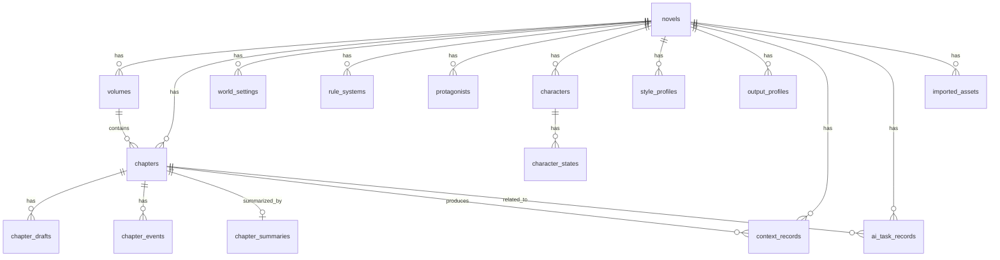

# AI Novel Studio 数据模型设计文档

版本：v0.1.0 草案  
项目名称：AI Novel Studio  
项目路径：F:\ai-novel-studio  
目标平台：Windows 桌面端  
技术路线：Tauri + React + TypeScript + SQLite  
开发方式：VS Code + Copilot / Agent 辅助开发  

---

# 1. 文档目的

本文档用于定义 AI Novel Studio 的核心数据模型、数据关系、状态流转和后续数据库扩展方向。

AI Novel Studio 是一个 Windows 桌面端 AI 小说创作软件。它的核心不是简单保存文本，而是围绕“逐章生成一本小说”的完整工作流保存数据：

```text
小说作品
↓
世界背景 / 规则体系 / 主角 / 特殊能力
↓
分卷大纲 / 章节大纲
↓
风格方案 / 输出控制方案
↓
角色库 / 章节出场角色 / 剧情事件
↓
AI 生成章节正文
↓
用户修改 / 重生成 / 润色 / 检查
↓
确认采用
↓
章节总结 / 角色状态更新 / 上下文沉淀
↓
继续下一章
```

本文档的目标是让 Copilot / Agent 在开发时有明确的数据边界，避免把所有内容混成一个大表或全部写死在前端组件中。

---

# 2. 数据设计核心原则

## 2.1 以小说作品为最高级对象

本项目不再使用旧项目中的“世界项目”作为最高级入口。

最高级对象应是：

```text
Novel / 小说作品
```

世界背景、规则体系、主角、角色、章节、风格方案、输出控制方案都属于某个小说作品。

---

## 2.2 以章节为核心生成单位

AI Novel Studio 不追求一次性生成整本小说。

正文生成、正文草稿、质量检查、章节总结、上下文更新都应围绕章节展开。

核心单位是：

```text
Chapter / 章节
```

每个章节可以有多个正文版本：

```text
ChapterDraft / 章节草稿版本
```

只有用户确认采用的草稿，才会成为章节正式正文，并参与后续上下文总结。

---

## 2.3 AI 结果必须可追踪

AI 生成的内容不能只保存最终文本。

应保存：

```text
任务类型
输入摘要
调用的提示词模板
调用的模型
生成结果
是否被用户采用
生成时间
错误信息
```

这样后续才能回溯：

- 这一章正文是怎么生成的
- 用了哪个风格方案
- 用了哪些角色
- 用户采用了哪个版本
- 哪个 AI 任务失败了

---

## 2.4 复杂配置放在作品详情页，工作台只调用

例如：

- 风格方案
- 输出控制方案
- TXT / JSON 导入结果
- 角色库
- 世界设定
- 大纲

这些数据应在作品详情页或专门管理页维护。

写作工作台只读取和调用这些数据，不应在工作台中维护完整复杂配置。

---

## 2.5 本地优先，SQLite 保存

AI Novel Studio 是 Windows 原生桌面软件，早期版本应优先采用本地 SQLite 保存数据。

后续可扩展云同步，但 v1.0.0 前不作为重点。

---

## 2.6 允许渐进式实现

v0.1.0 不需要一次实现全部表。

第一阶段可以先用 mock 数据与 TypeScript 类型搭建 UI。

后续从 v0.2.0 开始逐步接入 SQLite。

---

# 3. 总体数据模块

建议核心数据模块如下：

```text
AI Novel Studio 数据模块
├─ novels                    小说作品
├─ volumes                   分卷
├─ chapters                  章节
├─ chapter_drafts            章节正文版本
├─ world_settings            世界背景
├─ rule_systems              魔法 / 科技 / 规则体系
├─ protagonists              主角设定
├─ characters                角色库
├─ character_states          角色状态
├─ outlines                  大纲
├─ chapter_events            章节剧情事件
├─ style_profiles            风格方案
├─ output_profiles           输出控制方案
├─ chapter_summaries         章节总结
├─ context_records           上下文记录
├─ prompt_templates          提示词模板
├─ ai_task_records           AI 任务记录
├─ imported_assets           导入文件记录
├─ settings                  设置
└─ app_metadata              应用元信息
```

---

# 4. 数据关系总览

## 4.1 核心关系

```text
novels 1 ─── N volumes
novels 1 ─── N chapters
volumes 1 ─── N chapters

chapters 1 ─── N chapter_drafts
chapters 1 ─── N chapter_events
chapters 1 ─── 1 chapter_summaries

novels 1 ─── N characters
characters 1 ─── N character_states

novels 1 ─── N style_profiles
novels 1 ─── N output_profiles

novels 1 ─── N ai_task_records
chapters 1 ─── N ai_task_records

novels 1 ─── N context_records
chapters 1 ─── N context_records

novels 1 ─── N imported_assets
```

---

## 4.2 推荐 Mermaid 关系图



---

# 5. 表设计总览

## 5.1 v0.1.0 阶段

v0.1.0 主要做 UI 原型，可先不接完整数据库。

建议先准备 TypeScript 类型和 mock 数据：

```text
Novel
Volume
Chapter
ChapterDraft
StyleProfile
OutputProfile
Character
AiTaskRecord
```

---

## 5.2 v0.2.0 至 v0.5.0 阶段优先落库

建议优先实现：

```text
novels
volumes
chapters
chapter_drafts
world_settings
rule_systems
protagonists
style_profiles
output_profiles
settings
ai_task_records
```

---

## 5.3 v0.6.0 之后扩展

后续实现：

```text
characters
character_states
chapter_events
chapter_summaries
context_records
imported_assets
prompt_templates
```

---

# 6. 通用字段规范

多数表建议包含：

```text
id                  主键，建议使用 UUID 字符串
novel_id            所属小说作品 ID
created_at           创建时间
updated_at           更新时间
deleted_at           软删除时间，可选
```

时间格式建议使用 ISO 8601 字符串：

```text
2026-05-17T01:30:00+08:00
```

SQLite 中可用 `TEXT` 保存时间。

---

# 7. 枚举值规范

## 7.1 小说状态 NovelStatus

```ts
export type NovelStatus =
  | "draft"
  | "writing"
  | "paused"
  | "completed"
  | "archived";
```

含义：

```text
draft       草稿
writing     创作中
paused      暂停
completed   已完结
archived    已归档
```

---

## 7.2 章节状态 ChapterStatus

```ts
export type ChapterStatus =
  | "not_started"
  | "outline_ready"
  | "draft_generated"
  | "editing"
  | "polished"
  | "adopted"
  | "summarized";
```

含义：

```text
not_started       未开始
outline_ready     已有章节大纲
draft_generated   已生成初稿
editing           修改中
polished          已润色
adopted           已采用
summarized        已总结
```

---

## 7.3 草稿来源 DraftSource

```ts
export type DraftSource =
  | "ai_generated"
  | "ai_regenerated"
  | "user_edited"
  | "ai_polished"
  | "imported";
```

含义：

```text
ai_generated      AI 初稿
ai_regenerated    AI 重生成版本
user_edited        用户修改版本
ai_polished        AI 润色版本
imported           导入正文
```

---

## 7.4 AI 任务类型 AiTaskType

```ts
export type AiTaskType =
  | "setting_structure"
  | "rule_structure"
  | "protagonist_structure"
  | "volume_outline_expand"
  | "chapter_outline_generate"
  | "style_analyze"
  | "character_generate"
  | "event_suggest"
  | "chapter_generate"
  | "chapter_rewrite"
  | "chapter_polish"
  | "quality_check"
  | "chapter_summarize"
  | "context_update";
```

---

## 7.5 AI 任务状态 AiTaskStatus

```ts
export type AiTaskStatus =
  | "pending"
  | "running"
  | "succeeded"
  | "failed"
  | "cancelled";
```

---

## 7.6 风格来源 StyleSourceType

```ts
export type StyleSourceType =
  | "manual"
  | "txt_analysis"
  | "json_import"
  | "system_default";
```

---

## 7.7 事件状态 ChapterEventStatus

```ts
export type ChapterEventStatus =
  | "candidate"
  | "selected"
  | "required"
  | "forbidden"
  | "adopted"
  | "discarded";
```

---

# 8. 核心表详细设计

---

# 8.1 novels：小说作品表

## 作用

保存小说作品的基本信息，是所有创作数据的最高级归属。

## 字段设计

| 字段名 | 类型 | 必填 | 说明 |
|---|---|---:|---|
| id | TEXT | 是 | UUID 主键 |
| title | TEXT | 是 | 作品名称 |
| subtitle | TEXT | 否 | 副标题 |
| genre | TEXT | 否 | 题材，例如玄幻、科幻、奇幻、都市 |
| description | TEXT | 否 | 作品简介 |
| cover_path | TEXT | 否 | 本地封面路径 |
| status | TEXT | 是 | draft / writing / paused / completed / archived |
| current_volume_id | TEXT | 否 | 当前写作分卷 |
| current_chapter_id | TEXT | 否 | 当前写作章节 |
| total_word_count | INTEGER | 是 | 总字数 |
| target_word_count | INTEGER | 否 | 目标总字数 |
| last_opened_at | TEXT | 否 | 最近打开时间 |
| created_at | TEXT | 是 | 创建时间 |
| updated_at | TEXT | 是 | 更新时间 |
| deleted_at | TEXT | 否 | 软删除时间 |

## SQLite 建表示例

```sql
CREATE TABLE IF NOT EXISTS novels (
  id TEXT PRIMARY KEY,
  title TEXT NOT NULL,
  subtitle TEXT,
  genre TEXT,
  description TEXT,
  cover_path TEXT,
  status TEXT NOT NULL DEFAULT 'draft',
  current_volume_id TEXT,
  current_chapter_id TEXT,
  total_word_count INTEGER NOT NULL DEFAULT 0,
  target_word_count INTEGER,
  last_opened_at TEXT,
  created_at TEXT NOT NULL,
  updated_at TEXT NOT NULL,
  deleted_at TEXT
);
```

## TypeScript 类型

```ts
export interface Novel {
  id: string;
  title: string;
  subtitle?: string;
  genre?: string;
  description?: string;
  coverPath?: string;
  status: NovelStatus;
  currentVolumeId?: string;
  currentChapterId?: string;
  totalWordCount: number;
  targetWordCount?: number;
  lastOpenedAt?: string;
  createdAt: string;
  updatedAt: string;
  deletedAt?: string;
}
```

---

# 8.2 volumes：分卷表

## 作用

保存小说分卷结构。一个小说可以有多个分卷。

## 字段设计

| 字段名 | 类型 | 必填 | 说明 |
|---|---|---:|---|
| id | TEXT | 是 | UUID 主键 |
| novel_id | TEXT | 是 | 所属小说 |
| title | TEXT | 是 | 分卷名称 |
| summary | TEXT | 否 | 分卷简介 |
| goal | TEXT | 否 | 分卷目标 |
| main_conflict | TEXT | 否 | 分卷主要矛盾 |
| order_index | INTEGER | 是 | 排序 |
| status | TEXT | 是 | planned / writing / completed |
| created_at | TEXT | 是 | 创建时间 |
| updated_at | TEXT | 是 | 更新时间 |
| deleted_at | TEXT | 否 | 软删除时间 |

## SQLite 建表示例

```sql
CREATE TABLE IF NOT EXISTS volumes (
  id TEXT PRIMARY KEY,
  novel_id TEXT NOT NULL,
  title TEXT NOT NULL,
  summary TEXT,
  goal TEXT,
  main_conflict TEXT,
  order_index INTEGER NOT NULL DEFAULT 0,
  status TEXT NOT NULL DEFAULT 'planned',
  created_at TEXT NOT NULL,
  updated_at TEXT NOT NULL,
  deleted_at TEXT,
  FOREIGN KEY (novel_id) REFERENCES novels(id)
);
```

## TypeScript 类型

```ts
export interface Volume {
  id: string;
  novelId: string;
  title: string;
  summary?: string;
  goal?: string;
  mainConflict?: string;
  orderIndex: number;
  status: "planned" | "writing" | "completed";
  createdAt: string;
  updatedAt: string;
  deletedAt?: string;
}
```

---

# 8.3 chapters：章节表

## 作用

保存章节基础信息、章节大纲、状态和正式采用正文引用。

正文版本本身不直接放在 chapters 表中，而放在 chapter_drafts 表中。

## 字段设计

| 字段名 | 类型 | 必填 | 说明 |
|---|---|---:|---|
| id | TEXT | 是 | UUID 主键 |
| novel_id | TEXT | 是 | 所属小说 |
| volume_id | TEXT | 否 | 所属分卷 |
| title | TEXT | 是 | 章节标题 |
| outline | TEXT | 否 | 章节大纲 |
| goal | TEXT | 否 | 本章目标 |
| order_index | INTEGER | 是 | 排序 |
| status | TEXT | 是 | 章节状态 |
| adopted_draft_id | TEXT | 否 | 已采用正文版本 |
| word_count | INTEGER | 是 | 当前正式字数 |
| target_word_count | INTEGER | 否 | 目标字数 |
| created_at | TEXT | 是 | 创建时间 |
| updated_at | TEXT | 是 | 更新时间 |
| deleted_at | TEXT | 否 | 软删除时间 |

## SQLite 建表示例

```sql
CREATE TABLE IF NOT EXISTS chapters (
  id TEXT PRIMARY KEY,
  novel_id TEXT NOT NULL,
  volume_id TEXT,
  title TEXT NOT NULL,
  outline TEXT,
  goal TEXT,
  order_index INTEGER NOT NULL DEFAULT 0,
  status TEXT NOT NULL DEFAULT 'not_started',
  adopted_draft_id TEXT,
  word_count INTEGER NOT NULL DEFAULT 0,
  target_word_count INTEGER,
  created_at TEXT NOT NULL,
  updated_at TEXT NOT NULL,
  deleted_at TEXT,
  FOREIGN KEY (novel_id) REFERENCES novels(id),
  FOREIGN KEY (volume_id) REFERENCES volumes(id),
  FOREIGN KEY (adopted_draft_id) REFERENCES chapter_drafts(id)
);
```

## TypeScript 类型

```ts
export interface Chapter {
  id: string;
  novelId: string;
  volumeId?: string;
  title: string;
  outline?: string;
  goal?: string;
  orderIndex: number;
  status: ChapterStatus;
  adoptedDraftId?: string;
  wordCount: number;
  targetWordCount?: number;
  createdAt: string;
  updatedAt: string;
  deletedAt?: string;
}
```

---

# 8.4 chapter_drafts：章节正文版本表

## 作用

保存同一章节的多个正文版本。

例如：

- AI 初稿
- AI 重生成版
- 用户修改稿
- AI 润色稿
- 导入版本
- 最终采用版本

## 字段设计

| 字段名 | 类型 | 必填 | 说明 |
|---|---|---:|---|
| id | TEXT | 是 | UUID 主键 |
| novel_id | TEXT | 是 | 所属小说 |
| chapter_id | TEXT | 是 | 所属章节 |
| title | TEXT | 否 | 草稿标题 |
| content | TEXT | 是 | 正文内容 |
| source | TEXT | 是 | ai_generated / user_edited / ai_polished 等 |
| version_no | INTEGER | 是 | 版本号 |
| word_count | INTEGER | 是 | 字数 |
| is_adopted | INTEGER | 是 | 是否采用，0/1 |
| ai_task_id | TEXT | 否 | 来源 AI 任务 |
| note | TEXT | 否 | 用户备注 |
| created_at | TEXT | 是 | 创建时间 |
| updated_at | TEXT | 是 | 更新时间 |

## SQLite 建表示例

```sql
CREATE TABLE IF NOT EXISTS chapter_drafts (
  id TEXT PRIMARY KEY,
  novel_id TEXT NOT NULL,
  chapter_id TEXT NOT NULL,
  title TEXT,
  content TEXT NOT NULL,
  source TEXT NOT NULL,
  version_no INTEGER NOT NULL DEFAULT 1,
  word_count INTEGER NOT NULL DEFAULT 0,
  is_adopted INTEGER NOT NULL DEFAULT 0,
  ai_task_id TEXT,
  note TEXT,
  created_at TEXT NOT NULL,
  updated_at TEXT NOT NULL,
  FOREIGN KEY (novel_id) REFERENCES novels(id),
  FOREIGN KEY (chapter_id) REFERENCES chapters(id),
  FOREIGN KEY (ai_task_id) REFERENCES ai_task_records(id)
);
```

## TypeScript 类型

```ts
export interface ChapterDraft {
  id: string;
  novelId: string;
  chapterId: string;
  title?: string;
  content: string;
  source: DraftSource;
  versionNo: number;
  wordCount: number;
  isAdopted: boolean;
  aiTaskId?: string;
  note?: string;
  createdAt: string;
  updatedAt: string;
}
```

## 采用正文规则

当用户点击“确认采用”时：

```text
1. 当前 draft 的 is_adopted 设置为 1
2. 同章节其他 draft 的 is_adopted 设置为 0
3. chapters.adopted_draft_id 更新为当前 draft.id
4. chapters.status 更新为 adopted
5. chapters.word_count 更新为当前 draft.word_count
6. novels.total_word_count 重新统计或增量更新
7. 触发后续章节总结任务
```

---

# 8.5 world_settings：世界背景表

## 作用

保存作品的大致世界背景。用户不需要填写完整世界观，只需要填写方向性内容。

## 字段设计

| 字段名 | 类型 | 必填 | 说明 |
|---|---|---:|---|
| id | TEXT | 是 | UUID 主键 |
| novel_id | TEXT | 是 | 所属小说 |
| title | TEXT | 是 | 设定标题 |
| content | TEXT | 是 | 世界背景正文 |
| structured_json | TEXT | 否 | AI 结构化整理结果 |
| is_active | INTEGER | 是 | 是否当前启用 |
| created_at | TEXT | 是 | 创建时间 |
| updated_at | TEXT | 是 | 更新时间 |

## TypeScript 类型

```ts
export interface WorldSetting {
  id: string;
  novelId: string;
  title: string;
  content: string;
  structuredJson?: string;
  isActive: boolean;
  createdAt: string;
  updatedAt: string;
}
```

---

# 8.6 rule_systems：规则体系表

## 作用

保存魔法、科技、修炼、能力、战斗等规则体系。

## 字段设计

| 字段名 | 类型 | 必填 | 说明 |
|---|---|---:|---|
| id | TEXT | 是 | UUID 主键 |
| novel_id | TEXT | 是 | 所属小说 |
| title | TEXT | 是 | 规则体系名称 |
| category | TEXT | 否 | magic / technology / cultivation / combat / social 等 |
| content | TEXT | 是 | 规则内容 |
| forbidden_rules | TEXT | 否 | 禁止违背内容 |
| structured_json | TEXT | 否 | AI 结构化结果 |
| is_active | INTEGER | 是 | 是否启用 |
| created_at | TEXT | 是 | 创建时间 |
| updated_at | TEXT | 是 | 更新时间 |

## TypeScript 类型

```ts
export interface RuleSystem {
  id: string;
  novelId: string;
  title: string;
  category?: "magic" | "technology" | "cultivation" | "combat" | "social" | "other";
  content: string;
  forbiddenRules?: string;
  structuredJson?: string;
  isActive: boolean;
  createdAt: string;
  updatedAt: string;
}
```

---

# 8.7 protagonists：主角设定表

## 作用

保存主角基础设定、特殊能力、目标和限制。

一个小说早期可以只有一个主角。后续可支持多主角。

## 字段设计

| 字段名 | 类型 | 必填 | 说明 |
|---|---|---:|---|
| id | TEXT | 是 | UUID 主键 |
| novel_id | TEXT | 是 | 所属小说 |
| name | TEXT | 是 | 主角姓名 |
| identity | TEXT | 否 | 身份 |
| personality | TEXT | 否 | 性格 |
| goal | TEXT | 否 | 长期目标 |
| special_ability | TEXT | 否 | 特殊能力 |
| ability_limits | TEXT | 否 | 能力限制 |
| forbidden_behaviors | TEXT | 否 | 不能做出的行为 |
| current_state | TEXT | 否 | 当前状态 |
| created_at | TEXT | 是 | 创建时间 |
| updated_at | TEXT | 是 | 更新时间 |

## TypeScript 类型

```ts
export interface Protagonist {
  id: string;
  novelId: string;
  name: string;
  identity?: string;
  personality?: string;
  goal?: string;
  specialAbility?: string;
  abilityLimits?: string;
  forbiddenBehaviors?: string;
  currentState?: string;
  createdAt: string;
  updatedAt: string;
}
```

---

# 8.8 characters：角色库表

## 作用

保存已生成或用户创建的角色。

AI 候选角色被用户选择后，才进入正式角色库。

第二次调用角色时，必须读取已有角色信息，避免长篇割裂。

## 字段设计

| 字段名 | 类型 | 必填 | 说明 |
|---|---|---:|---|
| id | TEXT | 是 | UUID 主键 |
| novel_id | TEXT | 是 | 所属小说 |
| name | TEXT | 是 | 角色姓名 |
| role_type | TEXT | 否 | protagonist / supporting / antagonist / neutral |
| identity | TEXT | 否 | 身份 |
| faction | TEXT | 否 | 阵营 |
| relation_to_protagonist | TEXT | 否 | 与主角关系 |
| goal | TEXT | 否 | 当前目标 |
| personality | TEXT | 否 | 性格特点 |
| behavior_limits | TEXT | 否 | 行为边界 |
| forbidden_behaviors | TEXT | 否 | 不能做出的行为 |
| first_appearance_chapter_id | TEXT | 否 | 首次出场章节 |
| current_state | TEXT | 否 | 当前状态 |
| source | TEXT | 是 | manual / ai_generated |
| is_active | INTEGER | 是 | 是否启用 |
| created_at | TEXT | 是 | 创建时间 |
| updated_at | TEXT | 是 | 更新时间 |

## SQLite 建表示例

```sql
CREATE TABLE IF NOT EXISTS characters (
  id TEXT PRIMARY KEY,
  novel_id TEXT NOT NULL,
  name TEXT NOT NULL,
  role_type TEXT,
  identity TEXT,
  faction TEXT,
  relation_to_protagonist TEXT,
  goal TEXT,
  personality TEXT,
  behavior_limits TEXT,
  forbidden_behaviors TEXT,
  first_appearance_chapter_id TEXT,
  current_state TEXT,
  source TEXT NOT NULL DEFAULT 'manual',
  is_active INTEGER NOT NULL DEFAULT 1,
  created_at TEXT NOT NULL,
  updated_at TEXT NOT NULL,
  FOREIGN KEY (novel_id) REFERENCES novels(id),
  FOREIGN KEY (first_appearance_chapter_id) REFERENCES chapters(id)
);
```

## TypeScript 类型

```ts
export interface Character {
  id: string;
  novelId: string;
  name: string;
  roleType?: "protagonist" | "supporting" | "antagonist" | "neutral";
  identity?: string;
  faction?: string;
  relationToProtagonist?: string;
  goal?: string;
  personality?: string;
  behaviorLimits?: string;
  forbiddenBehaviors?: string;
  firstAppearanceChapterId?: string;
  currentState?: string;
  source: "manual" | "ai_generated";
  isActive: boolean;
  createdAt: string;
  updatedAt: string;
}
```

---

# 8.9 character_states：角色状态表

## 作用

保存角色在不同章节后的状态变化。

这对长篇连续性非常重要。

例如：

```text
第 3 章后，角色 A 受伤
第 6 章后，角色 A 对主角产生怀疑
第 10 章后，角色 A 离开学院
```

## 字段设计

| 字段名 | 类型 | 必填 | 说明 |
|---|---|---:|---|
| id | TEXT | 是 | UUID 主键 |
| novel_id | TEXT | 是 | 所属小说 |
| character_id | TEXT | 是 | 角色 ID |
| chapter_id | TEXT | 否 | 产生该状态的章节 |
| state_summary | TEXT | 是 | 状态摘要 |
| relationship_changes | TEXT | 否 | 关系变化 |
| goal_changes | TEXT | 否 | 目标变化 |
| location | TEXT | 否 | 当前地点 |
| health_state | TEXT | 否 | 身体状态 |
| knowledge_state | TEXT | 否 | 已知信息 |
| created_at | TEXT | 是 | 创建时间 |

## TypeScript 类型

```ts
export interface CharacterState {
  id: string;
  novelId: string;
  characterId: string;
  chapterId?: string;
  stateSummary: string;
  relationshipChanges?: string;
  goalChanges?: string;
  location?: string;
  healthState?: string;
  knowledgeState?: string;
  createdAt: string;
}
```

---

# 8.10 outlines：大纲表

## 作用

保存作品级、分卷级、章节级大纲。

也可以在早期将章节大纲直接放在 chapters.outline 中。后续复杂后再拆分。

## 字段设计

| 字段名 | 类型 | 必填 | 说明 |
|---|---|---:|---|
| id | TEXT | 是 | UUID 主键 |
| novel_id | TEXT | 是 | 所属小说 |
| volume_id | TEXT | 否 | 所属分卷 |
| chapter_id | TEXT | 否 | 所属章节 |
| outline_type | TEXT | 是 | novel / volume / chapter |
| title | TEXT | 是 | 大纲标题 |
| content | TEXT | 是 | 大纲内容 |
| order_index | INTEGER | 是 | 排序 |
| created_at | TEXT | 是 | 创建时间 |
| updated_at | TEXT | 是 | 更新时间 |

## TypeScript 类型

```ts
export interface Outline {
  id: string;
  novelId: string;
  volumeId?: string;
  chapterId?: string;
  outlineType: "novel" | "volume" | "chapter";
  title: string;
  content: string;
  orderIndex: number;
  createdAt: string;
  updatedAt: string;
}
```

---

# 8.11 chapter_events：章节剧情事件表

## 作用

保存 AI 推荐事件、用户选择事件、必须发生事件、禁止发生事件。

事件是正文生成提示词的重要来源。

## 字段设计

| 字段名 | 类型 | 必填 | 说明 |
|---|---|---:|---|
| id | TEXT | 是 | UUID 主键 |
| novel_id | TEXT | 是 | 所属小说 |
| chapter_id | TEXT | 是 | 所属章节 |
| title | TEXT | 是 | 事件标题 |
| description | TEXT | 是 | 事件说明 |
| involved_character_ids | TEXT | 否 | 涉及角色 ID，JSON 数组 |
| impact | TEXT | 否 | 剧情影响 |
| risk | TEXT | 否 | 风险提示 |
| status | TEXT | 是 | candidate / selected / required / forbidden / adopted / discarded |
| source | TEXT | 是 | manual / ai_suggested |
| ai_task_id | TEXT | 否 | 来源 AI 任务 |
| created_at | TEXT | 是 | 创建时间 |
| updated_at | TEXT | 是 | 更新时间 |

## TypeScript 类型

```ts
export interface ChapterEvent {
  id: string;
  novelId: string;
  chapterId: string;
  title: string;
  description: string;
  involvedCharacterIds?: string[];
  impact?: string;
  risk?: string;
  status: ChapterEventStatus;
  source: "manual" | "ai_suggested";
  aiTaskId?: string;
  createdAt: string;
  updatedAt: string;
}
```

---

# 8.12 style_profiles：风格方案表

## 作用

保存写作风格画像。

风格方案可以来自：

- 手动创建
- TXT 分析
- JSON 导入
- 系统默认

工作台只调用风格方案，不负责复杂编辑和导入。

## 字段设计

| 字段名 | 类型 | 必填 | 说明 |
|---|---|---:|---|
| id | TEXT | 是 | UUID 主键 |
| novel_id | TEXT | 否 | 所属小说；为空表示全局风格 |
| name | TEXT | 是 | 风格名称 |
| source_type | TEXT | 是 | manual / txt_analysis / json_import / system_default |
| source_asset_id | TEXT | 否 | 来源导入文件 |
| narrative_perspective | TEXT | 否 | 叙事人称 |
| tone | TEXT | 否 | 文风语气 |
| pace | TEXT | 否 | 节奏 |
| sentence_style | TEXT | 否 | 句式特点 |
| dialogue_ratio | REAL | 否 | 对话比例 |
| description_ratio | REAL | 否 | 描写比例 |
| psychological_ratio | REAL | 否 | 心理描写比例 |
| battle_style | TEXT | 否 | 战斗描写方式 |
| battle_intensity | TEXT | 否 | 战斗强度 |
| emotion_tendency | TEXT | 否 | 情绪倾向 |
| chapter_ending | TEXT | 否 | 章节结尾方式 |
| forbidden_styles | TEXT | 否 | 禁用写法，JSON 数组 |
| style_summary | TEXT | 否 | 风格总结 |
| raw_config_json | TEXT | 否 | 原始配置 JSON |
| is_active | INTEGER | 是 | 是否启用 |
| created_at | TEXT | 是 | 创建时间 |
| updated_at | TEXT | 是 | 更新时间 |

## SQLite 建表示例

```sql
CREATE TABLE IF NOT EXISTS style_profiles (
  id TEXT PRIMARY KEY,
  novel_id TEXT,
  name TEXT NOT NULL,
  source_type TEXT NOT NULL DEFAULT 'manual',
  source_asset_id TEXT,
  narrative_perspective TEXT,
  tone TEXT,
  pace TEXT,
  sentence_style TEXT,
  dialogue_ratio REAL,
  description_ratio REAL,
  psychological_ratio REAL,
  battle_style TEXT,
  battle_intensity TEXT,
  emotion_tendency TEXT,
  chapter_ending TEXT,
  forbidden_styles TEXT,
  style_summary TEXT,
  raw_config_json TEXT,
  is_active INTEGER NOT NULL DEFAULT 1,
  created_at TEXT NOT NULL,
  updated_at TEXT NOT NULL,
  FOREIGN KEY (novel_id) REFERENCES novels(id),
  FOREIGN KEY (source_asset_id) REFERENCES imported_assets(id)
);
```

## TypeScript 类型

```ts
export interface StyleProfile {
  id: string;
  novelId?: string;
  name: string;
  sourceType: StyleSourceType;
  sourceAssetId?: string;
  narrativePerspective?: string;
  tone?: string;
  pace?: string;
  sentenceStyle?: string;
  dialogueRatio?: number;
  descriptionRatio?: number;
  psychologicalRatio?: number;
  battleStyle?: string;
  battleIntensity?: string;
  emotionTendency?: string;
  chapterEnding?: string;
  forbiddenStyles?: string[];
  styleSummary?: string;
  rawConfigJson?: string;
  isActive: boolean;
  createdAt: string;
  updatedAt: string;
}
```

---

# 8.13 output_profiles：输出控制方案表

## 作用

保存章节生成参数。

例如：

- 默认章节
- 战斗章节
- 日常过渡
- 高压冲突
- 结尾爆点

## 字段设计

| 字段名 | 类型 | 必填 | 说明 |
|---|---|---:|---|
| id | TEXT | 是 | UUID 主键 |
| novel_id | TEXT | 否 | 所属小说；为空表示全局方案 |
| name | TEXT | 是 | 方案名称 |
| target_word_count | INTEGER | 否 | 目标字数 |
| min_word_count | INTEGER | 否 | 最少字数 |
| max_word_count | INTEGER | 否 | 最多字数 |
| pace_level | TEXT | 否 | slow / medium / fast |
| dialogue_ratio | REAL | 否 | 对话比例 |
| description_ratio | REAL | 否 | 描写比例 |
| battle_intensity | TEXT | 否 | low / medium / high |
| emotion_tendency | TEXT | 否 | 情绪倾向 |
| ending_hook_required | INTEGER | 是 | 是否要求结尾钩子 |
| extra_requirements | TEXT | 否 | 额外要求 |
| forbidden_items | TEXT | 否 | 禁止项，JSON 数组 |
| is_default | INTEGER | 是 | 是否默认 |
| created_at | TEXT | 是 | 创建时间 |
| updated_at | TEXT | 是 | 更新时间 |

## TypeScript 类型

```ts
export interface OutputProfile {
  id: string;
  novelId?: string;
  name: string;
  targetWordCount?: number;
  minWordCount?: number;
  maxWordCount?: number;
  paceLevel?: "slow" | "medium" | "fast";
  dialogueRatio?: number;
  descriptionRatio?: number;
  battleIntensity?: "low" | "medium" | "high";
  emotionTendency?: string;
  endingHookRequired: boolean;
  extraRequirements?: string;
  forbiddenItems?: string[];
  isDefault: boolean;
  createdAt: string;
  updatedAt: string;
}
```

---

# 8.14 chapter_summaries：章节总结表

## 作用

用户确认采用章节后，AI 自动总结本章内容，用于后续上下文。

## 字段设计

| 字段名 | 类型 | 必填 | 说明 |
|---|---|---:|---|
| id | TEXT | 是 | UUID 主键 |
| novel_id | TEXT | 是 | 所属小说 |
| chapter_id | TEXT | 是 | 所属章节 |
| adopted_draft_id | TEXT | 是 | 来源正文版本 |
| summary | TEXT | 是 | 章节摘要 |
| key_events | TEXT | 否 | 关键事件，JSON 数组 |
| character_changes | TEXT | 否 | 角色变化，JSON |
| relationship_changes | TEXT | 否 | 关系变化，JSON |
| new_foreshadows | TEXT | 否 | 新增伏笔，JSON |
| resolved_foreshadows | TEXT | 否 | 已回收伏笔，JSON |
| next_chapter_hints | TEXT | 否 | 下一章衔接建议 |
| ai_task_id | TEXT | 否 | 来源 AI 任务 |
| created_at | TEXT | 是 | 创建时间 |
| updated_at | TEXT | 是 | 更新时间 |

## TypeScript 类型

```ts
export interface ChapterSummary {
  id: string;
  novelId: string;
  chapterId: string;
  adoptedDraftId: string;
  summary: string;
  keyEvents?: string[];
  characterChanges?: Record<string, unknown>;
  relationshipChanges?: Record<string, unknown>;
  newForeshadows?: string[];
  resolvedForeshadows?: string[];
  nextChapterHints?: string;
  aiTaskId?: string;
  createdAt: string;
  updatedAt: string;
}
```

---

# 8.15 context_records：上下文记录表

## 作用

保存用于后续章节生成的上下文片段。

上下文不是用户每次手动创建，而是系统根据已采用章节、总结、角色状态自动沉淀。

## 字段设计

| 字段名 | 类型 | 必填 | 说明 |
|---|---|---:|---|
| id | TEXT | 是 | UUID 主键 |
| novel_id | TEXT | 是 | 所属小说 |
| chapter_id | TEXT | 否 | 来源章节 |
| context_type | TEXT | 是 | chapter_summary / volume_summary / character_state / foreshadow / rule |
| title | TEXT | 是 | 上下文标题 |
| content | TEXT | 是 | 上下文内容 |
| importance | INTEGER | 是 | 重要程度，1-5 |
| is_active | INTEGER | 是 | 是否参与后续生成 |
| created_at | TEXT | 是 | 创建时间 |
| updated_at | TEXT | 是 | 更新时间 |

## TypeScript 类型

```ts
export interface ContextRecord {
  id: string;
  novelId: string;
  chapterId?: string;
  contextType: "chapter_summary" | "volume_summary" | "character_state" | "foreshadow" | "rule" | "other";
  title: string;
  content: string;
  importance: 1 | 2 | 3 | 4 | 5;
  isActive: boolean;
  createdAt: string;
  updatedAt: string;
}
```

---

# 8.16 prompt_templates：提示词模板表

## 作用

保存不同 AI 分工对应的提示词模板。

模板也可以初期放在 `prompts/` 目录中，后续再同步到数据库。

## 字段设计

| 字段名 | 类型 | 必填 | 说明 |
|---|---|---:|---|
| id | TEXT | 是 | UUID 主键 |
| task_type | TEXT | 是 | AI 任务类型 |
| name | TEXT | 是 | 模板名称 |
| content | TEXT | 是 | 模板内容 |
| version | TEXT | 是 | 模板版本 |
| is_active | INTEGER | 是 | 是否启用 |
| created_at | TEXT | 是 | 创建时间 |
| updated_at | TEXT | 是 | 更新时间 |

## TypeScript 类型

```ts
export interface PromptTemplate {
  id: string;
  taskType: AiTaskType;
  name: string;
  content: string;
  version: string;
  isActive: boolean;
  createdAt: string;
  updatedAt: string;
}
```

---

# 8.17 ai_task_records：AI 任务记录表

## 作用

保存所有 AI 调用记录。

这是调试、回溯、成本估计和用户信任的重要基础。

## 字段设计

| 字段名 | 类型 | 必填 | 说明 |
|---|---|---:|---|
| id | TEXT | 是 | UUID 主键 |
| novel_id | TEXT | 否 | 所属小说 |
| chapter_id | TEXT | 否 | 所属章节 |
| task_type | TEXT | 是 | AI 任务类型 |
| status | TEXT | 是 | pending / running / succeeded / failed / cancelled |
| model_name | TEXT | 否 | 使用模型 |
| prompt_template_id | TEXT | 否 | 使用提示词模板 |
| input_summary | TEXT | 否 | 输入摘要 |
| prompt_snapshot | TEXT | 否 | 实际提示词快照，可选 |
| result_text | TEXT | 否 | AI 输出正文 |
| result_json | TEXT | 否 | AI 输出结构化 JSON |
| error_message | TEXT | 否 | 错误信息 |
| token_input | INTEGER | 否 | 输入 token 数 |
| token_output | INTEGER | 否 | 输出 token 数 |
| started_at | TEXT | 否 | 开始时间 |
| finished_at | TEXT | 否 | 结束时间 |
| created_at | TEXT | 是 | 创建时间 |

## SQLite 建表示例

```sql
CREATE TABLE IF NOT EXISTS ai_task_records (
  id TEXT PRIMARY KEY,
  novel_id TEXT,
  chapter_id TEXT,
  task_type TEXT NOT NULL,
  status TEXT NOT NULL DEFAULT 'pending',
  model_name TEXT,
  prompt_template_id TEXT,
  input_summary TEXT,
  prompt_snapshot TEXT,
  result_text TEXT,
  result_json TEXT,
  error_message TEXT,
  token_input INTEGER,
  token_output INTEGER,
  started_at TEXT,
  finished_at TEXT,
  created_at TEXT NOT NULL,
  FOREIGN KEY (novel_id) REFERENCES novels(id),
  FOREIGN KEY (chapter_id) REFERENCES chapters(id),
  FOREIGN KEY (prompt_template_id) REFERENCES prompt_templates(id)
);
```

## TypeScript 类型

```ts
export interface AiTaskRecord {
  id: string;
  novelId?: string;
  chapterId?: string;
  taskType: AiTaskType;
  status: AiTaskStatus;
  modelName?: string;
  promptTemplateId?: string;
  inputSummary?: string;
  promptSnapshot?: string;
  resultText?: string;
  resultJson?: string;
  errorMessage?: string;
  tokenInput?: number;
  tokenOutput?: number;
  startedAt?: string;
  finishedAt?: string;
  createdAt: string;
}
```

---

# 8.18 imported_assets：导入文件记录表

## 作用

记录用户导入的 TXT / JSON 文件。

导入文件可以用于：

- 风格分析
- 作品正文导入
- 章节上下文分析
- 输出控制方案导入
- 结构化设定导入

## 字段设计

| 字段名 | 类型 | 必填 | 说明 |
|---|---|---:|---|
| id | TEXT | 是 | UUID 主键 |
| novel_id | TEXT | 否 | 所属小说 |
| file_name | TEXT | 是 | 文件名 |
| file_path | TEXT | 否 | 本地路径 |
| file_type | TEXT | 是 | txt / json / markdown |
| asset_type | TEXT | 是 | style_reference / novel_text / config / outline / other |
| content_preview | TEXT | 否 | 内容预览 |
| parsed_json | TEXT | 否 | 解析后的 JSON |
| related_style_profile_id | TEXT | 否 | 生成的风格方案 |
| created_at | TEXT | 是 | 创建时间 |

## TypeScript 类型

```ts
export interface ImportedAsset {
  id: string;
  novelId?: string;
  fileName: string;
  filePath?: string;
  fileType: "txt" | "json" | "markdown" | "other";
  assetType: "style_reference" | "novel_text" | "config" | "outline" | "other";
  contentPreview?: string;
  parsedJson?: string;
  relatedStyleProfileId?: string;
  createdAt: string;
}
```

---

# 8.19 settings：设置表

## 作用

保存软件设置。

包括：

- AI API 配置
- 本地数据路径
- 导出路径
- 界面设置
- 编辑器设置

## 字段设计

| 字段名 | 类型 | 必填 | 说明 |
|---|---|---:|---|
| key | TEXT | 是 | 设置键 |
| value | TEXT | 否 | 设置值 |
| value_type | TEXT | 是 | string / number / boolean / json |
| category | TEXT | 否 | ai / ui / data / editor |
| updated_at | TEXT | 是 | 更新时间 |

## SQLite 建表示例

```sql
CREATE TABLE IF NOT EXISTS settings (
  key TEXT PRIMARY KEY,
  value TEXT,
  value_type TEXT NOT NULL DEFAULT 'string',
  category TEXT,
  updated_at TEXT NOT NULL
);
```

## 重要安全规则

API Key 不应明文提交到 GitHub。

在本地保存 API Key 时：

```text
1. 不能写死在代码里
2. 不能打印到日志中
3. UI 中只能显示脱敏结果
4. .env.local 必须加入 .gitignore
```

---

# 9. 索引设计建议

为了保证查询性能，建议增加以下索引：

```sql
CREATE INDEX IF NOT EXISTS idx_volumes_novel_id ON volumes(novel_id);
CREATE INDEX IF NOT EXISTS idx_chapters_novel_id ON chapters(novel_id);
CREATE INDEX IF NOT EXISTS idx_chapters_volume_id ON chapters(volume_id);
CREATE INDEX IF NOT EXISTS idx_chapter_drafts_chapter_id ON chapter_drafts(chapter_id);
CREATE INDEX IF NOT EXISTS idx_characters_novel_id ON characters(novel_id);
CREATE INDEX IF NOT EXISTS idx_character_states_character_id ON character_states(character_id);
CREATE INDEX IF NOT EXISTS idx_chapter_events_chapter_id ON chapter_events(chapter_id);
CREATE INDEX IF NOT EXISTS idx_style_profiles_novel_id ON style_profiles(novel_id);
CREATE INDEX IF NOT EXISTS idx_output_profiles_novel_id ON output_profiles(novel_id);
CREATE INDEX IF NOT EXISTS idx_ai_task_records_novel_id ON ai_task_records(novel_id);
CREATE INDEX IF NOT EXISTS idx_ai_task_records_chapter_id ON ai_task_records(chapter_id);
CREATE INDEX IF NOT EXISTS idx_context_records_novel_id ON context_records(novel_id);
```

---

# 10. 数据状态流转

## 10.1 章节状态流转

```text
not_started
↓
outline_ready
↓
draft_generated
↓
editing
↓
polished
↓
adopted
↓
summarized
```

说明：

```text
not_started       章节刚创建，没有大纲或正文
outline_ready     已有章节大纲
draft_generated   AI 已生成初稿
editing           用户正在修改
polished          AI 已润色
adopted           用户确认采用
summarized        已完成章节总结和上下文更新
```

---

## 10.2 AI 任务状态流转

```text
pending
↓
running
↓
succeeded / failed / cancelled
```

---

## 10.3 角色生成流程

```text
AI 生成候选角色
↓
用户选择角色
↓
写入 characters
↓
加入本章出场角色
↓
章节采用后更新 character_states
↓
下一次出场时读取已有角色资料
```

---

## 10.4 事件生成流程

```text
读取分卷大纲
↓
读取章节大纲
↓
读取前文总结
↓
AI 生成候选事件
↓
用户选择事件
↓
写入 chapter_events，状态 selected / required
↓
正文生成时加入提示词
↓
章节采用后状态变为 adopted
```

---

# 11. 工作台数据读取逻辑

进入写作工作台时，应读取：

```text
1. 当前 novel
2. volumes
3. chapters
4. 当前 chapter
5. 当前 chapter 的 drafts
6. 当前 novel 的 world_settings
7. 当前 novel 的 rule_systems
8. 当前 novel 的 protagonist
9. 当前 novel 的 style_profiles
10. 当前 novel 的 output_profiles
11. 当前 novel 的 characters
12. 当前 chapter 的 chapter_events
13. 当前 novel 的 context_records
```

右侧面板只调用数据，不维护完整复杂配置。

---

# 12. 正文生成所需数据包

生成一章正文时，Prompt Orchestrator 应组合：

```text
1. 小说基本信息
2. 世界背景
3. 规则体系
4. 主角设定
5. 当前分卷大纲
6. 当前章节大纲
7. 已选择出场角色
8. 已选择剧情事件
9. 风格方案
10. 输出控制方案
11. 前文上下文
12. 禁止违背规则
13. 用户临时要求
```

推荐在代码中定义：

```ts
export interface ChapterGenerationContext {
  novel: Novel;
  volume?: Volume;
  chapter: Chapter;
  worldSettings: WorldSetting[];
  ruleSystems: RuleSystem[];
  protagonist?: Protagonist;
  selectedCharacters: Character[];
  selectedEvents: ChapterEvent[];
  styleProfile?: StyleProfile;
  outputProfile?: OutputProfile;
  contextRecords: ContextRecord[];
  userInstruction?: string;
}
```

---

# 13. 本地数据文件位置建议

Tauri 中应使用应用数据目录保存本地数据库。

建议逻辑路径：

```text
%APPDATA%\AI Novel Studio\ai-novel-studio.db
```

或：

```text
%LOCALAPPDATA%\AI Novel Studio\ai-novel-studio.db
```

不要默认把正式数据库放在项目源码目录中。

开发阶段可以临时使用：

```text
F:\ai-novel-studio\data\dev.db
```

但正式版本应使用应用数据目录。

---

# 14. 迁移文件建议

建议建立数据库迁移目录：

```text
src-tauri/
└─ migrations/
   ├─ 0001_init.sql
   ├─ 0002_novel_basic.sql
   ├─ 0003_chapters.sql
   ├─ 0004_ai_tasks.sql
   └─ 0005_context.sql
```

或放在前端统一目录：

```text
database/
└─ migrations/
```

迁移原则：

```text
1. 不要直接手工改生产数据库
2. 每个版本新增表或字段必须有迁移文件
3. 迁移文件命名要有序号
4. GitHub 只提交迁移脚本，不提交用户数据库文件
```

---

# 15. Git 忽略规则建议

`.gitignore` 应忽略：

```gitignore
node_modules/
dist/
target/
.env
.env.local
*.db
*.sqlite
*.sqlite3
*.log
.DS_Store
```

如果需要保留开发示例数据库，应使用：

```text
data/example.db
```

但一般不建议提交真实数据库。

---

# 16. TypeScript 类型目录建议

建议将类型拆分到：

```text
src/types/
├─ novel.ts
├─ volume.ts
├─ chapter.ts
├─ character.ts
├─ style.ts
├─ output.ts
├─ context.ts
├─ ai.ts
└─ settings.ts
```

不要把所有类型堆在一个文件中。

---

# 17. 服务层目录建议

建议数据访问和业务逻辑分层：

```text
src/services/
├─ database/
│  ├─ db.ts
│  ├─ novelRepository.ts
│  ├─ chapterRepository.ts
│  ├─ characterRepository.ts
│  ├─ styleRepository.ts
│  └─ aiTaskRepository.ts
│
├─ ai/
│  ├─ aiClient.ts
│  ├─ aiTypes.ts
│  └─ aiTaskService.ts
│
├─ prompt/
│  ├─ promptOrchestrator.ts
│  ├─ promptTemplateService.ts
│  └─ contextBuilder.ts
│
└─ import/
   ├─ txtImportService.ts
   └─ jsonImportService.ts
```

组件层不要直接拼复杂提示词，也不要直接操作数据库 SQL。

---

# 18. v0.1.0 数据实现范围

v0.1.0 不要求真实数据库完整可用。

应完成：

```text
1. 定义核心 TypeScript 类型
2. 准备 mock novel 数据
3. 准备 mock chapter 数据
4. 准备 mock style profile 数据
5. 准备 mock output profile 数据
6. 首页作品卡片使用 mock 数据
7. 工作台章节树使用 mock 数据
8. 右侧面板使用 mock 数据
```

v0.1.0 不做：

```text
1. 正式 SQLite 数据库
2. 完整 migration 系统
3. 真实 AI 任务记录
4. 真实 TXT / JSON 导入
5. 真实上下文总结
```

---

# 19. v0.2.0 数据实现范围

v0.2.0 建议实现：

```text
1. SQLite 初始化
2. novels 表
3. world_settings 表
4. rule_systems 表
5. protagonists 表
6. settings 表
7. 新建小说作品落库
8. 编辑基础设定落库
```

---

# 20. v0.3.0 数据实现范围

v0.3.0 建议实现：

```text
1. volumes 表
2. chapters 表
3. 分卷管理
4. 章节管理
5. 章节大纲保存
6. 工作台左侧章节树读取真实数据
```

---

# 21. v0.5.0 数据实现范围

v0.5.0 建议实现：

```text
1. chapter_drafts 表
2. ai_task_records 表
3. prompt_templates 表
4. AI 生成结果保存为草稿
5. 重新生成保存新版本
6. 用户修改保存为 user_edited 版本
7. 确认采用更新 chapters.adopted_draft_id
```

---

# 22. v0.6.0 数据实现范围

v0.6.0 建议实现：

```text
1. style_profiles 表
2. output_profiles 表
3. imported_assets 表
4. TXT 风格文本导入记录
5. JSON 风格配置导入记录
6. 风格画像保存
7. 工作台调用风格方案和输出控制方案
```

---

# 23. v0.7.0 数据实现范围

v0.7.0 建议实现：

```text
1. characters 表
2. character_states 表
3. chapter_events 表
4. AI 候选角色保存
5. 用户选择角色进入角色库
6. AI 推荐事件保存
7. 用户选择事件用于正文生成
```

---

# 24. v0.8.0 数据实现范围

v0.8.0 建议实现：

```text
1. chapter_summaries 表
2. context_records 表
3. 章节采用后自动总结
4. 更新角色状态
5. 生成下一章上下文
```

---

# 25. 数据安全与隐私

## 25.1 API Key

API Key 不应保存在普通业务表中。

如果早期必须保存，应做到：

```text
1. 不写死在代码里
2. 不提交 GitHub
3. 不在日志中输出
4. UI 中脱敏显示
```

后续可以使用 Tauri 的安全存储插件或系统凭据管理。

---

## 25.2 用户作品数据

用户小说正文、设定、大纲属于隐私数据。

默认应保存在本地，不上传云端。

---

## 25.3 AI 任务记录

AI 任务记录可以保存结果和摘要。

但要注意：

```text
1. 不保存 API Key
2. 不保存敏感凭据
3. 如保存完整 prompt_snapshot，应让用户可以清理
4. 后续可提供“清理 AI 调用记录”功能
```

---

# 26. 数据模型最高优先级总结

AI Novel Studio 的数据模型应服务于以下目标：

```text
第一：以小说作品 Novel 为最高级对象
第二：以章节 Chapter 为正文生成单位
第三：同一章节支持多个正文版本 ChapterDraft
第四：AI 生成结果必须可追踪 AiTaskRecord
第五：风格方案和输出控制方案可复用
第六：角色状态和章节总结必须沉淀，保证长篇连续性
第七：工作台只调用数据，不承担复杂配置管理
第八：本地 SQLite 优先，保护用户作品数据
第九：分阶段实现，不在 v0.1.0 一次做完所有表
第十：代码中必须有明确 TypeScript 类型和服务层，避免数据逻辑散落在组件中
```

所有后续开发都应围绕以上数据原则展开。

---

# 27. v2.1.7 质量历史快照与当前状态

v2.1.7 将质量检查的“历史检测事实”和“当前问题处理状态”分开存储。该边界高于早期示例结构，后续修改质量链路时必须保持。

## 27.1 `quality_check_reports`：一次检查的不可变头部

每次质量检查创建独立报告。报告必须绑定：

```text
novel_id
chapter_id
draft_id
ai_task_id
content_hash / content_length
checked_at / created_at
```

只有在全部问题和当前状态成功写入后，报告才能从 `pending` 转为 `completed`。已 completed 报告只允许使用原 `ai_task_id` 幂等读取，不得替换评分、摘要、成员或 Task 绑定。

`ai_task_id` 为新报告必填。目标 Task 必须存在，`task_type = 'quality_check'`，`status = 'succeeded'`，且作品和章节归属与报告一致。

## 27.2 `quality_check_items`：报告内不可变问题快照

每个 item 只属于一份报告。复检再次出现同一 `issue_key` 时仍创建新 item ID，不得改写旧 item 的 `report_id`、检测字段或快照状态。

`sort_order` 是报告内的稳定顺序，从 0 递增。原始快照按 `sort_order ASC, id ASC` 读取。同一输入报告中不得出现重复 `issue_key`；重复时整份报告保存失败并回滚。

item 中的 `status` / `resolution_note` / `resolved_at` 只是生成当时的原始快照。回放历史报告时必须返回这些原始值，不覆盖当前工作流状态。

## 27.3 `quality_issue_states`：当前可变工作流

```text
PRIMARY KEY: (chapter_id, issue_key)
UNIQUE: id
status: pending / resolved / ignored
resolution_note
resolved_at
created_at / updated_at
```

当前报告的问题列表以 item 为检测事实，再按 `(chapter_id, issue_key)` 覆盖状态。历史报告 item 不允许修改该表；单条和批量状态更新都必须在 SQLite 事务中完成。

新报告再次发现旧问题时：

```text
ignored -> ignored
resolved -> pending
pending  -> pending
```

如果一份旧 pending 报告在更新 completed 报告之后才返回，它只能保存自身快照，不能更新 `quality_issue_states`。判断依据为 `created_at DESC, id DESC` 中是否存在更新 completed 报告；较新但 pending / failed 的报告不阻止当前最新完整报告刷新状态。

## 27.4 原子性和查询规则

```text
report ownership / AI Task / duplicate key validation
-> insert every immutable item
-> upsert eligible current states
-> mark report completed
-> read back report and items
-> commit
```

上述步骤必须位于同一 `IMMEDIATE` 事务。任意失败都不得留下 completed 报告、部分 item 或部分状态。

- 最新当前查询：只查 `status = 'completed'`，按 `created_at DESC, id DESC` 取一条。
- 历史列表：只列 completed，使用同一稳定顺序。
- 历史回放：按 report ID 返回原始 item，不 join 当前状态。
- 当前问题：仅对最新 completed 报告 join 当前状态。

## 27.5 完整备份

`schemaVersion: 3` 导出 `quality_issue_states`。schema 2 导入仍被支持，但必须在恢复事务内按每个 `(chapter_id, issue_key)` 的 item `updated_at DESC, rowid DESC` 合成旧模型最后保存的可变状态，并按 `report_id` 分组补齐缺失的 `sort_order`，不得依赖导入后重启再修复。

---

# 28. v2.1.8 章节上下文持久化一致性

v2.1.8 不修改 SQLite 表结构，而是收紧现有 `chapter_summaries`、`context_records`、`character_states`、`characters` 与 `chapters` 的写入和读取边界。本节高于第 8 节的早期示例；后续修改章节上下文链路时必须保持这些约束。

## 28.1 桌面端单一事实源

```text
Tauri 桌面模式 -> SQLite 是唯一事实源
浏览器开发模式 -> LocalStorage 回退
```

- 运行在 Tauri 中时，章节总结、上下文记录和角色状态的读取、创建、更新、过期与删除都必须通过 Rust IPC 落到 SQLite。
- 任一 IPC 失败必须向上传播。不得在 `catch` 中改写 LocalStorage、返回伪造 DTO 或继续显示保存成功。
- LocalStorage 只承担浏览器开发回退和旧数据迁移输入，不是桌面端 SQLite 的镜像或第二权威副本。

## 28.2 稳定身份与查询规则

`context_records.id` 是跨前端、IPC 和 SQLite 的稳定 UUID：

```text
调用方生成 id
-> Rust 校验 id 与作品 / 章节 / 分卷归属
-> SQLite 使用同一 id 插入或更新
-> read-back 返回同一 id
```

禁止 Rust 丢弃有效的调用方 ID 后生成新 ID。更新必须按 ID 命中恰好一条已有记录，且不得改变其 `novel_id`；未命中或归属不一致返回明确错误。

章节总结按作品查询时，底层记录使用以下稳定次序：

```text
章节 order_index ASC
-> chapter_id ASC
-> updated_at DESC
-> created_at DESC
-> id DESC
```

服务层据此为每个章节选择最新总结。已过期或已禁用记录是否参与生成，必须由调用场景显式过滤，不能依赖 LocalStorage 中的旧值。

## 28.3 章节上下文原子 bundle

用户确认章节总结时，以下数据属于一个业务提交：

```text
chapter summary
+ context records
+ character state history
+ characters.current_state
+ chapters.status = summarized
```

桌面端必须在单个 SQLite `IMMEDIATE` 事务中完成：

```text
校验 novel / chapter / adopted draft 归属
-> 校验每条 context record 与 character state 归属
-> upsert chapter summary
-> upsert every context record（保留输入 ID）
-> upsert every character state
-> 同步 characters.current_state
-> 以 adopted_draft_id 条件更新 chapter 为 summarized
-> read back authoritative DTOs
-> commit
```

任一校验、写入、read-back 或终态更新失败都必须回滚全部数据。只有事务提交后，界面才能报告总结保存成功。单独的 CRUD 命令仍可用于明确的编辑、过期和删除操作，但不得重新拆分总结确认这一业务事务。

当 `chapters.adopted_draft_id` 从旧正文切换到另一版正文时，正文采用事务还必须同时将该章已有 `chapter_summaries` 与 `context_records` 标为过期；采用返回成功后不得再依赖总结面板或其他 UI 懒触发修复。重采同一 `adopted_draft_id` 不应误过期当前上下文。任何过期写入失败都必须连同草稿采用状态、章节正式指针和章节状态整体回滚。

## 28.4 旧 LocalStorage 数据迁移

旧版可能同时留下 SQLite 与 LocalStorage 记录，且双写时期的 ID 可能不同。迁移遵循：

1. 优先按有效且完全相同的 ID 匹配。
2. ID 不同的旧镜像只能按作品、章节、实体内容和稳定时间字段进行确定性匹配。
3. 唯一匹配时记录源 ID 到 SQLite ID 的映射；无匹配时使用有效源 ID 或新 UUID 插入。
4. 多个候选无法唯一判定时不得猜测、覆盖或删除；保留 LocalStorage 记录并返回 warning。
5. 总结、上下文和角色状态的迁移在一个 SQLite 事务中提交；已插入或确定性匹配的角色状态按 `created_at DESC, id DESC` 重算并同步 `characters.current_state`。提交失败时 LocalStorage 不变。
6. 提交成功后只清理迁移结果已明确映射的记录；缓存清理失败返回 warning，SQLite 结果保持已提交。
7. 重复运行迁移必须按精确 ID 或确定性镜像匹配返回已有记录，不得产生副本。

该流程不是 SQLite 与 LocalStorage 之间的分布式 ACID 事务。安全边界是“先提交 SQLite，再按明确映射清理缓存；失败可幂等重试”。

## 28.5 浏览器回退补偿

浏览器开发模式没有 SQLite 事务。保存同一 bundle 或采用新正文并过期旧上下文前，必须拍摄相关 LocalStorage 集合快照；任一分步写入失败时恢复全部快照，并把原错误返回调用方。补偿回滚只用于开发回退，不能作为桌面端原子性通过证据。

---

# 29. v2.3.0 AI 执行事实模型

v2.3.0 新增独立于 Legacy `AiTaskRecord` / `generation_jobs` 的持久执行事实层。旧记录不迁移、不回填，也不能被解释成拥有并不存在的 Snapshot 或 Artifact。

## 29.1 AiTask

`AiTask` 冻结任务类型、作品/章节/草稿 scope、三类 Snapshot ID、traceId、operationId、requestHashVersion、canonical requestHash 及预期 Artifact type/schema。Task 身份字段不可变；状态与当前 Attempt / 结果 Artifact 通过 CAS 和数据库触发器更新。

Task 创建必须满足：

- `system` scope 只允许连接测试；其他 scope 的 Novel、Chapter、Draft 归属由 Rust 和 SQLite 双重验证。
- Task 与 Input / Context / Constraint Snapshot 在一个事务中创建。
- 相同 operationId 仅在完整 requestHash 相同时重放。
- `completed` 必须绑定同 Task、同当前 Attempt 且为 `valid` / `valid_with_warnings` 的 Artifact。

## 29.2 AiTaskAttempt

Attempt 使用 `(taskId, attemptId)` 联合身份及单 Task 递增 `attemptNumber`。同一 Task 最多一个 live Attempt（`queued`、`running`、`cancel_requested`）。Provider、Model 与 providerRequestId 一次性绑定；响应只保存白名单 metadata，不保存 raw body。

Attempt 失败是否允许重试由持久 `error.retryable` 决定。重试创建新 Attempt，不复活或改写旧 Attempt。

## 29.3 三类 Snapshot

| 模型 | 结构化字段 | 完整大文本 | 来源身份 |
|------|------------|------------|----------|
| `AiInputSnapshot` | schema、inputType、payload | input body | sourceDraftId/version/base hash |
| `AiContextSnapshot` | source manifest、budget、compilerVersion | compiled context | manifest 内稳定来源引用 |
| `AiConstraintSnapshot` | constraints、template identity、provider options | prompt template body | template id/version/hash |

三类 Snapshot 整行不可更新或删除。其大文本 document/chunks 在 Snapshot 建立引用后同样不可变。`contentHash` 是包含 schema、结构化字段和大文本 SHA-256 的 canonical 聚合 hash。

## 29.4 ResultArtifact

ResultArtifact 保存：

- Task / Attempt / Input Snapshot 联合来源；
- Artifact type/schema；
- raw、display、structured payload 的大文本引用与 hash；
- Novel / Chapter / Draft / version / base hash 的权威副本；
- contentHash、字符长度、processingStatus；
- 可选父 Artifact 与 derivation identity（M1 只读保留，尚未开放写入）。

来源字段只能从持久 Task 与 Input Snapshot 派生。raw hash/length 必须与 Attempt 的 Provider response metadata 完全相同。Artifact 身份、正文、来源与派生字段不可原地修改，整行不可删除；只有受控 processingStatus 合法边可更新。

## 29.5 ArtifactValidationIssue

ValidationIssue 按 `(artifactId, validationRunId, issueIndex)` 稳定排序，只允许追加。message/details 受长度、凭据和正文泄漏限制；完整 Provider body 始终保存在 Artifact raw 大文本中，不复制到 Issue 或普通日志。

## 29.6 关系与删除语义

M1 内部关系使用 `ON DELETE RESTRICT`，执行事实不能因上层清理级联丢失。Task 目标使用不可变字符串身份和创建时归属验证，不向既有业务表增加外键或来源列，避免改变草稿删除、质量历史或当前生产 AI 流程。

详细状态机、安全边界与 IPC 见 [`architecture/ai-execution-facts.md`](architecture/ai-execution-facts.md)。

---

# 30. v2.3.2 Safe Apply 模型

v2.3.2 新增三类持久事实，把有效 `setting_candidates@1` Artifact 的单个候选安全创建为正式 `world_settings` 行。该模型不允许 AI 直接写业务表，也不为浏览器回退伪造 SQLite 事实。

## 30.1 PlacementProposal

Proposal 绑定 `artifactId + candidateIndex + candidateHash`，并冻结 proposal type、目标作品、预分配 targetId、目标不存在的 version 0/hash、单个 effect payload、proposalHash 与创建时间。同一 Artifact 候选只能对应一个 Proposal；整行禁止 UPDATE 和 DELETE。

## 30.2 ApplyPlan

Plan 与 Proposal 一对一，冻结 operationId、planHash、目标前置条件和 effect payload。当前只允许一个 `create_world_setting` effect，状态边为：

```text
awaiting_confirmation → applying → applied
                              └──→ conflict
```

从 awaiting 进入 applying 时必须同时记录 `confirmedBy=user` 与确认时间，且只允许记录一次。身份和计划内容不可变；状态使用 revision CAS，Plan 不允许删除。

## 30.3 ArtifactTargetLink

成功应用创建一条 `created_from` 链接，绑定 Artifact、Proposal、ApplyPlan 与正式 target，保存 target version 1 和完整业务对象 hash。Link 整行不可更新或删除；同一 Plan、Proposal 或 target 不能重复链接。

## 30.4 原子性、冲突与重放

用户确认后的 world_setting、ArtifactTargetLink 和 Plan applied 必须在同一个 SQLite `IMMEDIATE` 事务中提交。预分配 targetId 已存在时 Plan 进入 conflict 且不覆盖目标；中途任一写入失败时确认、目标、链接和状态整体回滚。

相同 `planId + operationId + expectedPlanHash` 重放 applied 计划时必须重新读取目标和 Link，并校验目标完整 hash。目标被修改、删除或链接不一致时返回 `PLACEMENT_TARGET_CHANGED`，不能返回陈旧成功。提交状态未知时前端只以相同身份重放，不生成新 operationId。

详细契约见 [`architecture/safe-apply.md`](architecture/safe-apply.md)。

---

# 31. v2.4.0 编译 Snapshot 协议

v2.4.0 不新增表或 migration，继续复用 v2.3.0 三类不可变 Snapshot；正式连接测试和设定补充把 `schemaVersion` 提升为 2，以协议字段区分旧 Snapshot。

## 31.1 Input Snapshot schema 2

`inputType = compiled_provider_messages_v1`，大文本保存实际派发的 `{ messages }`。payload 使用 `compiled_ai_request_v1`，冻结 taskType、messageCount、requestBodyHash、compilationHash 与不含凭据的 taskInput。API Key、Base URL 和 Provider raw response 禁止进入 Snapshot。

## 31.2 Context Snapshot schema 2

`compilerVersion = context_compiler_v1`。`context_manifest_v1` 为每个来源保存 type/id/version/origin、稳定 ordinal、原文 hash/长度/token、included/truncated/omitted 状态及已包含片段 hash；`context_budget_v1` 保存模型窗口、输出保留、固定消息、可用 Context 和最终长度统计。

估算器固定为 `utf8_bytes_div3_v1`。完整 compiled context 作为既有不可变大文本保存，manifest 中的 compiledContextHash 必须与之相同。设定补充至少包含与 Task scope 一致且已进入编译结果的 Novel 来源；chapter scope 还必须包含对应 Chapter 来源。

## 31.3 Constraint Snapshot schema 2

`constraint_compiler_v1` payload 冻结 taskType、预期 Artifact type/schema、response schema、业务 constraints/hash 与 Tool Registry policy。Prompt 模板通过 id/version/hash 与独立大文本保存，Provider options 只包含 provider/model/temperature/maxTokens。

当前 `tool_registry_v1` hash 为 `c03ae58009cfb47b84f85dbb907b427cd1d659149af0a6133ec6898e8de4a0a5`，两个已迁移生产任务的 `allowedTools=[]`。Registry manifest 本身由代码定义并按稳定工具 identity 排序，本版本不新增数据库表存储 Registry。

## 31.4 compilationHash 与后端验证

`compilationHash` canonical 覆盖 scope、预期 Artifact、requestBodyHash、taskInput、Context manifest/budget、Constraint payload、Prompt hash 和 Provider options。Rust 在 Task/Snapshot 事务开始前复算该 hash，并验证固定 Prompt hash、实际 Provider messages、预算、来源类型、Registry identity 与任务策略；任何不一致都不得创建部分执行事实。

详细协议见 [`architecture/context-constraint-tool-registry.md`](architecture/context-constraint-tool-registry.md)。
